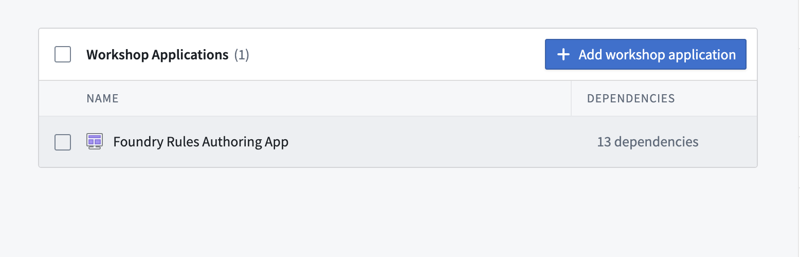
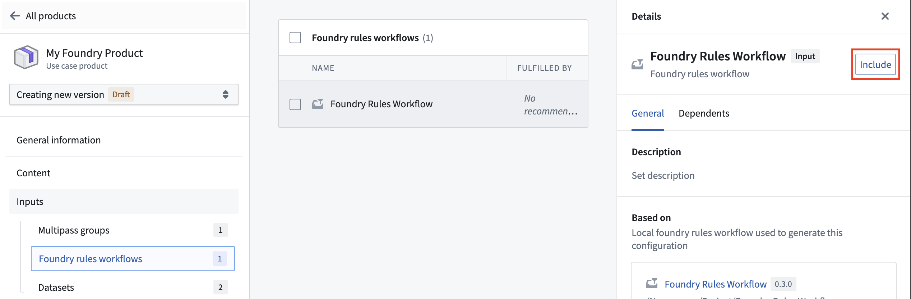
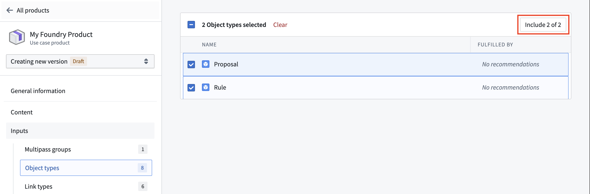
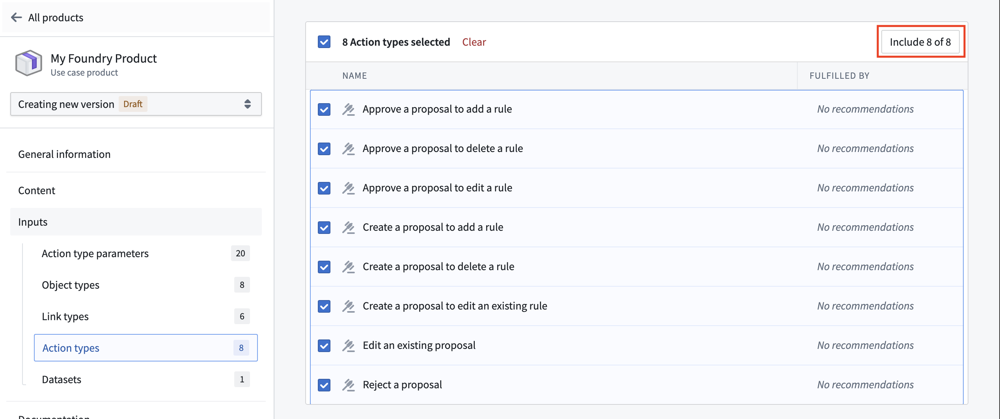

<!-- source: https://palantir.com/docs/foundry/foundry-rules/marketplace/ · mirrored 2026-08-22 from Palantir Foundry docs -->

# Add Foundry Rules to a Marketplace product

Use [Foundry DevOps](/docs/foundry/devops/overview/) to include your Foundry Rules workflow in [Marketplace products](/docs/foundry/devops/core-concepts/#product) and enable other users to install and reuse them. [Learn how to create your first product](/docs/foundry/foundry-devops/create-products/).

## Supported features

All Foundry Rules features are supported.

## Add Foundry Rules workflows to products

To add a Foundry Rules workflow to a product, first [create a product](/docs/foundry/foundry-devops/create-products/) then select the **Workshop Application** content type, followed by your [Foundry Rules authoring application](/docs/foundry/foundry-rules/author-and-run-a-rule/), as below.

After adding your Workshop application, go to the **Foundry rules workflows** section in your product's inputs and include your workflow.

Once your workflow has been included, additional object type and action types will be included as inputs to your product. You will likely want to include both the `Rule` and `Proposal` object types, along with all of the generated action types to your product.

:::callout{theme="neutral"}
When setting your product's installation mode to `Production`, be sure to enable `Only allow edits via actions` for the `Rule` and `Proposal` object types in the `Datasources` tab of the Ontology Manager application. Without this step, users will encounter an `Actions:PermissionDenied` error when attempting to create a proposal.
:::
