<!-- source: https://palantir.com/docs/foundry/foundry-rules/migrate-to-foundry-rules/ · mirrored 2026-08-14 from Palantir Foundry docs -->

# Migrate to Foundry Rules

While long-term support for Taurus continues, some organizations may wish to migrate their existing Taurus workflows to Foundry Rules to benefit from additional features, such as improved ease in making changes and performing pipeline maintenance, and further updates to development. Note that Taurus continues to receive long-term support.

By migrating Taurus use cases to Foundry Rules, you may benefit from:

* A simplified deployment that can be completed in minutes from a single Foundry Rules configuration page.
* Modifications and maintenance via single-step changes to the Foundry Rules configuration.
* Out-of-the-box execution without the need to interact with pipeline code, including streaming workflows.
* A built-in code generator supporting advanced Foundry Rules use cases requiring custom pipeline code.

The optimal Foundry Rules workflow targets one specific use case with one type of rule that you want your users to author. If you have multiple user groups and multiple rule authoring applications, you may consider creating multiple rule workflows by using the migration wizard multiple times.

## Migration considerations

Prior to migrating to Foundry Rules, consider the following:

* If you use Taurus as a larger product offering such as supply chain optimization, anti-money laundering, or QMOS for the automotive industry, no migration needs to be performed at this time.

* If you have a complex Taurus use case including any combination of the following, the migration will require some refactoring work, and you should consider the trade-off between the benefits outlined previously and extent of the changes required:
  * Your Taurus workshop module has multiple rule editor widgets with different configurations for various user groups.
  * Your Taurus repository uses advanced features of the Taurus packages or applies the rule logic in specific ways. An example of an advanced feature in use may be that the repository runs the proposals to create potential impact analyses.
  * Your [rule actions](/docs/foundry/foundry-rules/configure-rule-actions/) implement optional visibility, use object locator, object set, or attachment field types.

* If you are actively adding more input datasets, object types, or rule outputs to your Taurus use case, the new configuration interface provided by Foundry Rules may add maintainability. Even if you choose to use a Java repository in combination with a Foundry Rules workflow, you will benefit from partial code generation.

### Migrate Taurus workflow to Foundry Rules workflow

The following process uses your existing object types and Workshop modules but creates a parallel pipeline and new output datasets to prevent disruptions to operating pipelines.

When upgrading to V2, the following processes are performed:

* Checks for time series in your workflow
* Upgrades the existing application
* Unlinks the old application if necessary
* Manual actions required to finalize migration

To start, follow the instructions below:

1. Navigate to **Foundry Rules** from the Foundry workspace navigation sidebar and then to the **Old Workflows** tab.

2. Select the Ontology and find the V1 archetype from the list or use the search field.

   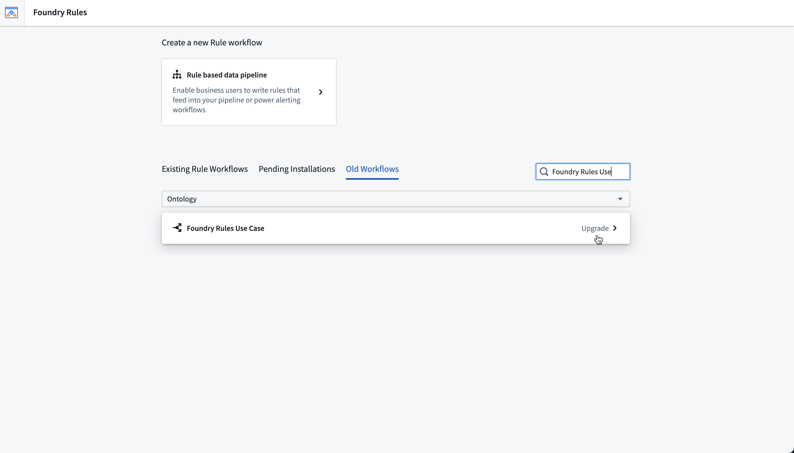

3. Select **Migrate from older Version**.

4. Choose the main rule editor Workshop resource and review the destination folder in which to save the new Foundry Rules workflow. Rename the workflow if necessary. Then, select **Start**

   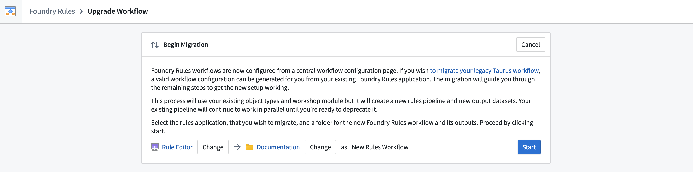

5. The Foundry Rules migration wizard will check whether your existing set up includes [time series](/docs/foundry/foundry-rules/timeseries-concepts/). If so, you will need to configure the link types and time series syncs. Select **Save Rules workflow** once you have completed the additional configuration.

    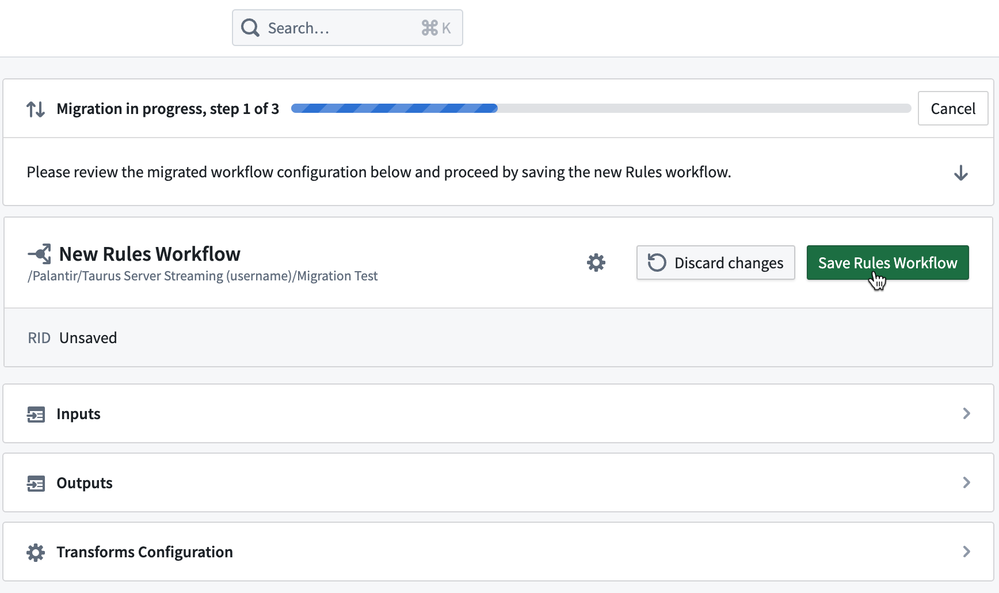

6. Some resources may need to be imported to the project. Review and expand to verify the list of resources and then complete the required on-screen actions, then select **Save**.

    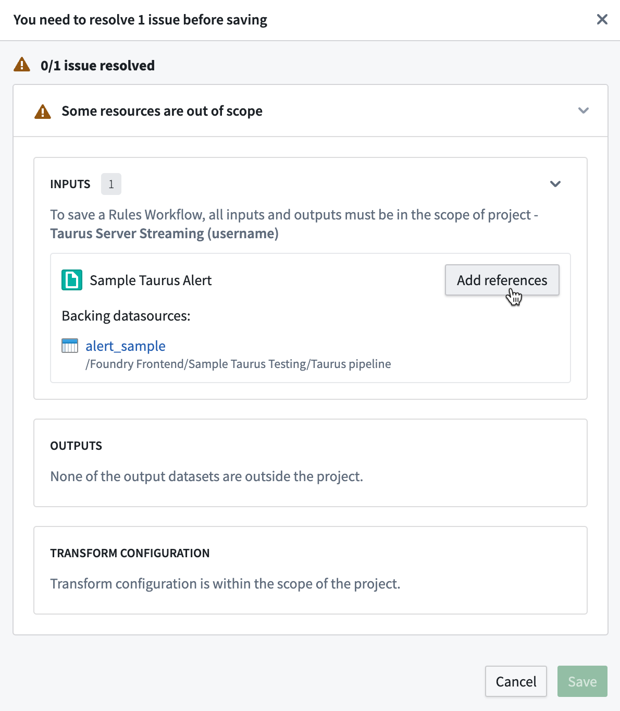

    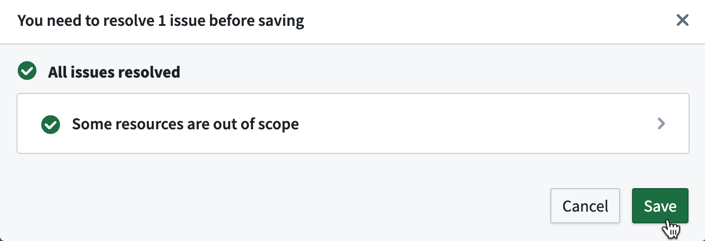

7. Select **Upgrade rules application**.

    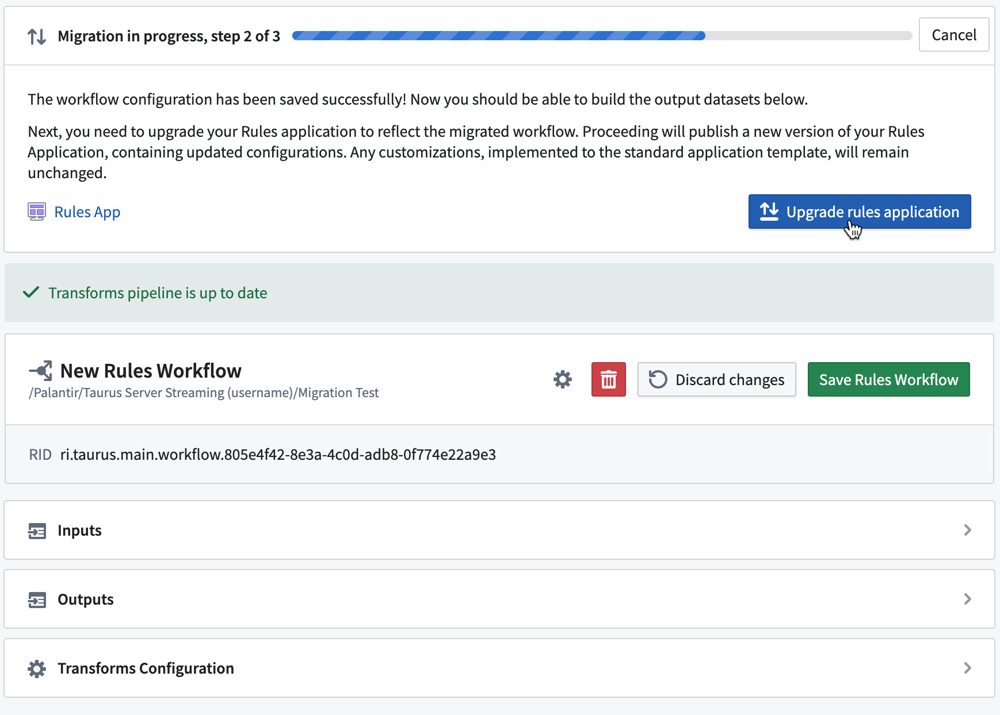

8. If requested, select **Unlink old application**.

    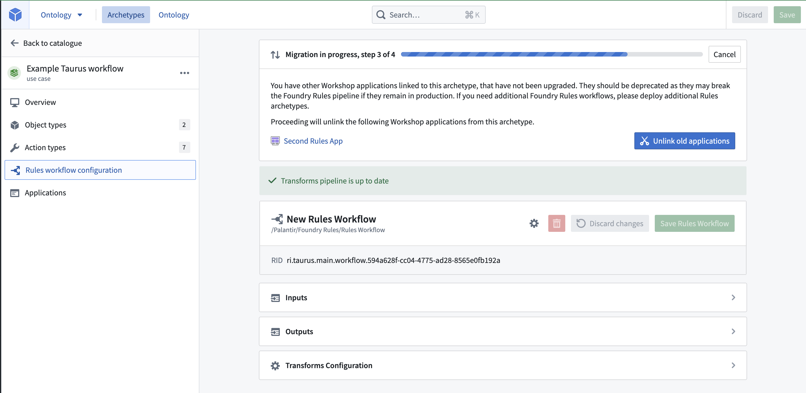

9. Finally, take note of the on-screen guidance and follow the appropriate instructions based on your use case for the newly upgraded pipeline:

    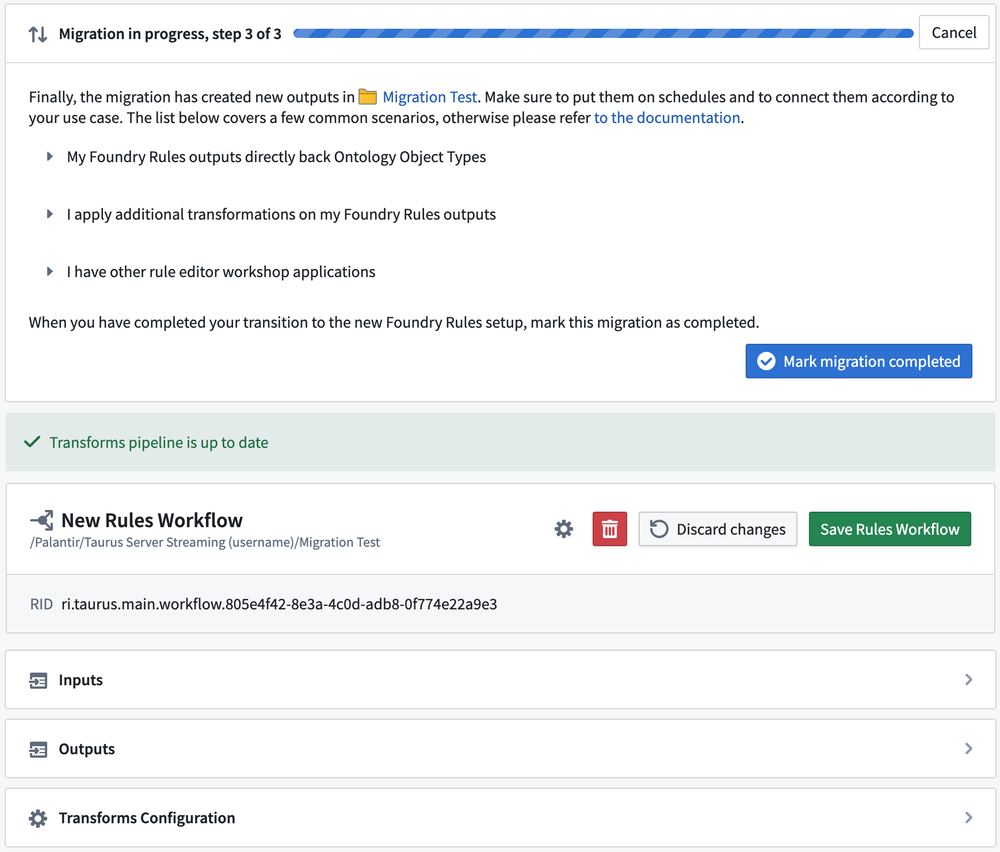

   * My Foundry Rules outputs directly feed into Ontology object types.
     * If your Outputs feed into Ontology object types (for example, without any additional transformations), then you need to replace the [objects' backing datasets](/docs/foundry/object-link-types/create-object-type/#add-a-backing-datasource-to-a-new-object-type) of this object type so that alerts will come from the new version of Foundry Rules.

:::callout{theme="warning"}
This option will result in [lost object edits if object types is V1](/docs/foundry/object-link-types/edit-object-type/). Otherwise, if you must retain edits, you may [keep the backing dataset ↗](https://stackoverflow.com/questions/72477419/how-to-safely-delete-an-object-property-without-losing-the-object-edits) and ensure that its content is a direct copy of the new rules output.
:::

* I apply additional transformations on my Foundry Rules outputs.
  * You should use the new output datasets to replace the previous rule outputs in your transformations. For advanced use cases, you can register a [custom repository to compute the rule outputs](/docs/foundry/foundry-rules/customize-foundry-rules-pipeline/).
* I have other rule editor Workshop applications.
  * If your rule editors all have the same inputs and outputs, you can have all of them refer to this Rules workflow. You can deploy more rule editor Workshop applications using Archetype's deploy menu in the **Applications** tab on the left. If your rule editors serve different use cases and have different configurations, you should migrate each one in a dedicated workflow by deploying a new Rules Archetype.

10. Once the steps have been completed, select **Mark migration completed**. Your use case is now operational on the new Foundry Rules setup.

## Verify migration

To check that the migration to Foundry Rules succeeded, access the link to the project where the rules output dataset was saved.

Open the rules output dataset and select **Build** or go to the Schedules tab and **Add build schedule**.

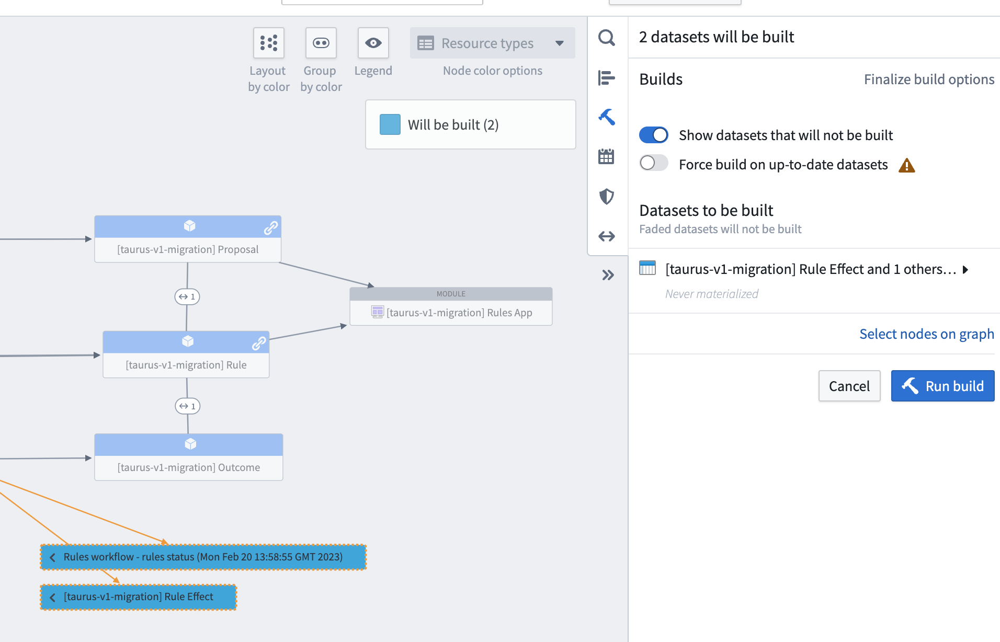

A successful build indicates the upgrade process to Foundry Rules was completed successfully.

## FAQs

* I was warned that my outputs contain configuration that is different in V2. How do I resolve this?
  Action type forms can be configured to accept various types of input. This can be simple numbers or dates but also attachments, object properties, or derived values from other form parameters. While the migration wizard attempts to recreate a configuration as close to the original as possible, this message warning indicates there may have been changes to the configuration.

To resolve, review the output configuration for your rule effects, as below:

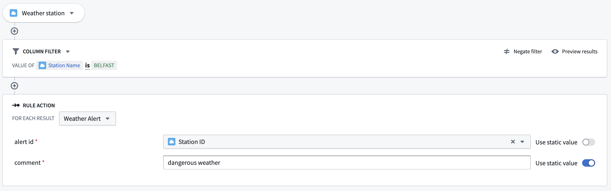

Then, check the rule editor form after completing step five of the migration to ensure it continues to behave according to your use case, as below:

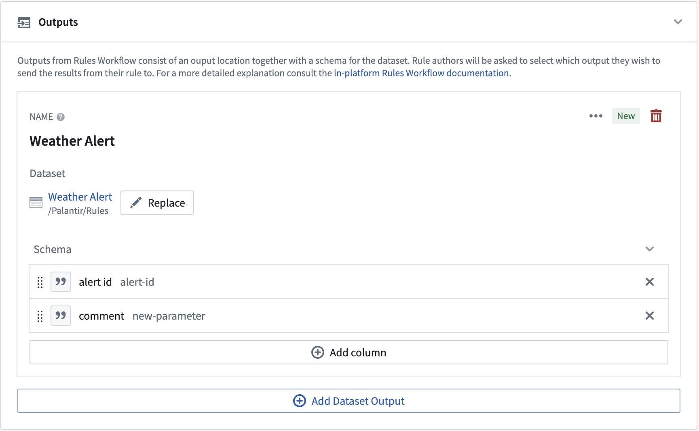

* Why does my dataset build succeed but has no data in it?

  The build job includes another dataset called the rules status dataset that contains information for each rule and why it did not run properly. Additionally, you may have not yet rerun your writeback dataset; see step four on the [Author and run a rule guide](/docs/foundry/foundry-rules/author-and-run-a-rule/#author-and-run-a-rule). The dataset can also be found under the **Transforms Configuration** section of the Build page:

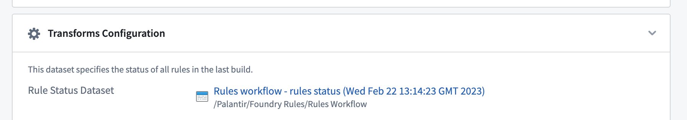

* Why am I unable to cancel the migration if someone else makes changes simultaneously to the Rules application?

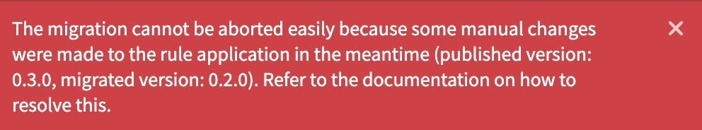

This error happens if you have completed the stage of upgrading the Rules application, while another user makes changes to the Rules application when you then attempt to **Cancel** the migration.

To resolve, open the Rules Workshop application and publish the older migrated version to undo the manual changes made. You will then be able to cancel the upgrade process successfully.

* Why doesn't the migration proceed without exactly one rule editor and proposal reviewer widget each?
  * Rules applications can be designed with any number of rule editor widgets and any number of proposal widgets, but are configured differently between Taurus and Foundry Rules. In Taurus, it is possible to configure the widgets with unique attributes such as having different inputs available in each. The migration would not combine configurations of multiple widgets but rather, translate one rule editor widget to one Rules workflow. In the new Foundry Rules setup however, different configurations should each be their own Rules workflow.
  * To resolve this issue for your migration, you should consider the following scenarios and appropriate resolutions. After that, complete the migration wizard again. Note that Workshop changes are versioned to support reverting changes if necessary:
    * You have multiple rule editor widgets by accident and only one is relevant. You should remove the irrelevant widgets from your workshop module and try the migration again.
    * You have multiple widgets with the same configuration. You should remove all widgets but one. After the migration, you can copy and paste the updated widget to recreate the design of your application.
    * You have multiple widgets with different configurations. In this case, you should split the Workshop module into multiple modules with one rule editor widget each and create a Rules archetype for each. Select **Migrate from older version** on the wizard to create the configuration from each Workshop module to save time.
