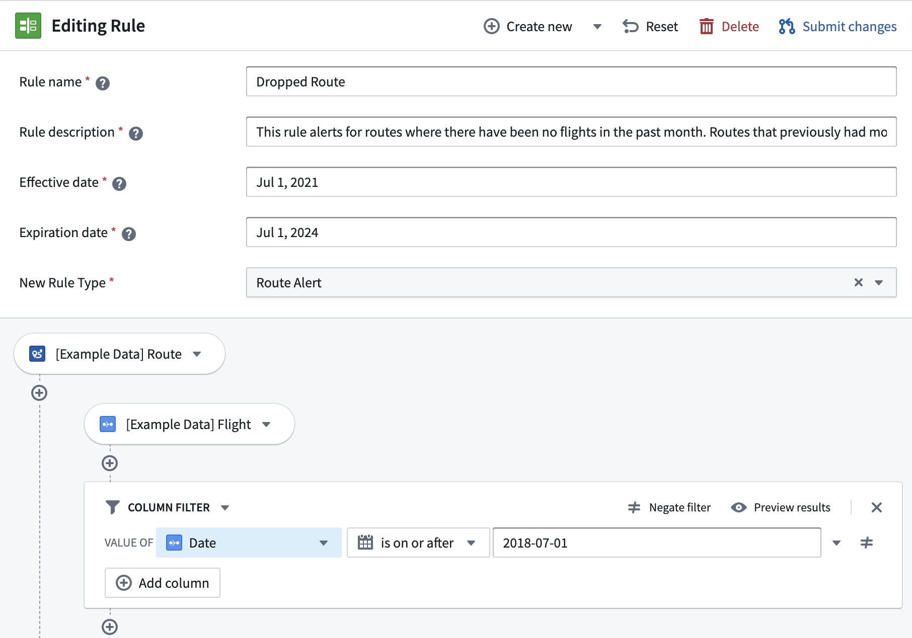
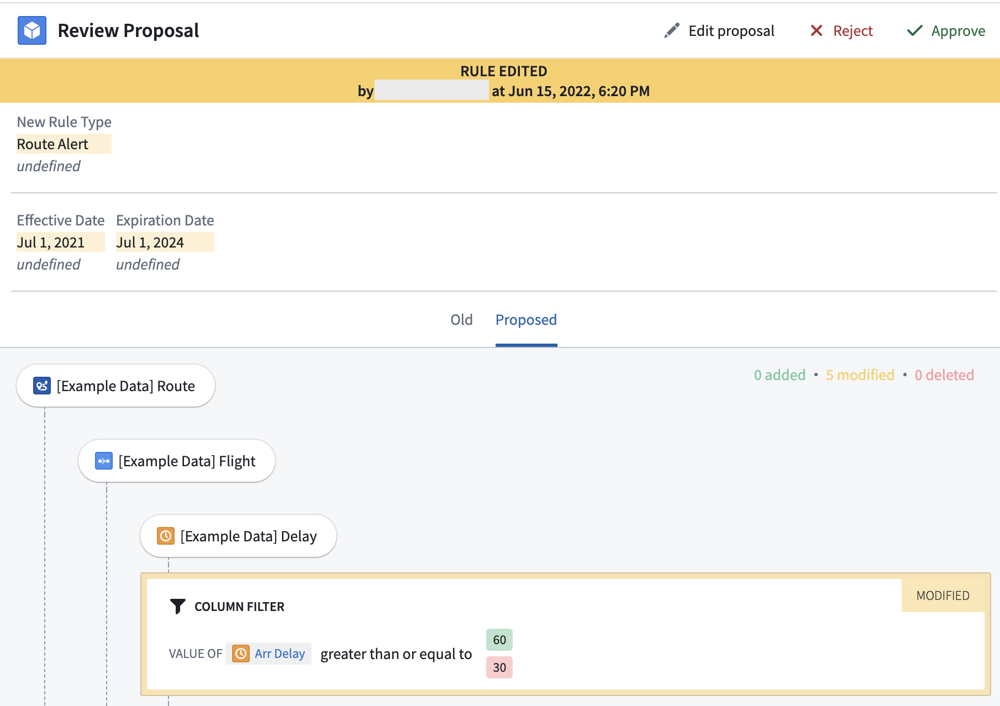

<!-- source: https://palantir.com/docs/foundry/foundry-rules/object-model/ · mirrored 2026-08-22 from Palantir Foundry docs -->

# Object model

There are two primary object model concepts that are relevant to Foundry Rules:

* [Rules](#rules), which are applied to data, and
* [Proposals](#proposals), which provide a means by which rules can be changed.

### Rules

Rules are standard objects consisting of:

* A collection of *rule metadata properties* such as name, description, author, rule type, etc.
* A collection of *custom properties* to be applied to the filtered dataset or passed to the transform.
  * For “alerting” patterns, these might be `alert_severity`, `alert_assignee`, or `priority`.
  * For “categorization” patterns, these might be `group`, `sub-group`, etc.
* A *logic property* containing the match conditions for that rule.
  * The logic is stored as a compressed JSON blob that conforms to a specific grammar for consistent serialization.

Learn how to [customize properties](/docs/foundry/foundry-rules/add-a-custom-property/) for your own workflow.

### Proposals

Many rule management use cases have corresponding requirements for an audit and review process governing the creation, editing, and deletion of rules. To service these needs, Foundry Rules supports **rule proposals** as a method of submitting, reviewing, and monitoring changes to rules. Rule proposals are analogous to the software development concept of ["pull requests" ↗](https://en.wikipedia.org/wiki/Distributed_version_control#Pull_requests), such that each rule can have multiple proposals at a given time.

:::callout{theme="neutral"}
Proposals are a feature and not a requirement of Foundry Rules. Since Foundry Rules employs standard objects and Actions to create this approval flow, the workflow can be customized as desired to match any operational or regulatory requirements for rule change management.
:::

Proposals are represented as objects containing:

* The *rule ID* to be edited, created, or deleted.
* *Proposal metadata* such as the proposal author, timestamp, status (open, approved, rejected), and reviewer.
* The *diff of the changes* in the proposal (i.e. list of the changes), captured in properties: `old_rule_name`, `new_rule_name`, `old_logic`, `new_logic`, etc.

