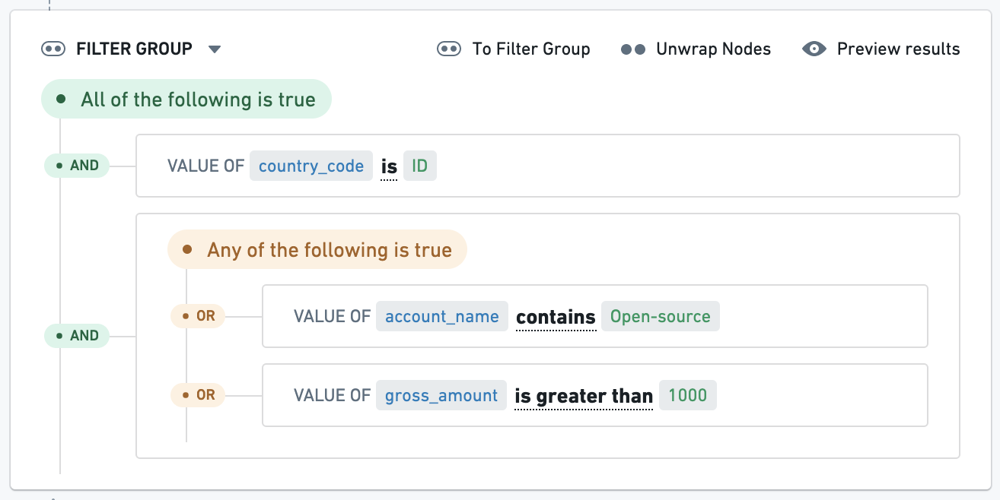

<!-- source: https://palantir.com/docs/foundry/foundry-rules/overview/ · mirrored 2026-08-22 from Palantir Foundry docs -->

# Foundry Rules

Foundry Rules (previously known as Taurus) enables users to actively manage complex business logic in Foundry with a point-and-click, low-code interface. With Foundry Rules, users can create rules and apply those rules to datasets, objects, and time series for a variety of use cases like alert generation or data categorization.

Foundry Rules comprises a set of components for creating, managing, and applying rules:

* A **rule** is a set of *conditions* that, taken together, can specify particular rows of data in a dataset.
* The **conditions** that form a rule apply to the columns of a dataset and can range from simple filters to complex aggregations, joins, or other operators.

The following pages describe several [core concepts](/docs/foundry/foundry-rules/core-concepts/) and provide instructions for how to [deploy](/docs/foundry/foundry-rules/deploy-foundry-rules/) and [customize](/docs/foundry/foundry-rules/customization/) Foundry Rules.

## Example use cases

Foundry Rules can simplify the process of managing use cases that involve complex sets of rules, such as:

* **Anti-Money Laundering (AML):** Flag suspicious transactions through rules targeting both per-transaction and aggregated metrics.
* **Equipment monitoring:** Raise alerts for potential equipment degradation based on sensor data (e.g. when certain measurements reach specific values).
* **Cohorting:** Categorize entities into groups or "cohorts" based on rules. For example, creating groups of customers with particular features for better targeted marketing.
