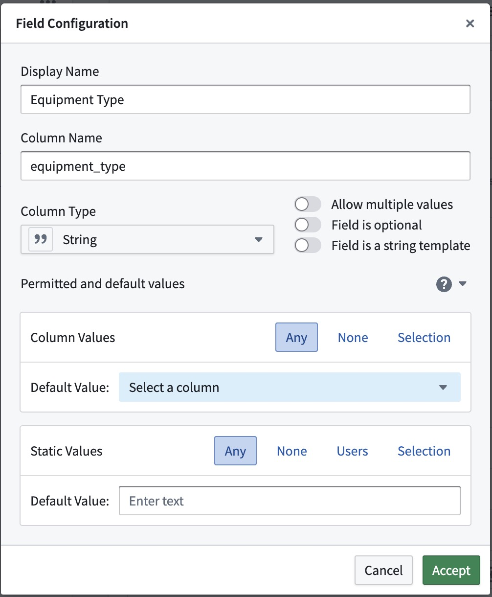
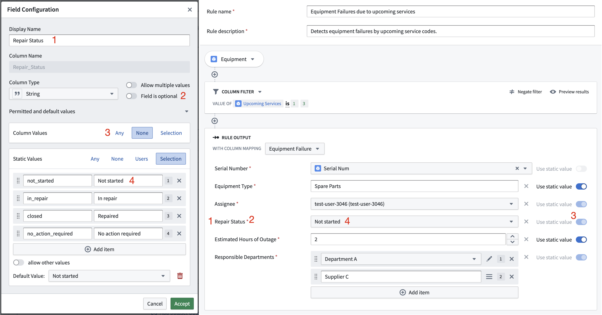
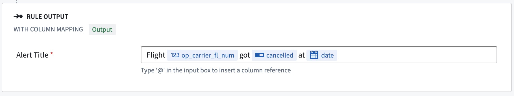

<!-- source: https://palantir.com/docs/foundry/foundry-rules/permitted-and-default-output-values/ · mirrored 2026-08-14 from Palantir Foundry docs -->

# Permitted and default output values

Workflow outputs specify the destination and format for the output of all the Foundry rules in the workflow. At the end of each rule in the **rule editor**, in the **rule output [logic block](/docs/foundry/foundry-rules/rule-logic/#logic-blocks)**, the author will assign a column or a static value to each workflow output. Assigning values ensures that the rule output is defined when its value is required and that the data can safely flow into the workflow output dataset with the correct data type.

The **Permitted and default output values** section can be used to streamline the assignment process and to further customize the rule output logic block. Default values will automatically be assigned when a new rule is created, and the option to assign either column or static values can be restricted to allow only one of the two value types.

The screenshot shows the standard configuration, which is the most permissive and does not specify any default values. The **Permitted and default output values** section will be collapsed unless any changes have been made to the standard configuration.

## Behavior and example use case

Each output field can have its own configuration. This is best illustrated by the following example:

If an `equipment failure alert` should link back to a specific equipment item, the field should be restricted to allow no static values (`None`) and only column values that are derived from the object property `Serial Num`.

Alerts are at the core of operational workflows, so they usually tie into a process. An equipment failure will require some kind of repair, so the alert can be in one of many possible states. The workflow output will have a field `Repair Status` (1), which is a required field (2) of type `String`. Let's assume some equipment failures have an automated service routine that is triggered together with the alert, but others require manual intervention. This information is something only the rule author can determine, so column values from the input data are disabled (3, `None`). The status needs to be set to one of multiple possible states (4) and should be `Not started` by default. The rule output logic block that the rule author will see reflects this configuration. The switch between static and column values is disabled, and a selection menu with all possible status options is shown.

## Configuration options

The configuration is split in two sections: column values and static values. Both sections depend on the output field type. If any configuration is incomplete or not satisfiable, an error icon will indicate the issue. The same error icon will indicate issues in the rule output logic block if the rule author provides values that are not compliant, such as an integer that is not within the required range.
For output values of type `String`, an option is available to make the field a string template. A string template is a combination of static and column values. If the **Field is a string template** option is selected, no further configurations are possible.

### Column values

Column values refer to values that come from a column of the underlying dataset after the rule logic has been applied. When the rule author write the rule logic, the actual data is not known and the output column can only be restricted by type or input property name. The following options can be configured for column values:

* **Any:** Any existing column can be assigned to this output field.
* **None:** This output field will only accept static values. Column references are not allowed.
* **Selection:** Any column of the specified set of column options can be assigned to this field.

### Static values

Static values refer to values that a rule author enters manually when creating or editing a rule. You can restrict these values so that they are within a number or date range or that inputs for multiple values have the correct length. Inputs for users and selection of values will be shown as dropdown menus so the rule author can enter the correct values more easily. The following options can be configured for static values:

* **Any:** Any value of the correct field type can be assigned to this output field.
* **None:** This output field will only accept column references. No static values are allowed.
* **Selection:** Any value of the specified set of values can be assigned to this output field. Optionally, other values may be allowed. Options will be displayed by their label.
* **Range:** Only static values that are within the specified range will be allowed. This option is available for numeric and date types only.
* **Users:** Any user of the specified set of Foundry Users can be assigned to this field. If no users are chosen, no restrictions will apply. This option is available for string types only.

For types that **allow multiple values**, the restrictions apply for each item in the input. For example, each integer in the input must be within the required range, each user must be one of the pre-selected users, or each item must be one of the labeled selection of items.
