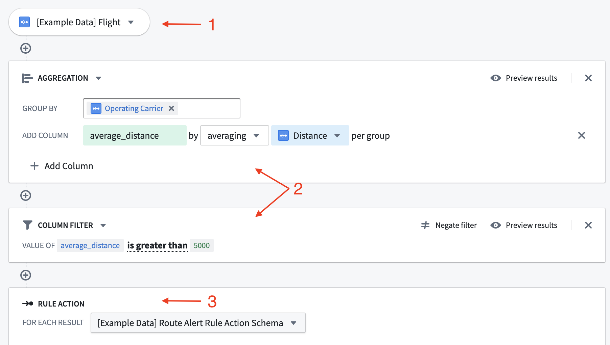
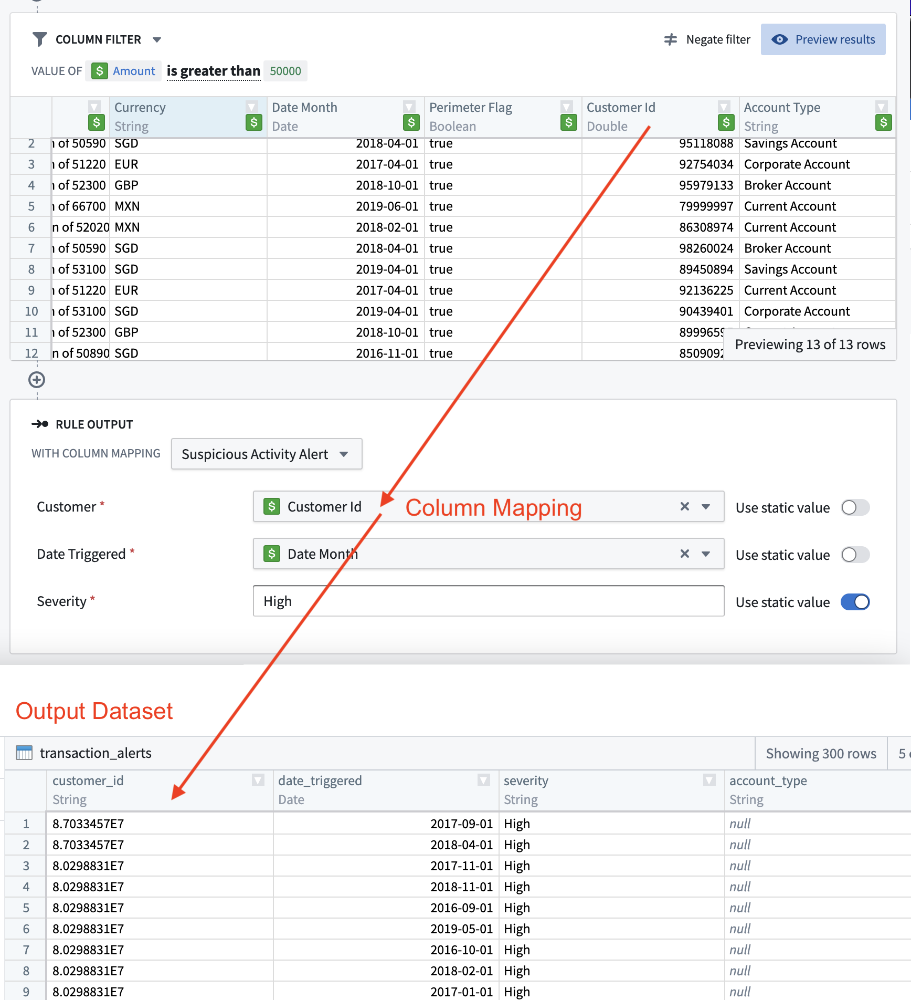

<!-- source: https://palantir.com/docs/foundry/foundry-rules/rule-logic/ · mirrored 2026-08-22 from Palantir Foundry docs -->

# Rule logic

Each Foundry rule has logic associated with it. This logic is formed of three parts:

1. [Inputs:](#inputs) The data inputs to a Foundry rule.
2. [Logic blocks:](#logic-blocks) The transformations to be applied to the selected input(s).
3. [Rule output:](#rule-output) The output format of the rule.

*All screenshots use notional data.*

## Inputs

The inputs to a Foundry rule can be either datasets or objects, depending on the use case. However, using objects as inputs provides a more user-friendly interface as well as extra features, such as autocomplete dropdowns for filter values.

The datasets and objects available to rule authors are configured by the workflow owner in the [Foundry Rules workflow configuration](/docs/foundry/foundry-rules/foundry-rules-workflow-configuration/).

:::callout{theme="warning"}
Foundry Rules does not support object types that are either backed by multiple data sources, have multiple materializations, or use edit-only properties.
:::

:::callout{theme="neutral"}
Objects backed by a restricted view cannot be used as inputs directly. Instead, configure the dataset which backs the restricted view as an [alternate backing dataset](/docs/foundry/foundry-rules/configure-workflow/#alternate-backing-datasets).
:::

## Logic blocks

The transformations applied to the rule's inputs are represented as a series of logic blocks. The available transformations include filtering, expressions, aggregates, and joins. It is also possible to configure which of these transformations are made available to the end user. Learn more about [enabling optional features](/docs/foundry/foundry-rules/enable-optional-features/).

Each logic block takes rows output from the previous block/source and applies the transformation, outputting a new set of rows and columns. The output can be viewed by clicking the **Preview** button in the top right of the block.

## Rule output

At the end of the rule is the rule output. Each rule output corresponds to an output dataset, as configured in the [Foundry Rules workflow configuration](/docs/foundry/foundry-rules/foundry-rules-workflow-configuration/). The selected output therefore specifies the destination and format for the rows output by the Foundry rule. The interface for each field may be [tailored to the type of values it accepts](/docs/foundry/foundry-rules/permitted-and-default-output-values/). *The output dataset produced will contain the rows output by all rules which use that output*. This behavior is designed to make it easier to achieve consistency in the output of different rules.

The rule output allows workflow owners to enforce the exact columns and types that rule authors must output from their logic. Visually, this enforcement is represented as a form where each form input corresponds to a column in the output dataset.

If different Foundry rules within the same application must output rows with different schema, then it is possible to configure a choice of several different rule outputs. Alternatively, if the schemas are similar, then it may be easier to configure some of the Action parameters to be optional, instead of creating a new rule Action.

Learn more about [configuring rule outputs](/docs/foundry/foundry-rules/foundry-rules-workflow-configuration/#workflow-outputs).

