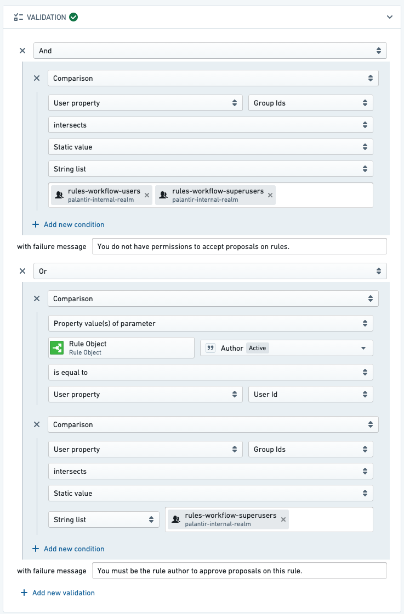
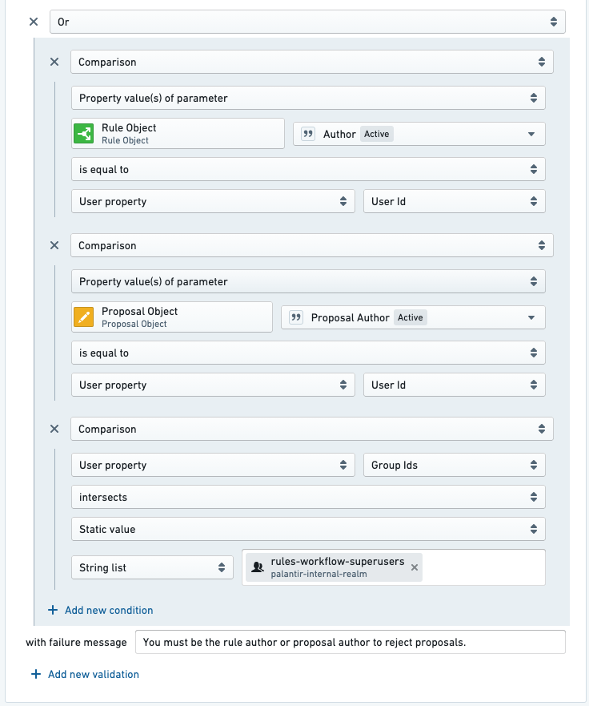

<!-- source: https://palantir.com/docs/foundry/foundry-rules/rule-permissions/ · mirrored 2026-08-22 from Palantir Foundry docs -->

# Permissions for editing rules

In some workflows, you may want to restrict the set of users that can edit or modify a rule. The following example shows how you can set up permissions so that a rule's author has final approval for any changes affecting their rule.

The permissioning setup is as follows:

* Only rule authors (and superusers) can approve proposals that edit their rules.
* Only rule authors (and superusers) can approve proposals that delete their rules.
* Only rule authors and proposal creators (and superusers) can reject proposals on the rule owner's rules.
  * To mitigate the issue of accidental proposals, proposal creators can also reject proposals. For example, if User A accidentally creates a proposal on User B's rule, User A is able to reject (effectively rescinding) that proposal.

Follow the steps below to achieve this permissioning setup:

1. Configure the *approve a proposal to edit a rule* Action so that users must either be the rule author associated with the proposal or a superuser.   
      

2. Configure the *approve a proposal to delete a rule* Action so that users must either be the rule author associated with the proposal or a superuser.

3. Configure the *reject a proposal* Action so that users must either be the rule author associated with the proposal, the proposal author, or a superuser.   
      

:::callout{theme="neutral"}
If you do not see an option to validate based on a rule object, you likely do not have the rule object added as a parameter to the Action. Add a new rule object parameter to the *reject a proposal* Action, just as you would add rule object parameters of other Foundry Rules actions.
:::
