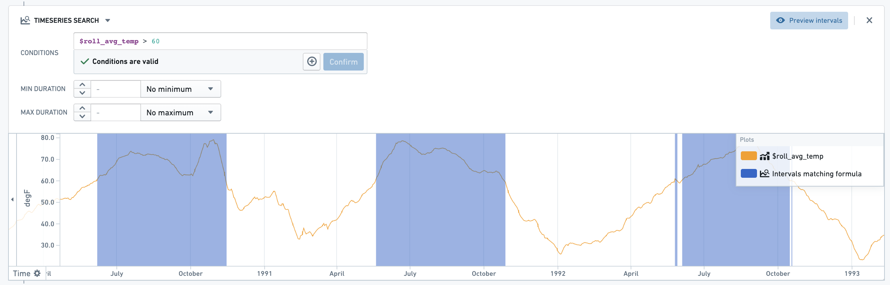

<!-- source: https://palantir.com/docs/foundry/foundry-rules/timeseries-concepts/ · mirrored 2026-08-14 from Palantir Foundry docs -->

# Time series rules \[Sunset]

:::callout{theme="warning" title="Sunset"}
Time series capabilities in Foundry Rules are in the [sunset](/docs/foundry/platform-overview/development-life-cycle/) phase of development and will be deprecated at a future date. Full support remains available. We recommend migrating your workflows to [time series alerting automations](/docs/foundry/time-series/alerting-overview/) for any new time series rules requirements.
:::

In addition to operating on datasets and objects, Foundry Rules enables users to manage rules that use time series data. With Foundry Rules, users can write rules that identify time periods of interest within the data. These time intervals are output as rows by the Foundry rules and can be consumed downstream, either for alerting or other use cases. Foundry Rules currently supports transforming existing time series; for example, using aggregates, formulas, and derivatives, as well as identifying intervals based on multiple criteria.

Foundry Rules builds on top of [time series](/docs/foundry/time-series/time-series-overview/) in Foundry and supports [time series properties](/docs/foundry/time-series/time-series-concepts-glossary/#time-series-property-tsp) and measures.

To use time series with Foundry Rules, follow the [deployment instructions](/docs/foundry/foundry-rules/deploy-timeseries-foundry-rules/).

## Time series boards

Rules can contain all the standard Foundry Rules [logic](/docs/foundry/foundry-rules/rule-logic/), as well as two types of time series boards: **Add Timeseries** and **Timeseries Search**.

### Add Timeseries board

The Add Timeseries board takes a series as input and produces a modified series which can then be consumed by later boards. A transformed series is defined using a name (1) and an operation (2), with the necessary configuration for that operation. For example, the board depicted below adds a new series `$baseline`, created using a rolling aggregate over 1000 days. The resulting time series can be previewed using the ‘Preview Timeseries’ button (3).

### Timeseries Search board

The Timeseries Search board produces intervals for every object in the input set based on the conditions specified. The conditions may reference both series linked to the original root object as well as any series created by previous **Add Timeseries** boards. Measures existing on the object are prefixed with `@`, while any series added as part of the rule are prefixed with `$`. The intervals matching the conditions can also be previewed using the ‘Preview Intervals’ button.

For every root object in the input, a set of matching intervals will be present in the output dataset as a series of columns containing the interval data: start time, end time, and duration.

