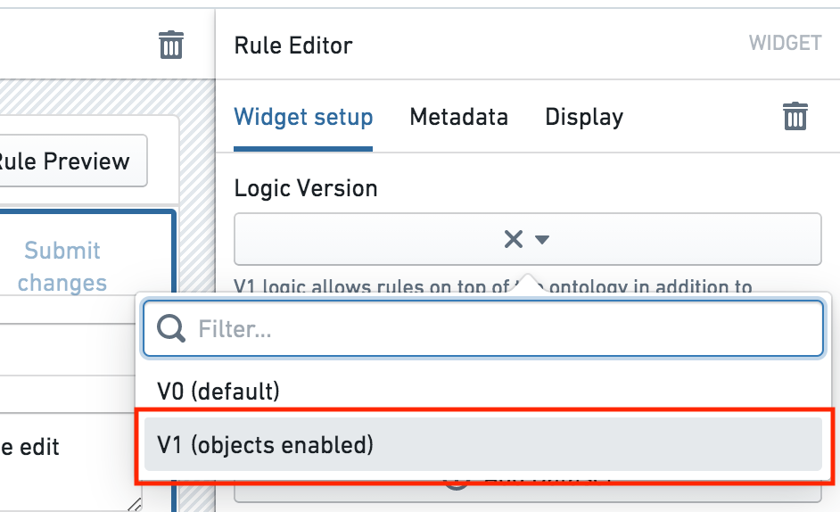
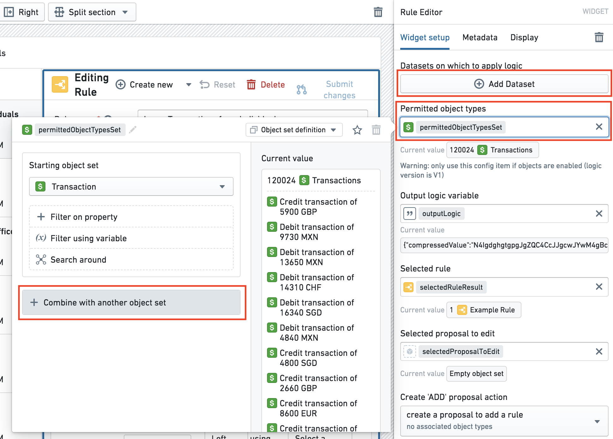
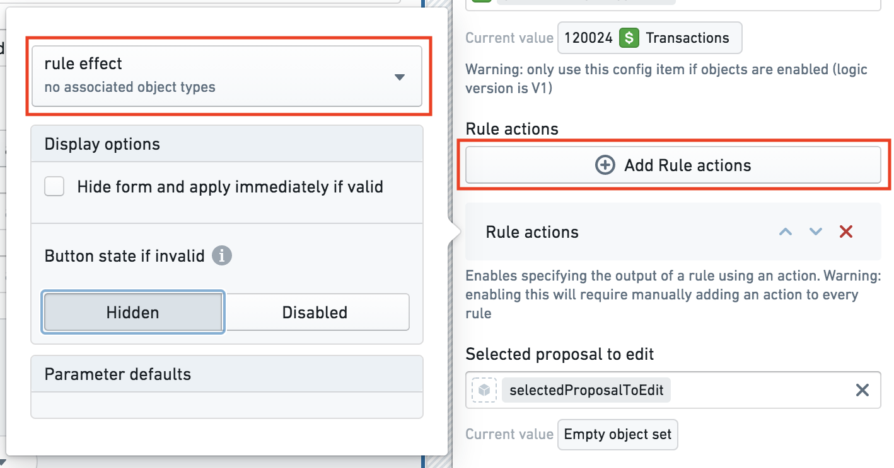

<!-- source: https://palantir.com/docs/foundry/foundry-rules/upgrade-to-use-rule-actions/ · mirrored 2026-08-22 from Palantir Foundry docs -->

# Upgrade to use rule Actions

:::callout{theme="warning"}
These steps are for legacy versions of Foundry Rules (previously known as Taurus). If you are just starting to deploy Foundry Rules, then the following steps are unnecessary and are already included as part of the [default setup](/docs/foundry/foundry-rules/deploy-foundry-rules/). Unless you have been specifically directed to this section, you likely do not need to follow these steps.
:::

Previously, Foundry Rules only supported dataset [inputs](/docs/foundry/foundry-rules/rule-logic/#inputs) to rules and had no concept of a [rule Action](/docs/foundry/foundry-rules/configure-rule-actions/). While authoring rules on objects is an optional feature, we strongly recommend upgrading to use **rule Actions**, especially if you upgrade to use objects.

To enable objects and rule Actions in Foundry Rules, follow the steps below:

*All screenshots use notional data.*

1. **Upgrade your Foundry Rules transforms library version:** Ensure that `tau-execution:tau-execution-core` is on *at least* version `0.60.4`, in the Project level `build.gradle` file:
   * `compile "com.palantir.tau-execution:tau-execution-core:0.60.4"`
   * If you cannot find the `build.gradle` file, then check the **Show hidden files and folders** option in the **Files** sidebar under the gear icon.

2. **Update the logic version:** Using edit mode in your Foundry Rules Workshop application, navigate to the **Rule Editor widget** and change the **Logic Version** to be "V1". While changing this selector has no destructive effects, it is not possible to change the version back to V0 after changing it to V1. However, there would be no benefit in returning to V0.

    

3. **Add objects to the Workshop application:** In the same Workshop application, add any object types you wish to make available within Foundry Rules to the **Permitted object types** object set variable. This variable should be a unioned object set of all the object types you wish to expose, as shown below.

   * If you are switching from a dataset to a corresponding object, then you should keep the dataset available in Foundry Rules until all of the existing rules have been migrated to use the object. However, there is no urgency to switch to using the object immediately, as the transform can continue to function with both declared.

    

4. **Add rule Actions:** After creating a suitable Foundry Action in the [Ontology Manager](/docs/foundry/ontology-manager/overview/), add the Action to the Workshop application by clicking **Add Rule actions**.

   Learn more about [configuring](/docs/foundry/foundry-rules/configure-rule-actions/) rule Actions.

    

   :::callout{theme="neutral"}
   After adding a rule Action to the Workshop configuration, all existing rules will require you to configure a rule Action the next time each of them are edited. However, it is important to note that even without a rule Action configured for each rule, the old transforms pipeline will continue to work. Therefore, there is no downtime associated with migrating, and the migration can be done at a pace that suits the users.
   :::

5. **Update the transforms pipeline code:** The simplest way to update the transforms pipeline is to update your existing instance of the rules workflow template within the Ontology Manager by adding the missing objects and Actions. Then, deploy the updated transform to use as a reference. After deploying the reference, you can [configure the transforms pipeline](/docs/foundry/foundry-rules/configure-transforms-pipeline/) to map this new code to your existing workflow.

   :::callout{theme="neutral"}
   As noted above, for the new transforms code to work, all rules must have a rule Action configured. Therefore, we recommend making the transform changes on a branch and testing those transform changes before merging.
   :::
