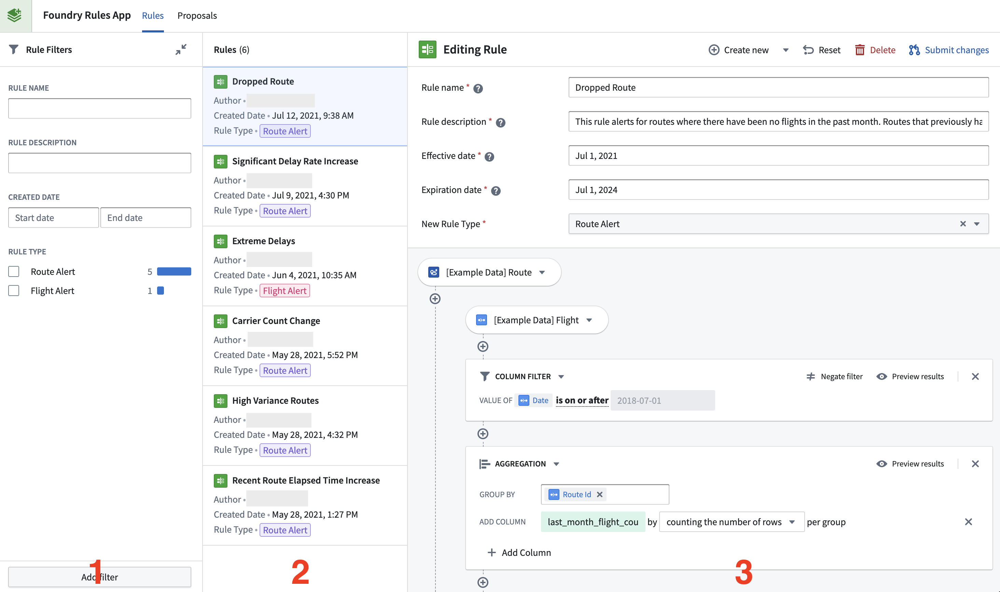
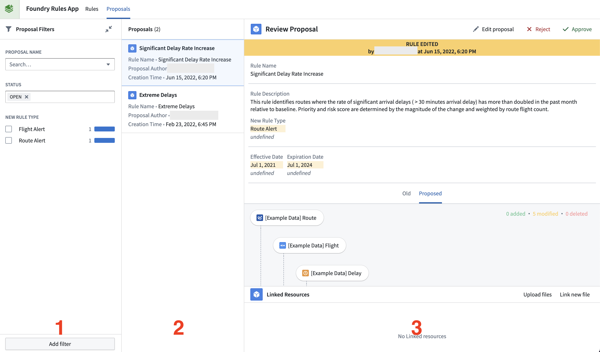

<!-- source: https://palantir.com/docs/foundry/foundry-rules/workshop-application/ · mirrored 2026-08-22 from Palantir Foundry docs -->

# Workshop application

A standard Foundry Rules application is a Workshop application that usually comprises two pages: the Rule Editor page and the Proposal Reviewer page.

* The **[Rule Editor](#rule-editor)** page is used for creating, editing, and deleting rules.
* The **[Proposal Reviewer](#proposal-reviewer)** page is used for reviewing and approving/rejecting rule proposals.

An additional **Rule Viewer** widget is available for creating a read-only rule logic viewer.

## Rule Editor

The purpose of the Rule Editor page is to allow for the creation and maintenance of rules. The following screenshot shows an example Rule Editor page consisting of the following widgets (numbered for identification):

1. **Filter list:** A selection of filters to filter the rules shown.
2. **Object list:** A list of existing rules that are filtered by the filter list (1) and can be selected to populate the Rule Editor (3).
3. **Rule Editor:** A widget that accepts a Foundry Action to create a proposal and auto-generates the required fields from parameters. The form elements displayed in the Rule Editor are determined by the Action configured in the Ontology for creating a new rule.   
      

After creating or editing a *rule*, the **Submit changes** button is used to create a new *proposal*. This proposal can be viewed and reviewed on the Proposal Reviewer page.

## Proposal Reviewer

The Proposal Reviewer page allows for the review and approval/rejection of rule proposals. Like the Rule Editor, it contains three sections (identified by number in the screenshot below):

1. **Filter list:** A selection of filters that change which proposals are shown (1).
2. **Object list:** A list of proposals (2) that are filtered by the filter list and can be selected to populate the Proposal Reviewer (3).
3. **Proposal Reviewer:** A widget that accepts Foundry Actions to approve or reject proposals. The widget shows a diff of the properties that have been edited, with changed values appearing in yellow and prior values in faded grey. When a user approves a proposal, the edits will be applied and the proposal will be either created, edited, or deleted (depending on the proposal).   
      
