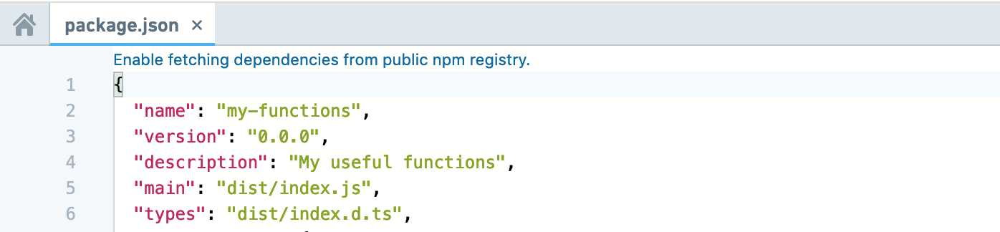
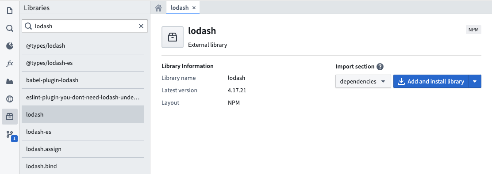
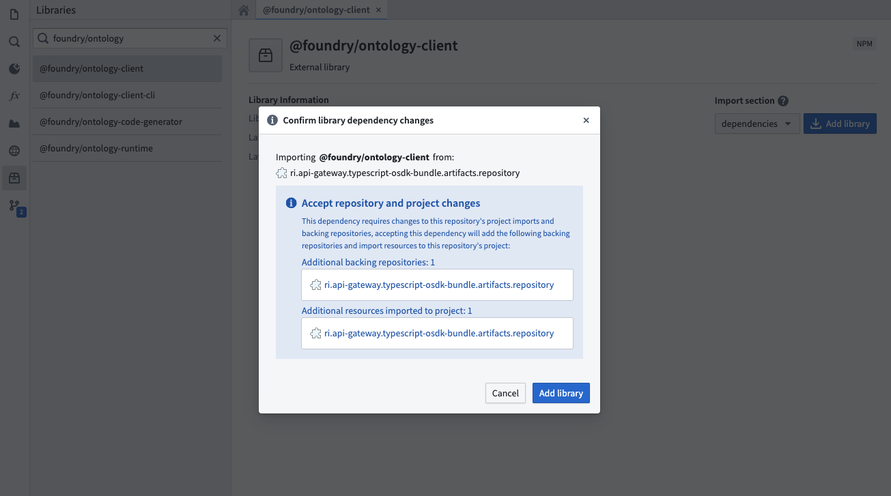
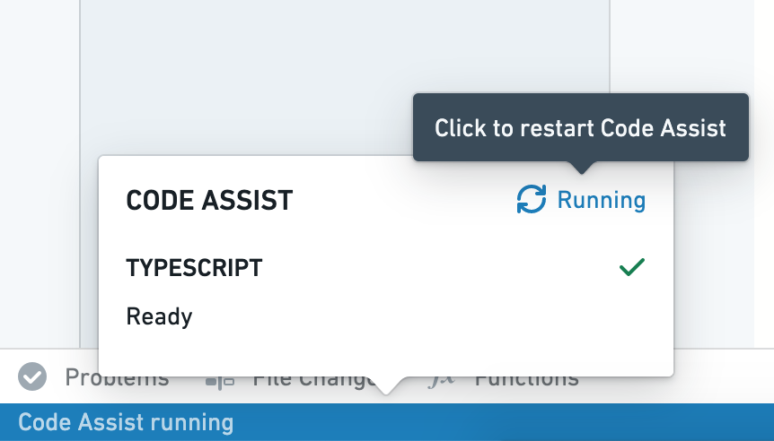

<!-- source: https://palantir.com/docs/foundry/functions/add-dependencies/ · mirrored 2026-08-18 from Palantir Foundry docs -->

# Add npm dependencies

:::callout{theme="warning"}
The following documentation is specific to TypeScript v1 functions. For more [robust capabilities](/docs/foundry/functions/language-feature-support/#typescript-v1-vs-typescript-v2), including support for Ontology SDK and configurable resource requests, we recommend [migrating to TypeScript v2](/docs/foundry/functions/typescript-v2-migration/).
:::

Functions repositories use [npm ↗](https://www.npmjs.com/) for managing dependencies, including packages for generating code based on the Foundry ontology and discovering functions in your code. You can use `npm` to install external dependencies into your repositories, using standard packages for purposes such as manipulating numbers and dates, performing statistical calculations, or working with data formats such as XML.

Note that the functions runtime only supports pure JavaScript libraries—any package that relies on a NodeJS runtime and makes system calls is not supported.

## Enable fetching dependencies from the public npm registry

By default, functions repositories do not fetch packages from the public npm registry.

If your repository does not already fetch dependencies from the public npm registry, a banner for enabling it will appear when you open a `package.json` file in Code Repositories.



## Add dependencies in Code Repositories

You can add packages to your functions repository using the Libraries sidebar in **Code Repositories**. Search for the desired package, and select a result to view details like the latest version. Results include packages from Foundry and <https://npmjs.com>.



Choose whether to add the package to `dependencies` or `devDependencies` in your `package.json` file. Select **Add and install library** to add the package to your repository.



If the package's originating repository is not yet configured as a backing repository, a dialog will prompt you to import additional resources. The **Add and install library** button automatically imports the package and its dependencies into your functions repository, updating your `package.json` and `package-lock.json`.

Once the running install tasks have finished, the package will be ready for use within your repository.

If you are using a `typescript-functions` template version lower than 0.520.0, installation through the task runner will be disabled. In this case, commit your updated `package.json` file, ensure checks pass successfully, then restart Code Assist to make the new package available.

## Manually add dependencies

You can manually add a package by modifying the `package.json` file in Code Repositories. This can be useful if you need to install a specific package version. Open `package.json`, add your dependency with a relevant version chosen from <https://npmjs.com>, and select **Commit**. After verifying that checks pass successfully, restart Code Assist to make the new package available.



Below is an example of adding the `d3-array` package manually to the `package.json` file in a repository:

```typescript
  "dependencies": {
    ...
    "d3-array": "^2.3.1"
  },
  "devDependencies": {
    ...
    "@types/d3-array": "^2.0.0"
  }
```
