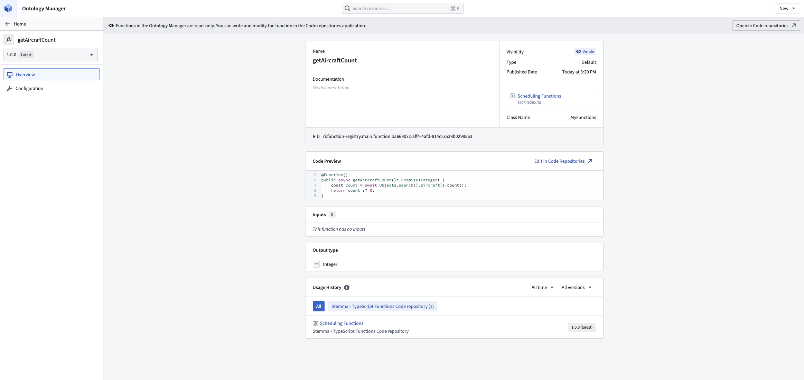
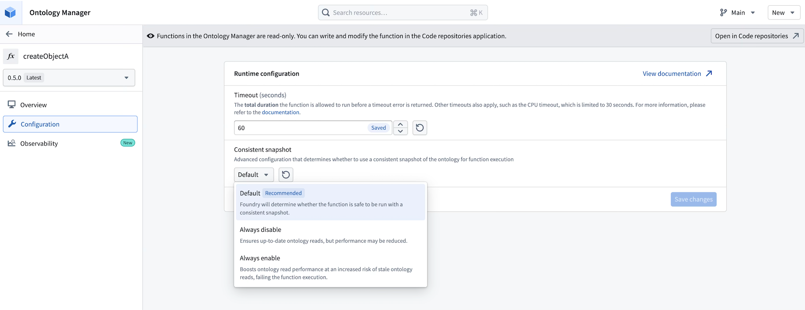

<!-- source: https://palantir.com/docs/foundry/functions/enforced-limits/ · mirrored 2026-08-18 from Palantir Foundry docs -->

# Manage published functions

Once published, all types of functions can be viewed and managed using the **Ontology Manager**.

## Searching for functions

To search for functions, navigate to the **Ontology Manager** and select the **Functions** tab.
You can search for functions by most metadata on the function, including but not limited to the function name, description, API name and RID.

## Function overview page

In Ontology Manager, select a function to view its inputs, outputs, usage history, and [function metrics](/docs/foundry/functions/function-metrics/), including success and failure counts and P95 execution duration.

## Function configuration page

Some types of functions allow you to configure resources such as timeouts or memory limits.
If your function supports any configuration options, you can view and edit them in the **Configuration** tab.
If this tab is not present, the function does not support any configuration options.

:::callout{theme="neutral"}
Configuration overrides are applied on a per-function version basis. Depending on the application from which you publish your function, new versions may have the default configuration and you may need to reapply any configuration overrides.
:::

For example, you can configure the timeout on a TypeScript function as seen in the following image.

### Configuration inheritance

Functions provide out-of-the-box support for inheriting configuration overrides when publishing new versions. The configuration is inherited from the prior stable version according to the semantic version specification. If publishing a non-stable version, configurations will be inherited from the prior version, regardless of whether it is a stable release.

Configuration inheritance requires your repository to contain updated template configurations. You can check the hidden `templateConfiguration.json` file to confirm the version your repository is on.

* For TypeScript v1 functions repositories, you must have `parentTemplateVersion >= 3.512.0`
* For Python functions repositories, you must have `parentTemplateVersion >= 0.423.0`

## Consistent snapshots

Function-backed actions automatically use one ontology snapshot for all read requests in a single run.

Consistent snapshots provide the following qualities:

* **Data consistency:** Without snapshots, sequential ontology queries within a function could return different versions of data if the underlying data changed between requests. With snapshots, your function operates on a consistent view of the ontology, similar to snapshot isolation in a database transaction.
* **Improved performance:** Reusing a single snapshot across all ontology requests significantly improves ontology read performance. A single function-backed action, along with any queries within, receives this benefit.

### Snapshot configuration

If you need to explicitly manage snapshots for advanced use cases, you can configure the snapshot behavior on the [function configuration page](#function-configuration-page) using the following options:

* **Default (recommended):** Leave this option selected unless you encounter snapshot-related errors.
* **Disable snapshots:** Use when you need the freshest data on each query during a run, or when you are hitting snapshot errors due to long-running workloads.
* **Enable snapshots:** Use when you need a consistent point-in-time view across all reads and want better read performance, and your function can tolerate data not updating mid-run. This is not recommended for most use cases.

:::callout{theme="warning"}
By default, functions with sources run against live data without snapshots. Enforcing snapshots is not recommended since functions can perform writes or invoke external systems.
:::

## Enforced limits

Several limits are in place to prevent functions from consuming too many resources when they are executed.

### Time limit

Functions are limited to **60 seconds** of elapsed run time by default. These limits can be modified on the [function configuration page](#function-configuration-page).

Functions are allowed to run for up to **280 seconds** when running in live preview, even if modified on the function configuration page.

Functions executed through [Automate](/docs/foundry/automate/overview/) run asynchronously for up to **4 hours**, exceeding the standard execution limits.

:::callout{theme="warning"}
TypeScript v1 functions are additionally limited to **30 seconds** of CPU time, which is not configurable. When a function exceeds this threshold, the cause is often inefficient data loading logic. Refer to the section on [optimizing performance](/docs/foundry/functions/optimize-performance/) for tips on how to avoid CPU timeouts.
:::

### Memory limit

Memory limits differ between TypeScript v1, TypeScript v2, and Python functions.

#### TypeScript v1

Function execution is limited to **128 Megabytes** of memory usage. This limit is rarely reached; often, functions run into time limits or object loading limits before memory limits.

#### Deployed Python functions

Deployed Python functions have **2 Gigabytes** of memory usage by default. Currently, deployed Python functions cannot configure memory usage on the function configuration page.

#### Serverless Python and TypeScript v2 functions

Serverless functions have **1024 Mebibytes** of memory usage by default. This can be configured from **512 Mebibytes** to **5120 Mebibytes** on the [function configuration page](#function-configuration-page).

### Multithreading

For TypeScript v1, function execution is on a single thread, allowing only one computation at any given time. However, you can parallelize loading of object sets or links. Refer to [optimizing performance](/docs/foundry/functions/optimize-performance/) for more information.

For TypeScript v2 and Python functions, you can use multithreading with the built-in Node.js `worker_threads` and Python `threading` libraries.

### Object set limits with TypeScript v1

When using [object sets](/docs/foundry/functions/api-object-sets/), calling `.all()` or `.allAsync()` will throw an error if:

* More than **100,000 objects** are loaded at once from the object set. In general, even loading tens of thousands of objects will run into time limits or memory limits. For use cases where you are running into this limit, consider fetching summary data using [aggregations](/docs/foundry/functions/api-object-sets/#computing-aggregations) or fetching a subset of objects using [ordering and limiting](/docs/foundry/functions/api-object-sets/#ordering-and-limiting).
* More than **3 [search arounds](/docs/foundry/functions/api-object-sets/#search-around)** are used at once.

Some aggregation and bucketing operations have limits. See the [aggregations](/docs/foundry/functions/api-object-sets/#computing-aggregations) section for details.
