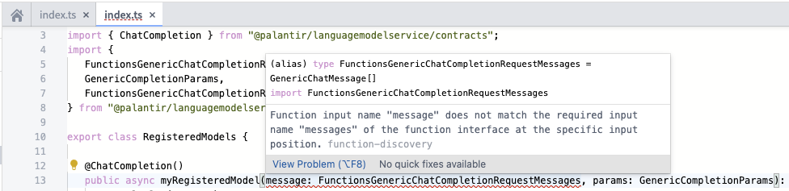
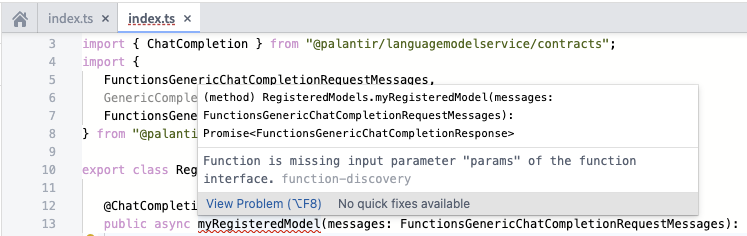
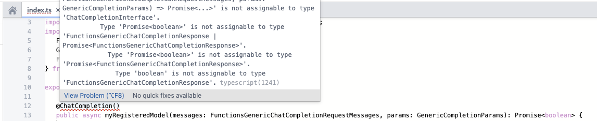

<!-- source: https://palantir.com/docs/foundry/functions/function-interfaces/ · mirrored 2026-08-18 from Palantir Foundry docs -->

# Function interfaces

**Function interfaces** allow function authors to integrate their custom logic with native Foundry features and offer a powerful way of defining contracts between consuming applications and functions.

Function interfaces define how an application or user should interact with a function. This includes the function’s inputs, outputs, and errors. In other words, a function interface describes a function’s signature, but a function interface is not itself a function. Function interfaces are designed to be implemented by functions.

Some Foundry applications use function interfaces to provide specialized behavior when executing functions which implement the interface, given the known inputs, outputs, and errors. Users can provide their own implementations of certain function interfaces, and Foundry can continue providing this specialized behavior. Applications within Foundry which depend on certain function interfaces can discover all functions which implement that interface.

For example, AIP Logic depends on function interfaces to allow users to bring their own LLMs into Logic functions. Specifically, the [Use LLM](/docs/foundry/logic/blocks/#use-llm) block in AIP Logic allows users to select Palantir-provided LLMs or *registered* LLMs. Registered models are user-authored functions that have implemented a function interface provided by Foundry; for instance, the chat completion function interface. This allows AIP Logic to discover functions that have been explicitly defined as being an implementation of a chat completion, have a signature typical of a generic LLM, and return errors which AIP Logic can handle appropriately. In the future, user-provided chat completion implementations will be usable in other parts of the platform, such as Pipeline Builder and Model Catalog.

[Learn how to register LLMs with the registered models feature.](/docs/foundry/aip/bring-your-own-model/) For the legacy method using function interfaces, see [Register an LLM using function interfaces \[Legacy\]](/docs/foundry/aip/chat-completion-function-interface-quickstart/).

## Palantir-provided function interfaces

The following list contains the function interfaces currently provided by Palantir:

* [`ChatCompletion`](#chatcompletion)

### `ChatCompletion`

**Description:** 

* Functions which generate contextually relevant text responses based on multi-turn and multi-user text conversation history.
* Ideal for conversational use cases.

**Foundry integrations:** 

* The *Use LLM* board in AIP Logic.
* Support in Pipeline Builder coming soon.

**Documentation:** 

* [**Register LLMs using function interfaces \[Legacy\]**](/docs/foundry/aip/chat-completion-function-interface-quickstart/)

## Type customization

To provide more flexibility, you are not limited to the provided types when implementing a function interface. In some cases, you may want to create your own [custom types](/docs/foundry/functions/types-reference/#structcustom-type). As long as a function is [compatible ↗](https://www.typescriptlang.org/docs/handbook/type-compatibility.html#comparing-two-functions) with the function defined on the function interface, the function will be accepted by the compiler and successfully published. If the function interface defines an input type for which all fields are optional, at least one common optional field must be shared when customizing the type.

```typescript
...
interface CustomParams extends GenericCompletionParams {
   modelSpecificParam?: string
}
...

// valid implementation
@ChatCompletion()
public async myRegisteredModel(
    messages: FunctionsGenericChatCompletionRequestMessages,
    params: CustomParams
): Promise<FunctionsGenericChatCompletionResponse> {
  ...
}
```

## Troubleshooting

Function interfaces are designed to be flexible and allow for a wide range of implementations. However, you may encounter errors when implementing a function interface. Here are some tips for TypeScript functions to help you avoid these errors when customizing your implementation.

### Error: `Function input name does not match the required input name of the function interface at the specific input position`

The input names of each parameter must match the input names defined on the function interface at each specific input position. As the linting suggests, ensure that each input name has the exact same input name as declared on the function interface at each position.



### Error: `Function is missing input parameter of the function interface`

This error arises if the implementing function does not include every required input defined on the function interface. To resolve the error, ensure each input declared on the function interface is included in the implementing function.



### Error: `Type {type1} is not assignable to type {type2}`

The compiler may reject the implementing function as not compatible with the function defined on the interface. If so, ensure your implementing function is [compatible ↗](https://www.typescriptlang.org/docs/handbook/type-compatibility.html#comparing-two-functions) with the function defined on the function interface by checking the structure of each type compared to the types defined on the function interface.


