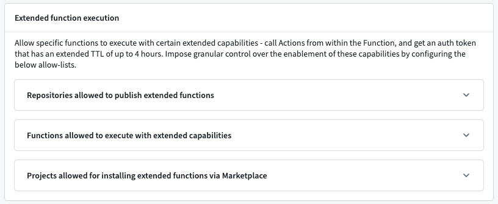

<!-- source: https://palantir.com/docs/foundry/functions/functions-settings/ · mirrored 2026-08-17 from Palantir Foundry docs -->

# Functions settings

The **Functions settings** page in [Control Panel](/docs/foundry/administration/control-panel/) allows administrators to manage a collection of settings that govern how functions behave within a specific [space](/docs/foundry/security/orgs-and-spaces/), with each setting controlling whether a particular capability is enabled as detailed in the sections below. To access the page, navigate to **Control Panel > Functions settings** for the space you want to configure.

## Extended function execution

The **Extended function execution** modal allows specific functions to execute with certain extended capabilities:

* Call [actions](/docs/foundry/action-types/overview/) from within the function.
* Obtain an authentication token with an extended time-to-live (TTL) of up to four hours.

Because these capabilities grant functions elevated access, the ability to extend function execution provides granular control over where they are enabled through a set of allowlists configured in the modal's collapsible sections. A function must satisfy the relevant allowlists before it can publish, execute, or install with those extended capabilities. Configure the following allowlists to control which repositories, functions, and projects can use extended function execution.

### Repositories allowed to publish extended functions

The repositories in this allowlist are the only repositories in the space that can publish functions with extended execution capabilities. To add a repository, select **Add** and search for the repository you want to allow.

### Functions allowed to execute with extended capabilities

The functions in this allowlist are the only functions that execute with extended capabilities. This list is checked at execution time, so a function must remain in the allowlist to continue executing with extended capabilities. New functions published from an allowlisted repository will automatically propagate to the functions allowlist. To add a function, select **Add** and search for the function you want to allow.

### Projects allowed for installing extended functions via Marketplace

The projects in this allowlist are the only projects where [Marketplace](/docs/foundry/marketplace/overview/) installation succeeds for functions that have extended execution capabilities. To add a project, select **Add** and search for the project you want to allow.
