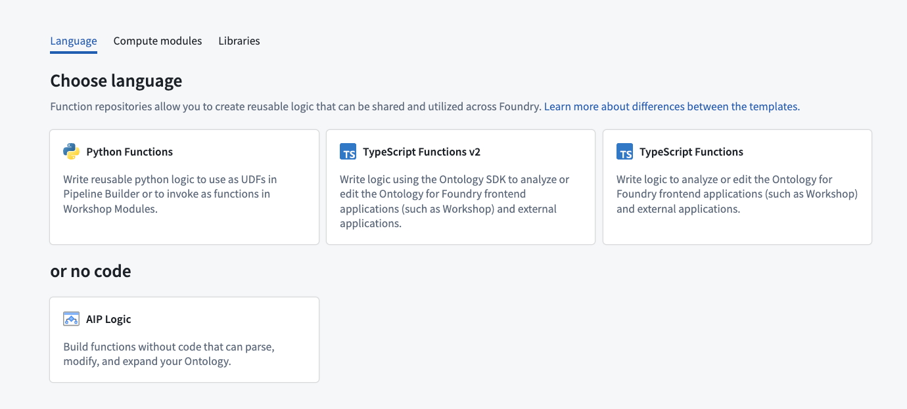
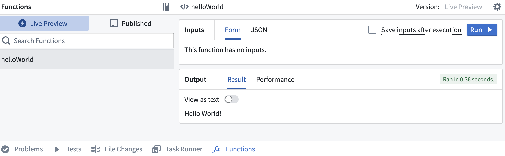
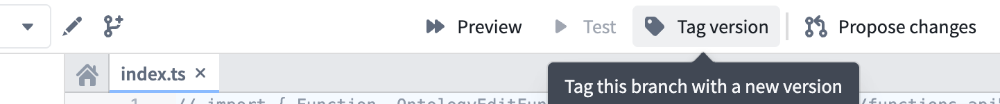
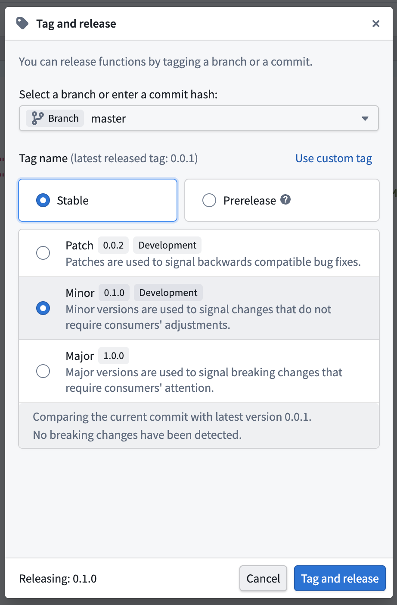
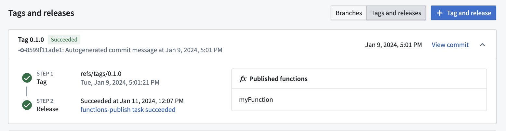
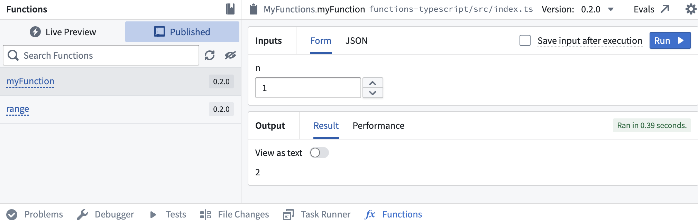

<!-- source: https://palantir.com/docs/foundry/functions/getting-started/ · mirrored 2026-08-18 from Palantir Foundry docs -->

# Getting started with functions

:::callout{theme="neutral"}
You can author functions repositories in [VS Code workspaces](/docs/foundry/vs-code/overview/) with the same interface and tooling. VS Code workspaces support live preview, resource imports, SDK generation, and release management.
:::

There are three language options for getting started with functions in Foundry; TypeScript v1, TypeScript v2, and Python. For more information on supported features for each language, review the [language feature support](/docs/foundry/functions/language-feature-support/) specifications.

Although each language has a different set of supported features, you will be able to access the same basic platform functionality for each language, including running, testing, and publishing functions. This page provides an overview of these features to help you understand how to use functions repositories, regardless of which language you will be working with.

For more detailed instructions on getting started with a specific language, refer to the tutorials below:

* [Getting started with TypeScript v1 functions](/docs/foundry/functions/typescript-v1-getting-started/)
* [Getting started with TypeScript v2 functions](/docs/foundry/functions/typescript-v2-getting-started/)
* [Getting started with Python functions](/docs/foundry/functions/python-getting-started/)

Review the sections below for general information on functions repository creation and usage.

## Create a functions repository

When creating a functions repository, you will be able to choose the language that best suits your needs. You can initialize functions repositories directly from a project of your choice by selecting **+ New > Repository**, or from the Code Repositories application by selecting **+ New repository** in the top right. Once the repository has been initialized, you can add and run functions.

For detailed instructions on how to create a functions repository for a specific language, refer to the tutorial sections below:

* [Create a TypeScript v1 functions repository](/docs/foundry/functions/typescript-v1-getting-started/#create-a-typescript-v1-functions-repository)
* [Create a TypeScript v2 functions repository](/docs/foundry/functions/typescript-v2-getting-started/#create-a-typescript-v2-functions-repository)
* [Create a Python functions repository](/docs/foundry/functions/python-getting-started/#create-a-python-functions-repository)

## Development environment options

You can develop functions repositories in either Code Repositories or VS Code workspaces:

* **Code Repositories:** The web-based IDE described in the sections below.
* **VS Code workspaces:** Use live preview, import resources, generate SDKs, and manage tags and releases. To open a repository in a VS Code workspace, select **Edit in VS Code** in the header.

[Learn more about VS Code workspaces.](/docs/foundry/vs-code/overview/)

## Test in live preview

The functions live preview allows you to test your functions before committing them to your repository. You can run a function in live preview after adding it to your repository. To do so, open **Functions** on the bottom toolbar and select **Live Preview**. Choose a function, enter input values, and select **Run** to run the function.

:::callout{theme="warning"}
Live preview runs in a different runtime environment than published functions. Differences include CPU resources, available memory, and how long a function can run before timing out.   
[Manage the runtime environment for published functions.](/docs/foundry/functions/manage-functions/)
:::

Select **Commit** in the upper right to commit your changes to the `master` branch of your repository.

## Publish your functions

Once you commit your work, you will see the option to **Tag version**. This will publish all of the functions in your repository to the functions registry, [making them accessible across the platform](/docs/foundry/functions/use-functions/).

Select **Tag version** to tag a release off of the `master` branch. Set the tag name based on the extent of your changes, then choose **Tag and release**.

To view progress as your functions are tagged and released, select the **View** pop-up or navigate to the **Tags** tab. Once **Step 2: Release** is completed, select the published functions to view them in the functions registry.

:::callout{theme="warning"}
Functions may not be immediately searchable by name in Workshop or the functions registry while permissions propagate.
:::

## Run your function

After the checks for your tag have passed, navigate back to the **Code** tab in Code Repositories and select **Functions** from the bottom toolbar. You should see your new function under the **Published** section. Select it, and try running the new function:

[Learn more about leveraging functions across the platform.](/docs/foundry/functions/use-functions/)
