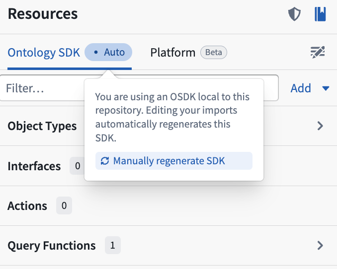
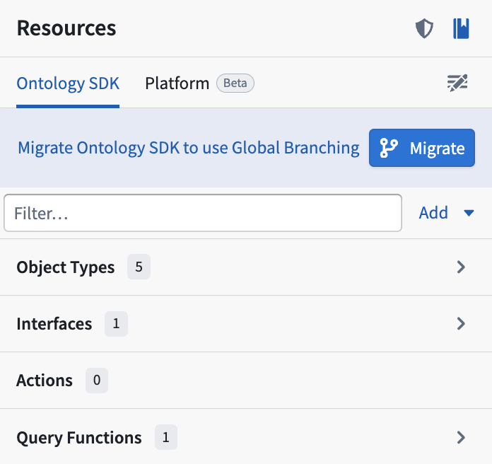

<!-- source: https://palantir.com/docs/foundry/functions/local-sdks/ · mirrored 2026-09-05 from Palantir Foundry docs -->

# Local Ontology SDKs

TypeScript v2 functions support a **local Ontology SDK**, where the OSDK is automatically generated from your resource imports rather than manually versioned and installed as a separate package. This means SDK types are always up-to-date with the latest resource imports. Local SDKs are required for full [Global Branching](/docs/foundry/global-branching/overview/) support.

## Set up a new local SDK

If this is your first time creating a local SDK for your repository, follow the steps below:

1. Open the **Resources** side panel in Code Repositories or VS Code.
2. From the bottom right corner of the panel, choose **Select**. A **Modify Import Resources** tab will open in your code editor.
3. Select an available Ontology from the dropdown menu.
4. From the side panel, choose the object types, link types, interface types, and other entities to import.



As you add entities from the Ontology, the SDK will automatically update to a new version and code bindings will generate within your repository. You can then import Ontology entities from the SDK package (for example, `@ontology/sdk`) and use them in your function signatures. When you tag a version of your function, the SDK is generated in CI and bundled with your function version, reflecting the state of the Ontology at the time of tagging.

## Generate the SDK from the command line

If you are not using VS Code, you can generate and regenerate the local SDK using the `./rune` command line tool. First, prepare the development environment:

```bash
./rune env prepare
```

To generate the SDK for the first time, provide a package name:

```bash
./rune sdk generate --sdk-package-name ontology
```

The package name determines the import path for Ontology entities in your code (for example, `import { MyObjectType } from "@ontology/sdk"`). You can choose any package name, but `ontology` is the default convention.

To regenerate the SDK after changing your resource imports:

```bash
./rune sdk generate
```

If `./rune` is missing from your repository, run `.palantir-scripts/install-rune` to install it.

## Migrate an existing repository to a local SDK

To migrate a repository from a standalone SDK to a local SDK:

1. Find the `functions.json` file in your repository, then set `useSdkSidebar` to `false`.

2. Navigate to the **Resources** side panel. Select **Migrate** at the top to generate a local SDK and commit the auto-generated changes to your repository's `package.json` and `package-lock.json` files.


