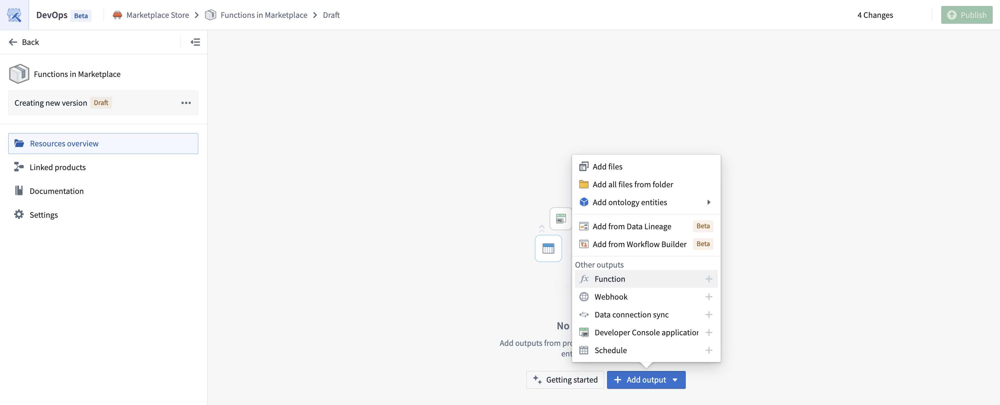
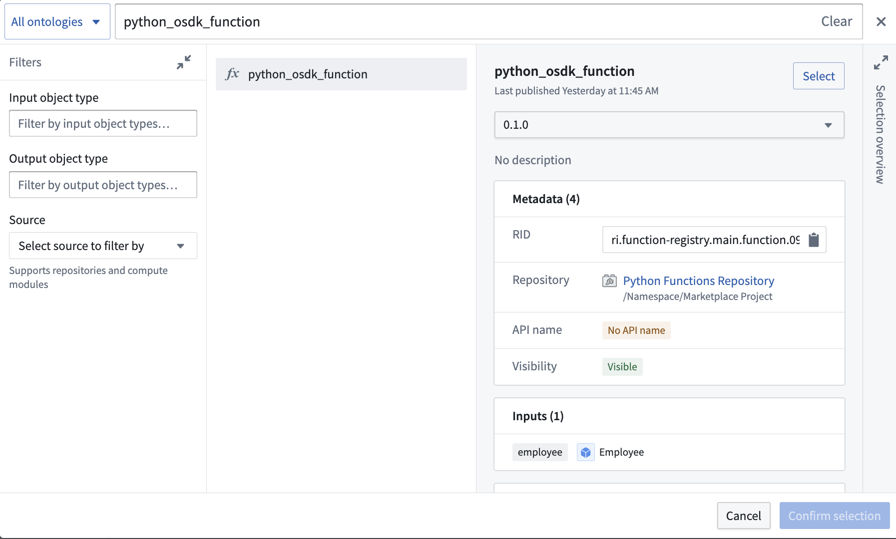

<!-- source: https://palantir.com/docs/foundry/functions/marketplace-functions/ · mirrored 2026-08-18 from Palantir Foundry docs -->

# Functions in Marketplace

You can use [Foundry DevOps](/docs/foundry/devops/overview/) to include your functions in [Marketplace products](/docs/foundry/devops/core-concepts/#product) for other users to install and reuse.

## Adding functions to products

To add a function to a product, [create a product](/docs/foundry/foundry-devops/create-products/). Then, add a function output as shown below.



You will be prompted to choose a function and a version.



### Including source code for code repositories

When packaging a function authored in a code repository, the backing repository will be automatically included as an additional output in the product. While you can choose to package the code repository with its source code, we generally discourage including source code for products not intended to be installed in [bootstrap mode](/docs/foundry/foundry-devops/create-products/#installation-mode). This is because a Marketplace-installed function does not need its backing source code to execute successfully. Additionally, code repositories are not guaranteed to compile or build out of the box.

If you want to make changes to a function post-installation (for example, to fix a bug or augment functionality), we recommend making those changes to the original function, releasing a new version of the Marketplace product, and then upgrading the installation. If you do not own the installed product, you should reach out to its maintainers with a bug report or feature request.

### Extended function execution requirements

Functions that use extended execution capabilities have additional Marketplace installation requirements. These capabilities include calling [actions](/docs/foundry/action-types/overview/) from within a function and obtaining authentication tokens with extended time-to-live (TTL). Before installation, an administrator must add the destination project to the **Extended function execution** allowlist under **Functions settings** in [Control Panel](/docs/foundry/administration/control-panel/).

For allowlist configuration instructions, see [Functions settings](/docs/foundry/functions/functions-settings/).

## Version and API name resolution

When a function is installed through Marketplace, there are two ways in which its version and API name are resolved: deduplication mode and stable mode.

### Deduplication mode

This is the historical and default behavior for resolving a function's version and API name when installed through Marketplace.

In deduplication mode, a function's version is resolved as follows:

* When a function is initially created by an installation, its first version is published at `0.1.0`.
* Upon subsequent installations such as upgrades, the function is published at its latest version incremented by a minor version. For example, if the latest version of the installed function is `1.1.0`, the next installation will publish at `1.2.0`.

:::callout{theme="info"}
[Function versions](/docs/foundry/functions/functions-versioning/) are immutable. In other words, once a version of a function is published, it cannot be mutated or overridden.
:::

The way a function's API name is resolved is as follows:

* If the API name is already bound to another function in the installation's Ontology, the API name will be deduplicated by appending an incrementing integer suffix. For example, if the API name `myFunction` is already taken, the function will be installed with API name `myFunction1`. If that API name is also taken, it will be installed with API name `myFunction2`, and so on.
* Once an API name exists on the installed function, the function maintains that API name through subsequent installations such as upgrades.

:::callout{theme="info"}
[Function API names](/docs/foundry/functions/query-functions/#api-name-validations) are unique per-Ontology. To be precise, if there already exists a function with an API name `myFunction` in an Ontology, no other function with the same API name can exist in that same Ontology.
:::

### Stable mode

:::callout{theme="neutral" title="Beta"}
Stable mode is in the [beta](/docs/foundry/platform-overview/development-life-cycle/) phase of development and may not be available on your enrollment. Functionality may change during active development. Contact Palantir Support to enable this on your enrollment.
:::

Versions and API names are an integral part of your function’s API. It is therefore desirable in many cases to preserve them when packaging and installing them through Marketplace. It is especially important when installing functions alongside upstream applications that reference function dependencies statically, as in [Developer Console applications](/docs/foundry/developer-console/marketplace-installation/).

In stable mode, a function's version is resolved as follows:

* The installed function is always published at its packaged version.
* If the version already exists for the installed function, an entirely new function will be created; the old function will be hidden and its API name will be removed.

:::callout{theme="info"}
Creating new functions to resolve version conflicts affects upstream applications. If an upstream application is part of the same installation, it is automatically updated to reference the new function. Otherwise, you will need to update it manually.
:::

A function's API name is resolved as follows:

* The installed function is always published with the API name it was packaged with.
* If the API name is already taken by another function, an installation error will occur. To resolve this conflict, you must delete the existing function or change its API name.

## Deployed functions

Functions either run in a serverless execution mode or are [deployed](/docs/foundry/functions/functions-deployed/) to a long-lived container. Marketplace packages the execution mode of a function's repository alongside the function itself, so an installed function runs the same way it ran in the environment where it was packaged.

### How Marketplace packages function execution mode

Function execution mode is configured per repository, which Marketplace packages *once* for all the functions backed by the same deployment.

For a repository in deployed mode, Marketplace captures the environment variables, resource requests and limits, scaling limits, and other key deployment configuration details.

Marketplace does not package the container image as a fixed value. Rather, the container image is resolved during installation from the version of the function being installed, so the installed deployment always runs the image of the installed function.

To package a function whose repository is in deployed mode, a deployment must exist for that repository, and it must be running the version of the function you are packaging. If it is not, packaging fails. To resolve this, start or update the deployment so that it runs the version you want to package or switch the repository to serverless execution.

### How Marketplace applies configuration during installation

When you install or upgrade a product, Marketplace applies the packaged execution mode and deployment configuration to the destination environment. This is equivalent to unlocking the installation and configuring execution manually to match the environment where the product was packaged.

If the packaged mode is *deployed*, Marketplace creates a deployment for the installed repository if one does not already exist, the packaged deployment configuration is applied to it, and the deployment is started.

If the packaged mode is *serverless*, Marketplace sets the installed repository to serverless execution. Marketplace stops the installation if a deployment already exists for that repository.

Serverless functions may not be available on every enrollment. If a product packages a function in serverless mode but serverless execution is not available in the destination environment, the function is installed in deployed mode instead. When this occurs, Marketplace creates and starts a deployment with the default configuration. This guarantees that the installed function is runnable as a deployed function.

:::callout{theme="warning" title="Compute costs"}
Deployed functions incur compute costs for as long as the deployment is running, while serverless functions only incur costs when executed. Therefore, a serverless function that is installed in deployed mode because the destination environment does not support serverless execution incurs the compute costs of a long-lived deployment.
:::

### Limitations of deployed functions in Marketplace

Deployed functions in Marketplace have the following limitations.

#### Only one version of a function can be deployed at a time

A deployment runs a single version of a function. When you upgrade a Marketplace product that contains a deployed function, the function is republished at a new version, and that new version is automatically deployed in place of the version that was previously deployed.

Products outside the installation being upgraded are not updated by that upgrade. If an external product, or one that is neither included in the Marketplace product nor part of a [linked product](/docs/foundry/marketplace/linked-products/), references a specific version of the deployed function, its reference continues to point at the old version. Since only one version of a function can be deployed at a time, any references to the old version of the function will return an error.

To avoid this, you must:

* Package the consumers of a deployed function in the same product or in a [linked product](/docs/foundry/marketplace/linked-products/) so that they are upgraded alongside the function.
* Use serverless execution where possible. Serverless functions can execute different versions of a function on demand, so an upgrade does not invalidate references to earlier versions.

#### Deployments restart during upgrades

Some changes to the long-lived container that backs a deployed function, such as updating the sources it is configured with, cannot be applied while that container is running. For this reason, the deployment may be stopped and started again each time it is upgraded as part of a Marketplace product upgrade, meaning the function may experience downtime.

## Static function inputs

:::callout{theme="warning"}
This feature is only supported in [TypeScript v1](/docs/foundry/functions/typescript-v1-getting-started/).
:::

It is possible to modify parts of a function’s behavior at install time by providing a locally defined function which overrides the "static" function input that is shipped with your Marketplace product. To do this, you can specify that a particular function may be overridden by using the `@Static` decorator.

```
import { Function, Static, Double } from "@foundry/functions-api";

export class MyFunctions {

    @Function()
    public async modifyNumberByStaticFoo(
        n: Double,
        @Static() staticFunctionInput: (num: Double) => Promise<Double> = this.defaultFoo
    ): Promise<Double> {
        return await staticFunctionInput(n);
    }

    private async defaultFoo(n: number) {
        return -n;
    }

}
```

When packaging a function, any static inputs will appear as function inputs during installation. Installers can then provide their own function logic that will override the default behavior.

:::callout{theme="warning"}
Calling [queries](/docs/foundry/functions/query-functions/) or [making API calls](/docs/foundry/functions/api-calls/) within overridden static functions is not supported.
:::

## Custom aliases

[Custom aliases](/docs/foundry/functions/custom-aliases/) store string values such as configuration parameters, feature flags, or environment-specific settings. When you add a function with custom aliases to a Marketplace product, the aliases automatically appear as configurable parameters under **Inputs**. Installers can set environment-specific values without modifying the function source code.

Custom aliases are supported in TypeScript v2 and Python functions. Unlike [static function inputs](#static-function-inputs), custom aliases:

* Work with both TypeScript v2 and Python
* Allow installers to configure string values rather than function logic
* Support descriptions and preset values in the Marketplace installation experience

For details on defining and using custom aliases in your functions, see [Custom aliases](/docs/foundry/functions/custom-aliases/).

## Model aliases

You can add functions that reference language models through [model aliases](/docs/foundry/functions/model-aliases/) to Marketplace products. Marketplace imposes specific limitations on these aliases.

:::callout{theme="warning"}
Model aliases cannot be remapped during installation. If the model referenced by an alias is not available in the target environment, the function fails to resolve the alias at runtime.
:::

Unlike [custom aliases](#custom-aliases), which appear as configurable parameters during installation, Marketplace resolves model aliases at runtime using the exact model RID configured in the source repository. Ensure that models referenced by aliases are available in every target environment where the product will be installed.

## Known issues

### Interface inputs in Marketplace functions

Functions that accept [interfaces](/docs/foundry/interfaces/interface-overview/) as input parameters may throw a `MarketplaceSdkObjectMappingNotFound` error in the target environment. Marketplace requires the SDK bindings to include concrete object types, not only interfaces.

If a function declares an interface input and the target environment contains objects of a concrete type that implements the interface, the SDK cannot find the concrete type mapping. The function then fails at runtime.

**Workaround:** Ensure that the concrete object type used in the target environment also exists in the source environment, then explicitly include it in the Marketplace-packaged SDK. This generates the required mapping so the function can resolve and use the object type.
