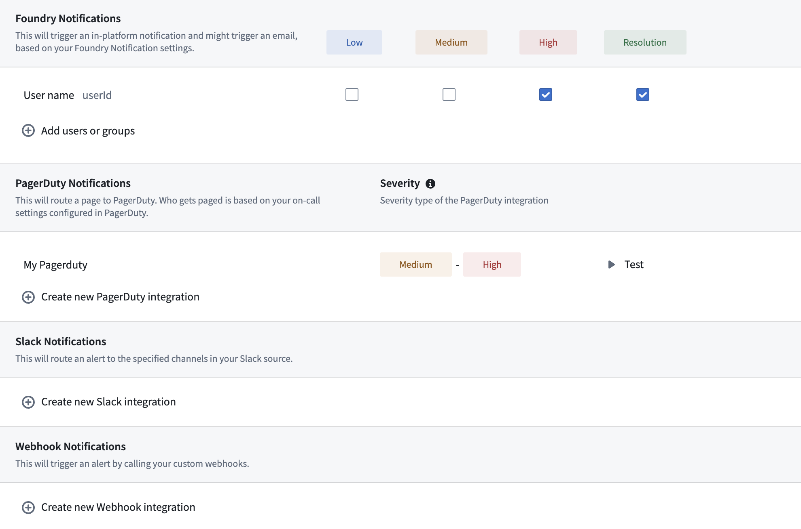
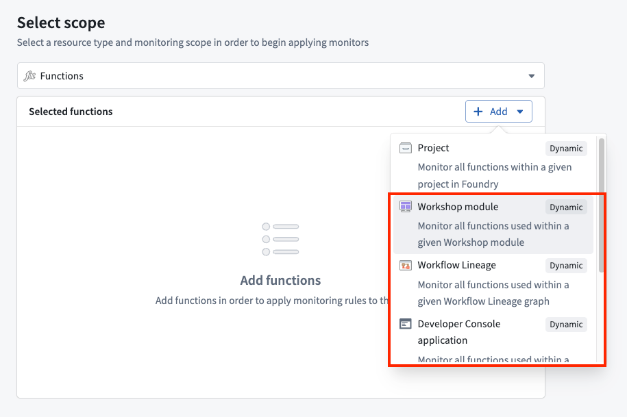

<!-- source: https://palantir.com/docs/foundry/functions/monitoring/ · mirrored 2026-08-22 from Palantir Foundry docs -->

# Function monitoring

Functions in Foundry can be monitored to track performance and reliability. This page explains the available monitoring capabilities for functions.

You can also view real-time [function metrics](/docs/foundry/functions/function-metrics/) in Ontology Manager, including success and failure counts and P95 duration for each function type.

## Available monitoring rules

Function monitoring in Foundry supports the following rule types:

1. **Function duration p95:** Alerts when the 95th percentile execution time exceeds thresholds.
2. **Number of function failures in window:** Alerts when the total failure count exceeds thresholds within a timeframe. This rule tracks all failure types.
3. **Number of user-facing function failures in window:** Alerts when the count of user-facing failures exceeds thresholds within a timeframe. This rule tracks only user-facing errors thrown by function code.
4. **Number of non-user-facing function failures in window:** Alerts when the count of non-user-facing failures exceeds thresholds within a timeframe. This rule excludes user-facing errors, making it useful for monitoring infrastructure and system-level failures.

For detailed configuration options and parameters for each rule type, review the [monitoring rules reference documentation](/docs/foundry/monitoring-views/rules-reference/#function-rules).

## Set up function monitoring

To set up monitoring for your functions, follow the standard process for creating monitoring views and rules:

1. Create a monitoring view as described in the [monitoring views overview documentation](/docs/foundry/monitoring-views/overview/#create-a-new-monitoring-view).
2. Add a monitoring rule for functions as described in the section on [adding a monitoring rule](/docs/foundry/monitoring-views/overview/#add-a-monitoring-rule).
3. Configure appropriate thresholds and severity levels.
4. Set up alert notifications following the [alert subscription guide](/docs/foundry/monitoring-views/overview/#subscribe-to-alerts).

### Dynamic scopes

Function monitors support **Workflow Lineage**, **Workshop**, and **OSDK application** as dynamic scopes. When you select one of these scopes, the monitor automatically tracks all functions the scoped resource uses and adjusts as functions are added or removed without requiring further intervention.

## Related documentation

* [Monitoring rules reference](/docs/foundry/monitoring-views/rules-reference/#function-rules)
* [Monitoring views overview](/docs/foundry/monitoring-views/overview/)
* [External system integration](/docs/foundry/monitoring-views/external-systems/) for alerts
