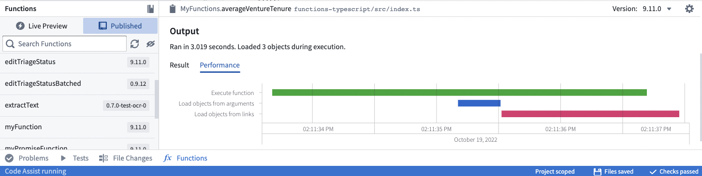

<!-- source: https://palantir.com/docs/foundry/functions/optimize-performance/ · mirrored 2026-08-22 from Palantir Foundry docs -->

# Optimize performance

This page describes best practices for optimizing function performance and resource usage. Following these guidelines helps minimize compute consumption and ensures your functions run efficiently.

:::callout{theme="info"}
For information about compute costs and how functions are metered, see [Compute usage with Ontology queries](/docs/foundry/ontologies/query-compute-usage/).
:::

## Understand function compute costs

The cost of a function has multiple components:

* **Overhead:** Each function execution has a fixed overhead of 4 compute-seconds, regardless of what it does.
* **Compute time:** The vCPU time the function needs to execute.
* **External calls:** Calls to other parts of the platform (Ontology queries, model inference, LLM calls) incur their own costs.

For more information about how compute-seconds are calculated and measured in the platform, see [Usage types](/docs/foundry/resource-management/usage-types/).

## Use the Performance tab

The performance tab provides a tool to analyze and identify performance issues with your functions.



The waterfall graph represents operations as horizontal bars stretched out across time on the X-axis. There are markers for each operation to indicate how time is spent.

* **Execute function** indicates CPU time spent executing the function code.
* **Load objects from arguments** and **Load objects from links** indicate the time spent calling the underlying Ontology backend database service (OSS).

To improve function performance:

* Use the Objects API to aggregate and traverse links more quickly than within function context (as described in [Prefer using the Objects API where possible](#prefer-using-the-objects-api-where-possible)).
* Ensure Ontology backend service calls are done in parallel to avoid sequential loads. If you have multiple `async`/`await` calls, use `Promise.all` to await all the calls in parallel.
  * For example, a common pattern is to use `.map()` on a list to create Promises, then use `Promise.all` on the resulting list.
  * **Important:** Using `Promise.all()` improves execution speed but does not reduce resource consumption or cost. You still make the same number of operations—they just run in parallel. Bulk operations are both faster and more cost-effective.
* Avoid unnecessary nested loops, which can increase execution time.

## Choose efficient input types

When designing functions, the type of input parameter you choose significantly affects performance. Use the most efficient input type that meets your requirements.

**Best practice:** Use object sets when possible for maximum efficiency and scalability.
**Acceptable:** Use object arrays when you need to work with objects in memory.
**Anti-pattern:** Single object parameters should only be used when your object type contains just one instance or when specific business logic genuinely requires per-object processing.

| Input type | Efficiency | Use case |
|------------|------------|----------|
| Object set | Best | Queryable set of objects; no upfront loading cost if you only need aggregations |
| Object array | Good | When you need to iterate over specific objects |
| Single object | Least efficient | When business logic requires processing one object at a time |

### Best practice: Object sets

Objects passed as parameters trigger Ontology queries to load the object data. Even a single object input triggers a call to load that object into memory.

**Object sets** are preferable because they defer loading until you actually need the data. If you only need an aggregation (like count or sum), the Ontology backend computes it without loading individual objects.

```python tab="Python"
from functions.api import function, Float
from ontology_sdk.ontology.objects import ExampleDataAircraft
from ontology_sdk.ontology.object_sets import ExampleDataAircraftObjectSet

# Less efficient: Single object triggers upfront loading

@function()
def get_aircraft_name(aircraft: ExampleDataAircraft) -> str:
    return aircraft.display_name

# Moderate: Array of objects triggers upfront loading

@function()
def get_aircrafts_names(aircraft_array: list[ExampleDataAircraft]) -> list[str]:
    return [aircraft.display_name for aircraft in aircraft_array]

# Most efficient: Object set defers loading until needed

# Here, only the aggregated value is loaded in memory of the function
@function()
def count_aircrafts(aircraft_set: ExampleDataAircraftObjectSet) -> Float:
    return aircraft_set.count().compute()
```

```typescript tab="TypeScript v2"
// getAircraftName.ts - Less efficient: Single object triggers upfront loading
import { Osdk } from "@osdk/client";
import { ExampleDataAircraft } from "@ontology/sdk";

export default function getAircraftName(aircraft: Osdk.Instance<ExampleDataAircraft>): string {
    return aircraft.displayName!;
}

// getAircraftsNames.ts - Moderate: Array of objects triggers upfront loading
import { Osdk } from "@osdk/client";
import { ExampleDataAircraft } from "@ontology/sdk";

export default function getAircraftsNames(aircraftArray: Osdk.Instance<ExampleDataAircraft>[]): string[] {
    return aircraftArray.map(e => e.displayName!);
}

// countAircrafts.ts - Most efficient: Object set defers loading until needed
// Here, only the aggregated value is loaded in memory of the function
import { ObjectSet } from "@osdk/client";
import { Integer } from "@osdk/functions";
import { ExampleDataAircraft } from "@ontology/sdk";

export default async function countAircrafts(aircraftSet: ObjectSet<ExampleDataAircraft>): Promise<Integer> {
    const result = await aircraftSet.aggregate({
        $select: { $count: "unordered" }
    });
    return result.$count;
}
```

```typescript tab="TypeScript v1"
import { Function, Integer } from "@foundry/functions-api";
import { ObjectSet, ExampleDataAircraft } from "@foundry/ontology-api";

export class MyFunctions {
    // Less efficient: Single object triggers upfront loading
    @Function()
    public getAircraftName(aircraft: ExampleDataAircraft): string {
        return aircraft.displayName!;
    }

    // Moderate: Array of objects triggers upfront loading
    @Function()
    public getAircraftsNames(aircraftArray: ExampleDataAircraft[]): string[] {
        return aircraftArray.map(e => e.displayName!);
    }

    // Most efficient: Object set defers loading until needed
    // Here, only the aggregated value is loaded in memory of the function
    @Function()
    public async countAircrafts(aircraftSet: ObjectSet<ExampleDataAircraft>): Promise<Integer> {
        const count = await aircraftSet.count();
        return count!;
    }
}
```

## Load objects efficiently

The common source of performance issues in functions comes from loading objects inefficiently. Loading objects one at a time in a loop causes a round-trip to the ontology on each iteration.

### Anti-pattern: Loading objects one by one

Loading objects inside a loop is an anti-pattern that significantly impacts performance. Each iteration makes a separate query to the Ontology:

```python tab="Python"
from functions.api import function
from ontology_sdk import FoundryClient
from ontology_sdk.ontology.objects import ExampleDataAircraft

# Anti-pattern: Objects loaded one by one in a loop

@function()
def for_loop_worst(pks_list: list[str]) -> int:
    client = FoundryClient()
    seats_count = 0

    for current_pk in pks_list:
        aircrafts = client.ontology.objects.ExampleDataAircraft.where(
            ExampleDataAircraft.object_type.tail_number == current_pk
        ).page()
        aircraft = aircrafts.data[0]
        seats_count += aircraft.number_of_seats or 0

    return seats_count

# Better: Load all objects in one call, then iterate

@function()
def for_loop_better(pks_list: list[str]) -> int:
    client = FoundryClient()
    seats_count = 0

    aircrafts = client.ontology.objects.ExampleDataAircraft.where(
        ExampleDataAircraft.object_type.tail_number.in_(pks_list)
    )

    for aircraft in aircrafts:
        seats_count += aircraft.number_of_seats or 0

    return seats_count

# Best: Let the backend perform the aggregation

@function()
def for_loop_best(pks_list: list[str]) -> int:
    client = FoundryClient()

    result = client.ontology.objects.ExampleDataAircraft.where(
        ExampleDataAircraft.object_type.tail_number.in_(pks_list)
    ).sum(ExampleDataAircraft.object_type.number_of_seats).compute()

    return int(result or 0)
```

```typescript tab="TypeScript v2"
// forLoopWorst.ts - Anti-pattern: Objects loaded one by one in a loop
import { Client, Osdk } from "@osdk/client";
import { ExampleDataAircraft } from "@ontology/sdk";
import { Integer } from "@osdk/functions";

export default async function forLoopWorst(client: Client, pks_list: string[]): Promise<Integer> {
    let seatsCount = 0;

    for (const currentPk of pks_list) {
        const fetchedPage = await client(ExampleDataAircraft).where({
            tailNumber: { $eq: currentPk }
        }).fetchPage();
        const aircraft = fetchedPage.data[0];
        seatsCount += aircraft?.numberOfSeats ?? 0;
    }

    return seatsCount;
}

// forLoopBetter.ts - Better: Load all objects in one call, then iterate
import { Client, Osdk } from "@osdk/client";
import { ExampleDataAircraft } from "@ontology/sdk";
import { Integer } from "@osdk/functions";

export default async function forLoopBetter(client: Client, pks_list: string[]): Promise<Integer> {
    let seatsCount = 0;

    const allObjects = client(ExampleDataAircraft).where({
        tailNumber: { $in: pks_list }
    });

    for await (const currentObject of allObjects.asyncIter()) {
        seatsCount += currentObject?.numberOfSeats ?? 0;
    }

    return seatsCount;
}

// forLoopBest.ts - Best: Let the backend perform the aggregation
import { Client } from "@osdk/client";
import { ExampleDataAircraft } from "@ontology/sdk";
import { Integer } from "@osdk/functions";

export default async function forLoopBest(client: Client, pks_list: string[]): Promise<Integer> {
    const result = await client(ExampleDataAircraft).where({
        tailNumber: { $in: pks_list }
    }).aggregate({
        $select: { "numberOfSeats:sum": "unordered" }
    });

    return result.numberOfSeats.sum!;
}
```

```typescript tab="TypeScript v1"
import { Function, Integer } from "@foundry/functions-api";
import { Objects, ExampleDataAircraft } from "@foundry/ontology-api";

export class MyFunctions {
    // Anti-pattern: Objects loaded one by one in a loop
    @Function()
    public forLoopWorst(pks_list: string[]): Integer {
        let seatsCount = 0;

        for (const currentPk of pks_list) {
            const aircraft = Objects.search()
                .exampleDataAircraft()
                .filter(o => o.tailNumber.exactMatch(currentPk))
                .all()[0];
            seatsCount += aircraft.numberOfSeats ?? 0;
        }

        return seatsCount;
    }

    // Better: Bulk load objects, then iterate
    @Function()
    public forLoopBetter(pks_list: string[]): Integer {
        const allObjects = Objects.search()
            .exampleDataAircraft()
            .filter(o => o.tailNumber.exactMatch(...pks_list))
            .all();

        let seatsCount = 0;
        for (const currentObject of allObjects) {
            seatsCount += currentObject.numberOfSeats ?? 0;
        }

        return seatsCount;
    }

    // Best: Let the backend perform the aggregation
    @Function()
    public async forLoopBest(pks_list: string[]): Promise<Integer> {
        const seatsCount = await Objects.search()
            .exampleDataAircraft()
            .filter(o => o.tailNumber.exactMatch(...pks_list))
            .sum(o => o.numberOfSeats);

        return seatsCount!;
    }
}
```

### Best practice: Backend aggregations

When you need to compute aggregates like counts, sums, or averages, use the Ontology backend's aggregation capabilities instead of loading objects and computing in your function.

## Prefer using the Objects API where possible

[Workshop function-backed columns](/docs/foundry/workshop/widgets-object-table/#function-backed-columns) often calculate values by aggregating over each object's links, such as by counting related objects.

:::callout{theme="neutral"}
Function-backed columns are distinct from [derived properties](/docs/foundry/workshop/derived-properties/), which are configured directly in Workshop without writing code.
:::

Although the code below works, the function itself must retrieve all linked objects, and then perform an aggregation (in this case, calculating the length):

```typescript tab="TypeScript v1"
import { Function, FunctionsMap, Integer } from "@foundry/functions-api";
import { Employee } from "@foundry/ontology-api";

export class MyFunctions {
    @Function()
    public async getEmployeeProjectCount(employees: Employee[]): Promise<FunctionsMap<Employee, Integer>> {
        const promises = employees.map(employee => employee.workHistory.allAsync());
        const allEmployeeProjects = await Promise.all(promises);
        let functionsMap = new FunctionsMap();
        for (let i = 0; i < employees.length; i++) {
            functionsMap.set(employees[i], allEmployeeProjects[i].length);
        }
        return functionsMap;
    }
}
```

```typescript tab="TypeScript v2"
import { ObjectSpecifier, Osdk } from "@osdk/client";
import { Employee } from "@ontology/sdk";
import { Integer } from "@osdk/functions";

export default async function getEmployeeProjectCount(
    employees: Osdk.Instance<Employee>[]
): Promise<Record<ObjectSpecifier<Employee>, Integer>> {
    const allEmployeeProjectCounts = await Promise.all(
        employees.map(async employee => {
            let count = 0;
            for await (const project of employee.$link.workHistory.asyncIter()) {
                count++;
            }
            return count;
        })
    );

    const result: Record<ObjectSpecifier<Employee>, Integer> = {};
    employees.forEach((employee, i) => {
        result[employee.$objectSpecifier] = allEmployeeProjectCounts[i];
    });

    return result;
}
```

While the above takes advantage of the async API and asynchronous functions (see [Optimizing link traversals](#optimizing-link-traversals)), it is often beneficial to use the aggregation methods provided by the Objects API:

```typescript tab="TypeScript v1"
import { Function, FunctionsMap, Integer } from "@foundry/functions-api";
import { Employee, Objects } from "@foundry/ontology-api";

export class MyFunctions {
    @Function()
    public async getEmployeeProjectCount(employees: Employee[]): Promise<FunctionsMap<Employee, Integer>> {
        const result: FunctionsMap<Employee, Integer> = new FunctionsMap();
        // Get all projects that have an employeeId matching from the employees parameter, then count how many projects are mapped to each employeeId
        const aggregation = await Objects.search().project()
                .filter(project => project.employeeId.exactMatch(...employees.map(employee => employee.id)))
                .groupBy(project => project.employeeId.byFixedWidths(1))
                .count();

        const map = new Map();
        aggregation.buckets.forEach(bucket => {
            // bucket.key.min represents the employeeId as each bucket size is 1.
            map.set(bucket.key.min, bucket.value);
        });
        employees.forEach(employee => {
            const value = map.get(employee.primaryKey);
            if (value === undefined) {
                return;
            }
            result.set(employee, value);
        });

        return result;
    }
}
```

```typescript tab="TypeScript v2"
import { ObjectSpecifier, Osdk } from "@osdk/client";
import { Employee } from "@ontology/sdk";
import { Integer } from "@osdk/functions";

export default async function getEmployeeProjectCount(
    employees: Osdk.Instance<Employee>[]
): Promise<Record<ObjectSpecifier<Employee>, Integer>> {
    const result: Record<ObjectSpecifier<Employee>, Integer> = {};

    // Count each employee's linked projects using a backend aggregation, rather than loading the project objects themselves
    const counts = await Promise.all(
        employees.map(async employee => ({
            employee,
            count: await employee.$link.workHistory.aggregate({ $select: { $count: "unordered" } }),
        }))
    );

    counts.forEach(({ employee, count }) => {
        result[employee.$objectSpecifier] = count.$count;
    });

    return result;
}
```

In this way, you can perform the aggregation without needing to pull in all linked projects first.

:::callout{theme="neutral"}
Note that the usual limitations of aggregations still apply. In particular, `.topValues()` on string IDs will only return the top 1000 values. Aggregations are currently limited to a maximum of 10K buckets, so you may need to perform multiple aggregations to retrieve the desired result. See [Computing Aggregations](/docs/foundry/functions/api-object-sets/#computing-aggregations) for more details.
:::

## Optimizing link traversals

The most common source of performance issues in functions comes from traversing links in an inefficient manner. Often, this occurs when you write code that loops over many objects and calls an API to load related objects on every iteration of the loop.

```typescript tab="TypeScript v1"
for (const employee of employees) {
    const pastProjects = employee.workHistory.all();
}
```

```typescript tab="TypeScript v2"
for (const employee of employees) {
    const pastProjects = await employee.$link.workHistory.fetchPage();
}
```

In this example, each iteration of the loop will load an individual employee's past projects, causing a round-trip to the database. To avoid this slowdown, you can use the asynchronous link traversal APIs when traversing many links at once. Below is an example of a function that is written to load links asynchronously:

```typescript tab="TypeScript v1"
import { Function } from "@foundry/functions-api";
import { Employee } from "@foundry/ontology-api";

export class MyFunctions {
    @Function()
    public async findEmployeeWithMostProjects(employees: Employee[]): Promise<Employee> {
        // Create a Promise to load projects for each employee
        const promises = employees.map(employee => employee.workHistory.allAsync());
        // Dispatch all the promises, which will load all links in parallel
        const allEmployeeProjects = await Promise.all(promises);
        // Iterate through the results to find the employee who has the greatest number of projects
        let result;
        let maxProjectsLength;
        for (let i = 0; i < employees.length; i++) {
            const employee = employees[i];
            const projects = allEmployeeProjects[i];

            if (!result || projects.length > maxProjectsLength) {
                result = employee;
                maxProjectsLength = projects.length;
            }
        }

        return result;
    }
}
```

```typescript tab="TypeScript v2"
import { Osdk } from "@osdk/client";
import { Employee, Project } from "@ontology/sdk";

async function getProjects(employee: Osdk.Instance<Employee>): Promise<Osdk.Instance<Project>[]> {
    const projects: Osdk.Instance<Project>[] = [];
    for await (const project of employee.$link.workHistory.asyncIter()) {
        projects.push(project);
    }
    return projects;
}

export default async function findEmployeeWithMostProjects(
    employees: Osdk.Instance<Employee>[]
): Promise<Osdk.Instance<Employee>> {
    // Dispatch a request to load projects for each employee, which will load all links in parallel
    const allEmployeeProjects = await Promise.all(employees.map(employee => getProjects(employee)));

    // Iterate through the results to find the employee who has the greatest number of projects
    let result = employees[0];
    let maxProjectsLength = allEmployeeProjects[0].length;
    for (let i = 1; i < employees.length; i++) {
        if (allEmployeeProjects[i].length > maxProjectsLength) {
            result = employees[i];
            maxProjectsLength = allEmployeeProjects[i].length;
        }
    }

    return result;
}
```

The TypeScript v1 example uses an ES6 [async function ↗](https://developer.mozilla.org/en-US/docs/Web/JavaScript/Reference/Statements/async_function), which makes it convenient to handle the `Promise` return values that are returned from the `.getAsync()` and `.allAsync()` methods. The TypeScript v2 example uses `Promise.all()` together with `$link` and `asyncIter()` to load each employee's linked projects in parallel.

## Understand async operations and resource usage

Asynchronous operations can speed up function execution, but they may not reduce resource usage. Understanding this distinction is important for cost optimization.

```python tab="Python"
from functions.api import function, Float
from ontology_sdk.ontology.object_sets import ExampleDataAircraftObjectSet

# Best: Bulk operation using search around

@function
def bulk_processing(aircraft_set: ExampleDataAircraftObjectSet) -> Float:
    all_maintenance_events = aircraft_set.search_around_example_data_aircraft_maintenance_event()
    return all_maintenance_events.count().compute()
```

```typescript tab="TypeScript v2"
// forLoopAsync.ts - Faster execution, but still multiple Ontology calls
import { Client, ObjectSet, Osdk } from "@osdk/client";
import { ExampleDataAircraft } from "@ontology/sdk";
import { Integer } from "@osdk/functions";

async function getMaintenanceEventCount(
    client: Client,
    aircraft: Osdk.Instance<ExampleDataAircraft>
): Promise<Integer> {
    const aircraftSet = client(ExampleDataAircraft).where({
        tailNumber: { $eq: aircraft.tailNumber }
    });
    const maintenanceEvents = aircraftSet.pivotTo("exampleDataAircraftMaintenanceEvent");
    const result = await maintenanceEvents.aggregate({
        $select: { $count: "unordered" }
    });
    return result.$count ?? 0;
}

export default async function forLoopAsync(
    client: Client,
    aircraftSet: ObjectSet<ExampleDataAircraft>
): Promise<Integer> {
    const allObjects: Osdk.Instance<ExampleDataAircraft>[] = [];
    for await (const obj of aircraftSet.asyncIter()) {
        allObjects.push(obj);
    }

    const futures = allObjects.map(obj => getMaintenanceEventCount(client, obj));
    const results = await Promise.all(futures);

    return results.reduce((sum, count) => sum + count, 0);
}

// bulkProcessing.ts - Best: Single Ontology operation
import { ObjectSet } from "@osdk/client";
import { ExampleDataAircraft } from "@ontology/sdk";
import { Integer } from "@osdk/functions";

export default async function bulkProcessing(
    aircraftSet: ObjectSet<ExampleDataAircraft>
): Promise<Integer> {
    const allMaintenanceEvents = aircraftSet.pivotTo("exampleDataAircraftMaintenanceEvent");
    const result = await allMaintenanceEvents.aggregate({
        $select: { $count: "unordered" }
    });
    return result.$count ?? 0;
}
```

```typescript tab="TypeScript v1"
import { Function, Integer } from "@foundry/functions-api";
import { ObjectSet, ExampleDataAircraft } from "@foundry/ontology-api";
import { Objects } from "@foundry/ontology-api";

export class MyFunctions {
    private async getMaintenanceEventCount(aircraft: ExampleDataAircraft): Promise<Integer> {
        const aircraftSet = Objects.search().exampleDataAircraft([aircraft]);
        const maintenanceEvents = aircraftSet.searchAroundExampleDataAircraftMaintenanceEvent();
        return await maintenanceEvents.count() ?? 0;
    }

    // Faster execution, but still multiple Ontology calls
    @Function()
    public async forLoopAsync(aircraftSet: ObjectSet<ExampleDataAircraft>): Promise<Integer> {
        const allObjects = aircraftSet.all();
        const futures = allObjects.map(obj => this.getMaintenanceEventCount(obj));
        const results = await Promise.all(futures);
        return results.reduce((sum, count) => sum + count, 0);
    }

    // Best: Single Ontology operation
    @Function()
    public async bulkProcessing(aircraftSet: ObjectSet<ExampleDataAircraft>): Promise<Integer> {
        const allMaintenanceEvents = aircraftSet.searchAroundExampleDataAircraftMaintenanceEvent();
        return await allMaintenanceEvents.count() ?? 0;
    }
}
```

:::callout{theme="warning" title="Async operations improve speed, not cost"}
Using asynchronous operations like `Promise.all()` can improve execution speed by running operations in parallel. However, it is important to understand that async operations **do not reduce resource consumption or cost**—they just make things faster.

For example, parallelizing a loop of individual queries is faster than running them sequentially, but you are still making the same number of queries. **Bulk operations that push computation to the backend are both faster and more resource-effective** than either approach.
:::

## Write efficient ontology edits

When writing functions that edit objects, apply the same bulk-loading principles. Load all objects upfront rather than one at a time.

### Editing large set of objects

When editing large numbers of objects, use pagination (explicit or implicit via `iterate` or `asyncIter`) to process them in manageable chunks without loading everything into memory at once.

```python tab="Python"
from functions.api import function, OntologyEdit
from ontology_sdk.ontology.objects import ExampleDataAircraft
from ontology_sdk.ontology.object_sets import ExampleDataAircraftObjectSet
from ontology_sdk import FoundryClient

# Single object edit

@function(edits=[ExampleDataAircraft])
def edit_aircraft_name(aircraft: ExampleDataAircraft) -> list[OntologyEdit]:
    ontology_edits = FoundryClient().ontology.edits()
    editable = ontology_edits.objects.ExampleDataAircraft.edit(aircraft)
    editable.display_name = "new display name"
    return ontology_edits.get_edits()

# Bulk edit using object set with iteration

@function(edits=[ExampleDataAircraft])
def edit_all_aircrafts(aircraft_set: ExampleDataAircraftObjectSet) -> list[OntologyEdit]:
    ontology_edits = FoundryClient().ontology.edits()

    for aircraft in aircraft_set.iterate():
        editable = ontology_edits.objects.ExampleDataAircraft.edit(aircraft)
        editable.display_name = "new display name"

    return ontology_edits.get_edits()

# Alternative: Pagination

# This processes objects in chunks. The iterate() method above takes care of it behind the scenes.
@function(edits=[ExampleDataAircraft])
def edit_all_with_pagination(aircraft_set: ExampleDataAircraftObjectSet) -> list[OntologyEdit]:
    edits = FoundryClient().ontology.edits()

    next_token = None
    while True:
        page = aircraft_set.page(1000, next_token)
        for aircraft in page.data:
            editable = edits.objects.ExampleDataAircraft.edit(aircraft)
            editable.status = "reviewed"

        next_token = page.next_page_token
        if not next_token:
            break

    return edits.get_edits()
```

```typescript tab="TypeScript v2"
// editAircraftName.ts - Single object edit
import { Osdk, Client } from "@osdk/client";
import { ExampleDataAircraft } from "@ontology/sdk";
import { Edits, createEditBatch } from "@osdk/functions";

type OntologyEdit = Edits.Object<ExampleDataAircraft>;

export default async function editAircraftName(
    client: Client,
    aircraft: Osdk.Instance<ExampleDataAircraft>
): Promise<OntologyEdit[]> {
    const batch = createEditBatch<OntologyEdit>(client);
    batch.update(aircraft, { displayName: "new display name" });
    return batch.getEdits();
}

// editAllAircrafts.ts - Bulk edit using object set
import { Client, ObjectSet } from "@osdk/client";
import { ExampleDataAircraft } from "@ontology/sdk";
import { Edits, createEditBatch } from "@osdk/functions";

type OntologyEdit = Edits.Object<ExampleDataAircraft>;

export default async function editAllAircrafts(
    client: Client,
    aircraftSet: ObjectSet<ExampleDataAircraft>
): Promise<OntologyEdit[]> {
    const batch = createEditBatch<OntologyEdit>(client);

    for await (const aircraft of aircraftSet.asyncIter()) {
        batch.update(aircraft, { displayName: "new display name" });
    }

    return batch.getEdits();
}
```

```typescript tab="TypeScript v1"
import { Function, OntologyEditFunction, Edits } from "@foundry/functions-api";
import { ObjectSet, ExampleDataAircraft } from "@foundry/ontology-api";

export class MyFunctions {
    // Single object edit
    @Edits(ExampleDataAircraft)
    @OntologyEditFunction()
    public editAircraftName(aircraft: ExampleDataAircraft): void {
        aircraft.displayName = "new display name";
    }

    // Array edit
    @Edits(ExampleDataAircraft)
    @OntologyEditFunction()
    public editAircraftsNames(aircraftArray: ExampleDataAircraft[]): void {
        aircraftArray.forEach(aircraft => {
            aircraft.displayName = "new display name";
        });
    }

    // Object set edit - most efficient when you need to edit many objects
    @Edits(ExampleDataAircraft)
    @OntologyEditFunction()
    public editAllAircrafts(aircraftSet: ObjectSet<ExampleDataAircraft>): void {
        aircraftSet.all().forEach(aircraft => {
            aircraft.displayName = "new display name";
        });
    }
}
```

## Optimize derived column generation

Workshop supports computing function-backed columns using functions on objects (FOO). Workshop applications typically call these functions with a few dozen rows of content from an object table. The function then returns a map where each object is mapped to the display value in the derived column.

### Base implementation without optimization

Below is a non-optimized implementation that serves as the base case:

```typescript tab="TypeScript v1"
import { Function, FunctionsMap, Double } from "@foundry/functions-api";
import { Objects, ObjectSet, objectTypeA } from "@foundry/ontology-api";

export class MyFunctions {
    /**
     * This Function takes an ObjectSet as input, and generates a derived column as output.
     * This derived column maps each object instance to the numeric value that will populate the column.
     * This implementation is a trivial for-loop that multiplies an object property by a constant value.
     * This serves as the base case that we will improve below.
     */
    @Function()
    public getDerivedColumn_noOptimization(objects: ObjectSet<objectTypeA>, scalar: Double): FunctionsMap<objectTypeA, Double> {
        // Define the result map to return
        const resultMap = new FunctionsMap<objectTypeA, Double>();

        /* There is a limit to the number of objects that can be loaded in memory.
         * See enforced limit documentation for current object set load limits.
         */
        const allObjs: objectTypeA[] = objects.all();

        // For each loaded object, perform the computation. If the result is defined, store it in the result map.
        allObjs.forEach(o => {
            const result = this.computeForThisObject(o, scalar);
            if (result) {
                resultMap.set(o, result);
            }
        });

        return resultMap;
    }

    // An example of a function that computes the required value for the provided object.
    private computeForThisObject(obj: objectTypeA, scalar: Double): Double | undefined {
        if (scalar === 0) {
            // Division by zero error
            return undefined;
        }
        // Checks if exampleProperty is defined, and divides if so. If not, it returns undefined.
        return obj.exampleProperty ? obj.exampleProperty / scalar : undefined;
    }
}
```

```typescript tab="TypeScript v2"
import { ObjectSet, ObjectSpecifier, Osdk } from "@osdk/client";
import { ObjectTypeA } from "@ontology/sdk";
import { Double } from "@osdk/functions";

// An example of a function that computes the required value for the provided object.
function computeForThisObject(obj: Osdk.Instance<ObjectTypeA, never, "exampleProperty">, scalar: Double): Double | undefined {
    if (scalar === 0) {
        // Division by zero error
        return undefined;
    }
    // Checks if exampleProperty is defined, and divides if so. If not, it returns undefined.
    return obj.exampleProperty ? obj.exampleProperty / scalar : undefined;
}

/**
 * This function takes an ObjectSet as input, and generates a derived column as output.
 * This derived column maps each object instance to the numeric value that will populate the column.
 * This implementation is a trivial for-loop that multiplies an object property by a constant value.
 * This serves as the base case that we will improve below.
 */
export default async function getDerivedColumnNoOptimization(
    objects: ObjectSet<ObjectTypeA>,
    scalar: Double
): Promise<Record<ObjectSpecifier<ObjectTypeA>, Double>> {
    // Define the result map to return
    const resultMap: Record<ObjectSpecifier<ObjectTypeA>, Double> = {};

    /* There is a limit to the number of objects that can be loaded in memory.
     * See enforced limit documentation for current object set load limits.
     */
    for await (const obj of objects.asyncIter({ $select: ["exampleProperty"] })) {
        // For each loaded object, perform the computation. If the result is defined, store it in the result map.
        const result = computeForThisObject(obj, scalar);
        if (result !== undefined) {
            resultMap[obj.$objectSpecifier] = result;
        }
    }

    return resultMap;
}
```

### Parallel execution optimization

If the computation is complex, it is possible to reduce compute time by using asynchronous execution. This way, computations for each object are executed in parallel:

```typescript tab="TypeScript v1"
import { Function, FunctionsMap, Double } from "@foundry/functions-api";
import { Objects, ObjectSet, objectTypeA, objectTypeB } from "@foundry/ontology-api";

/**
 * This function takes a list of strings that are object primaryKeys as input, and generates a derived column as output.
 */
@Function()
public async getDerivedColumn_parallel(objects: ObjectSet<objectTypeA>, scalar: Double): Promise<FunctionsMap<objectTypeA, Double>> {
    // Define the result map
    const resultMap = new FunctionsMap<objectTypeA, Double>();

    /* There is a limit to the number of objects that can be loaded in memory.
     * See enforced limit documentation for current object set load limits.
     * This should not be a problem as Workshop can lazy-load as users are scrolling.
     */
    const allObjs: objectTypeA[] = objects.all();

    // Launch parallel computations for each object in the array
    const promises = allObjs.map(currObject => this.computeForThisObject(currObject, scalar));

    // Use Promise.all to parallelize async execution of helper function
    const allResolvedPromises = await Promise.all(promises);

    // Populate resultMap with results
    for (let i = 0; i < allObjs.length; i++) {
        resultMap.set(allObjs[i], allResolvedPromises[i]);
    }

    return resultMap;
}

// An example of a function that computes the required value for the provided object.
private async computeForThisObject(obj: objectTypeA, scalar: Double): Promise<Double | undefined> {
    if (scalar === 0) {
        // Division by zero error
        return undefined;
    }
    // Checks if exampleProperty is defined, and divides if so. If not, it returns undefined.
    return obj.exampleProperty ? obj.exampleProperty / scalar : undefined;
}
```

```typescript tab="TypeScript v2"
import { ObjectSet, ObjectSpecifier, Osdk } from "@osdk/client";
import { ObjectTypeA } from "@ontology/sdk";
import { Double } from "@osdk/functions";

// An example of a function that computes the required value for the provided object.
async function computeForThisObject(obj: Osdk.Instance<ObjectTypeA, never, "exampleProperty">, scalar: Double): Promise<Double | undefined> {
    if (scalar === 0) {
        // Division by zero error
        return undefined;
    }
    // Checks if exampleProperty is defined, and divides if so. If not, it returns undefined.
    return obj.exampleProperty ? obj.exampleProperty / scalar : undefined;
}

/**
 * This function takes an ObjectSet as input, and generates a derived column as output.
 */
export default async function getDerivedColumnParallel(
    objects: ObjectSet<ObjectTypeA>,
    scalar: Double
): Promise<Record<ObjectSpecifier<ObjectTypeA>, Double>> {
    // Define the result map
    const resultMap: Record<ObjectSpecifier<ObjectTypeA>, Double> = {};

    /* There is a limit to the number of objects that can be loaded in memory.
     * See enforced limit documentation for current object set load limits.
     * This should not be a problem as Workshop can lazy-load as users are scrolling.
     */
    const allObjs: Osdk.Instance<ObjectTypeA, never, "exampleProperty">[] = [];
    for await (const obj of objects.asyncIter({ $select: ["exampleProperty"] })) {
        allObjs.push(obj);
    }

    // Launch parallel computations for each object in the array
    const promises = allObjs.map(currObject => computeForThisObject(currObject, scalar));

    // Use Promise.all to parallelize async execution of helper function
    const allResolvedPromises = await Promise.all(promises);

    // Populate resultMap with results
    allObjs.forEach((obj, i) => {
        const result = allResolvedPromises[i];
        if (result !== undefined) {
            resultMap[obj.$objectSpecifier] = result;
        }
    });

    return resultMap;
}
```

### Advanced: Ontology filtering within computation

For more complex cases where each object requires querying the Ontology, see the below examples.
**Note:** The same applies with a `TwoDimensionalAggregation` that would populate a [Chart XY widget](/docs/foundry/workshop/widgets-chart/) in Workshop. You can pass a list of category strings (buckets) to compute, instead of a list of object instances. Below is an example:

```typescript tab="TypeScript v1"
/**
 * An example of a function that computes the required value for the provided object.
 * For a given object, query the Ontology (filter for other objects, search-around to another object set, etc.)
 */
@Function()
private async computeForThisObject_filterOntology(obj: objectTypeA): Promise<Double> {
    // Create an object set by filtering on some properties
    const currObjectSet = await Objects.search().objectTypeB().filter(o => o.property.exactMatch(obj.exampleProperty));
    // Note: If there is an existing link between the ObjectTypes, an alternative would be:
    // const currObjectSet = await Objects.search().objectTypeA([obj]).searchAroundObjectTypeB();
    
    // Compute the aggregation for this object set
    return await this.computeMetric_B(currObjectSet);
}

@Function()
public async computeMetric_B(objs: ObjectSet<objectTypeB>): Promise<Double> {
    // Set up calls to different parts of the equation
    const promises = [this.sumValue(objs), this.sumValueIfPresent(objs)];

    // Execute all promises
    const allResolvedPromises = await Promise.all(promises);

    // Get values from the promises
    const sum = allResolvedPromises[0];
    const sumIfPresent = allResolvedPromises[1];

    // Perform calculation
    return sum / sumIfPresent;
}

@Function()
public async sumValue(objs: ObjectSet<objectTypeB>): Promise<Double> {
    // Sum the values of the objects
    const aggregation = await objs.sum(o => o.propertyToAggregateB);
    const firstBucketValue = aggregation.primaryKeys[0].value;
    return firstBucketValue;
}

@Function()
public async sumValueIfPresent(objs: ObjectSet<objectTypeB>): Promise<Double> {
    // Sum the object values if they are not null
    const aggregation = await objs.filter(o => o.metric.hasProperty()).sum(o => o.propertyToAggregateA);
    const firstBucketValue = aggregation.primaryKeys[0].value;
    return firstBucketValue;
}
```

```typescript tab="TypeScript v2"
import { Client, ObjectSet, ObjectSpecifier, Osdk } from "@osdk/client";
import { ObjectTypeA, ObjectTypeB } from "@ontology/sdk";
import { Double } from "@osdk/functions";

// Sum the values of the objects
async function sumValue(objs: ObjectSet<ObjectTypeB>): Promise<Double> {
    const aggregation = await objs.aggregate({
        $select: { "propertyToAggregateB:sum": "unordered" },
    });
    return aggregation.propertyToAggregateB.sum ?? 0;
}

// Sum the object values if they are not null
async function sumValueIfPresent(objs: ObjectSet<ObjectTypeB>): Promise<Double> {
    const aggregation = await objs
        .where({ metric: { $isNull: false } })
        .aggregate({ $select: { "propertyToAggregateA:sum": "unordered" } });
    return aggregation.propertyToAggregateA.sum ?? 0;
}

async function computeMetricB(objs: ObjectSet<ObjectTypeB>): Promise<Double> {
    // Set up calls to different parts of the equation and execute them in parallel
    const [sum, sumIfPresent] = await Promise.all([sumValue(objs), sumValueIfPresent(objs)]);

    // Perform calculation
    return sum / sumIfPresent;
}

/**
 * An example of a function that computes the required value for the provided object.
 * For a given object, query the Ontology (filter for other objects, pivot to another object set, etc.)
 */
async function computeForThisObjectFilterOntology(client: Client, obj: Osdk.Instance<ObjectTypeA, never, "exampleProperty">): Promise<Double> {
    // Create an object set by filtering on some properties
    const currObjectSet = client(ObjectTypeB).where({ property: { $eq: obj.exampleProperty } });
    // Note: If there is an existing link between the ObjectTypes, an alternative would be:
    // const currObjectSet = obj.$link.objectTypeB;

    // Compute the aggregation for this object set
    return await computeMetricB(currObjectSet);
}

/**
 * Takes an ObjectSet as input and generates a derived column, calling
 * computeForThisObjectFilterOntology for each object in parallel.
 */
export default async function getDerivedColumnFilterOntology(
    client: Client,
    objects: ObjectSet<ObjectTypeA>
): Promise<Record<ObjectSpecifier<ObjectTypeA>, Double>> {
    const resultMap: Record<ObjectSpecifier<ObjectTypeA>, Double> = {};

    const allObjs: Osdk.Instance<ObjectTypeA, never, "exampleProperty">[] = [];
    for await (const obj of objects.asyncIter({ $select: ["exampleProperty"] })) {
        allObjs.push(obj);
    }

    const results = await Promise.all(
        allObjs.map(obj => computeForThisObjectFilterOntology(client, obj))
    );
    allObjs.forEach((obj, i) => {
        resultMap[obj.$objectSpecifier] = results[i];
    });

    return resultMap;
}
```

### Converting to TwoDimensionalAggregation

For use with [Chart XY widgets](/docs/foundry/workshop/widgets-chart/) in Workshop, you can produce a `TwoDimensionalAggregation` from your computed results:

```typescript tab="TypeScript v1"
@Function()
public async getDerivedColumn_parallel_asTwoDimensional(objects: ObjectSet<objectTypeA>, scalar: Double): Promise<TwoDimensionalAggregation<string>> {
    const resultMap: FunctionsMap<objectTypeA, Double> = await this.getDerivedColumn_parallel(objects, scalar);

    // Create a TwoDimensionalAggregation from the resultMap
    const aggregation: TwoDimensionalAggregation<string> = {
        // Map the entries (object -> Double) of resultMap to (string -> Double)
        buckets: Array.from(resultMap.entries()).map(([key, value]) => ({
            key: key.pkProperty, // Use the primary key property
            value
        })),
    };

    return aggregation;
}
```

```typescript tab="TypeScript v2"
import { ObjectSet, Osdk } from "@osdk/client";
import { ObjectTypeA } from "@ontology/sdk";
import { Double, TwoDimensionalAggregation } from "@osdk/functions";

export default async function getDerivedColumnParallelAsTwoDimensional(
    objects: ObjectSet<ObjectTypeA>,
    scalar: Double
): Promise<TwoDimensionalAggregation<string, Double>> {
    const allObjs: Osdk.Instance<ObjectTypeA, never, "exampleProperty">[] = [];
    for await (const obj of objects.asyncIter({ $select: ["exampleProperty"] })) {
        allObjs.push(obj);
    }

    // Reuses computeForThisObject from the parallel execution example above
    const allResolvedPromises = await Promise.all(allObjs.map(currObject => computeForThisObject(currObject, scalar)));

    // Create a TwoDimensionalAggregation, keyed by the primary key property, from the computed values
    return allObjs
        .map((obj, i) => ({ key: String(obj.$primaryKey), value: allResolvedPromises[i] }))
        .filter((bucket): bucket is { key: string; value: Double } => bucket.value !== undefined);
}
```
