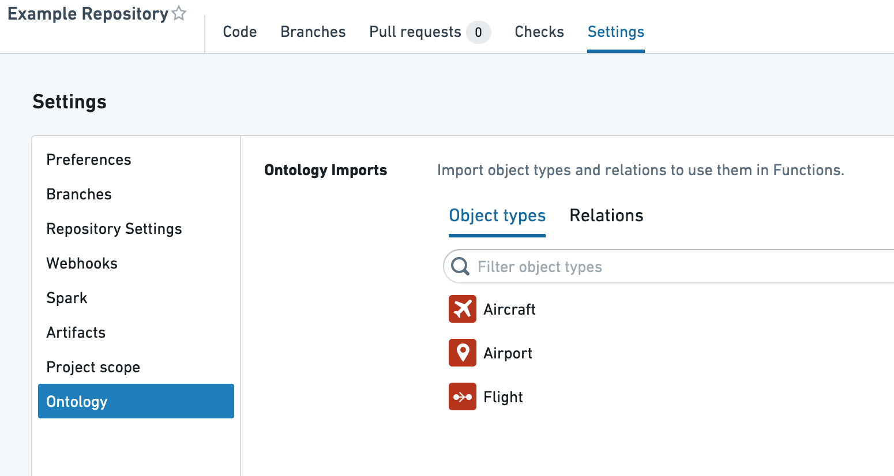
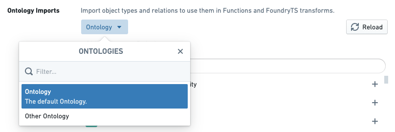
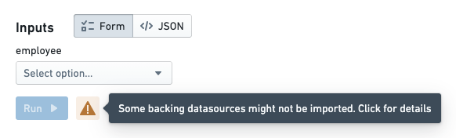

<!-- source: https://palantir.com/docs/foundry/functions/permissions/ · mirrored 2026-08-22 from Palantir Foundry docs -->

# Permissions

Authoring and executing functions in the platform is subject to many kinds of permission checks. This section outlines the different types of permissions you should be aware of and common issues you may run into.

## Function authoring

Functions repositories must be granted appropriate permissions to:

1. Access the Ontology so that proper code bindings can be generated.
2. Load objects in order to run a live preview of a function execution.

Note that repository permissions must be explicitly granted, and are not the same as the permissions granted to your user account. As a result, you have to take specific steps to import object types, link types, and backing datasources into the Project that contains your repository.

For a tutorial on these steps, see [this section](/docs/foundry/functions/ontology-imports/). Below, we explain the specific resources that are imported and the permissions granted for those resources.

### Ontology entity permissions

In a repository, whenever checks run or Code Assist starts up, the functions plugins load the latest Ontology based on the repository’s permissions and generate code bindings for every object and link type that was loaded. The set of object and link types that are loaded depends on the imports of the following resource types:

* Ontologies
* Ontology branches
* [Object types](/docs/foundry/object-link-types/object-types-overview/)
* [Link types](/docs/foundry/object-link-types/link-types-overview/)

In a functions repository, you can import the needed Ontology resources by navigating to **Settings** > **Ontology**. This interface allows you to choose object and link types to import into your Project.

If your user account has access to multiple Ontologies, you can also choose which Ontology you would like to use. Currently, importing multiple Ontologies into a single Project is unsupported.

:::callout{theme="warning" title="Warning"}
Although the above interface shows up within functions repositories, any Ontologies, object types, and link types you import are added at the **Project** level. This means that changing imports in one repository can affect other repositories in the same Project. If you want to have two repositories that rely on different Ontology entities, you should separate them into different Projects.
:::

### Object loading permissions

The **functions helper** in a repository allows users to execute functions in two ways: by executing a published function, or by executing code in live preview. When executed in a live preview, functions code is compiled and executed in Code Assist, which is infrastructure designed to enable quick iteration for code authors.

Because it is tied to the repository, Code Assist is subject to the same permissions requirements as code generation, as described above. This means that when running a function in live preview, the backing datasources underlying each object type you wish to use must be imported into the Project.

In the functions helper, if there are object types imported into your Project without the corresponding datasource being imported, a warning will be displayed in live preview prompting you to update the imports:

In the case of most object types, the **Import backing datasources** dialog will prompt you to import a Foundry dataset. For object types that have [row-level security](/docs/foundry/object-permissioning/configuring-rv-access-controls/) enabled, you will be prompted to import a [Restricted View](/docs/foundry/security/restricted-views/).

## Published function execution

Once a function has been published, it is ready for use by a broader audience of users and can be configured to execute in applications such as [Workshop](/docs/foundry/workshop/overview/) and [Actions](/docs/foundry/action-types/function-actions-overview/). There are still some considerations to keep in mind for permissions to execute a published function.

### Function permissions

In order to execute a function, a user must have **Viewer** role on the repository from which the function was published. Typically, it is best to locate functions repositories in the same Project as end-user applications that rely on functions in that repository, whether those applications are created using Workshop, Slate, or some other tool. If users encounter errors indicating that they lack permissions to read a function (ReadFunctionsPermissionDenied), check whether they have read access to the repository. [Learn more about how to move and share resources.](/docs/foundry/compass/move-and-share-resources/)

:::callout{theme="neutral"}
The **Check access** panel in the sidebar can be used to check someone's access to a Workshop or Slate application, including access to dependent functions. For more information, see the [Check access panel documentation](/docs/foundry/security/checking-permissions/).
:::

:::callout{theme="neutral" title="Function registration in Developer Console"}
A `PERMISSION_DENIED` error with the code `FunctionRegistry:ReadOntologyFunctionPermissionDenied` typically means the function is not registered or available in Developer Console, rather than indicating a folder-level permissions issue. Add and register the function in Developer Console. Folder and repository permissions alone do not make the function executable.
:::

[Function-backed Actions](/docs/foundry/action-types/function-actions-overview/) are a special case in which end users do not necessarily need read access to the function in order to apply an Action that uses it. An administrative user must have read access to a function when configuring an Action to use it. Afterwards, users will be able to apply the Action based on [Action-level permissions](/docs/foundry/action-types/permissions/), regardless of their access to the function.

### Object loading permissions

When a function loads object data, either as a parameter or via an [Object search](/docs/foundry/functions/api-object-sets/), the permissions of the end user running the function determine which objects are loaded. In the case of object types secured using row-level permissions, this means that different users executing the same function may receive different results. This behavior is intended—users should only see the objects they have access to, and this behavior enables a single function to work for users with differing access to individual objects.

## Extended function execution

Administrators control extended execution capabilities through **Functions settings** in [Control Panel](/docs/foundry/administration/control-panel/). These capabilities grant elevated access, such as calling [actions](/docs/foundry/action-types/function-actions-overview/) from within a function or obtaining authentication tokens with a time-to-live (TTL) of up to four hours.

To publish, execute, or install functions with extended capabilities, administrators must configure the appropriate allowlists:

* **Repositories allowed to publish extended functions:** Only repositories in this allowlist can publish functions with extended capabilities.
* **Functions allowed to execute with extended capabilities:** Only functions in this allowlist can execute with extended capabilities. Foundry checks this allowlist at execution time.
* **Projects allowed for installing extended functions via Marketplace:** Only projects in this allowlist can successfully install functions with extended capabilities from [Marketplace](/docs/foundry/marketplace/overview/).

If publishing, execution, or Marketplace installation returns a permission error for a function with extended capabilities, ask your administrator to verify the relevant allowlists.
