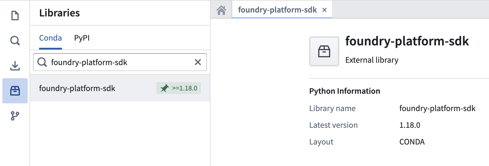
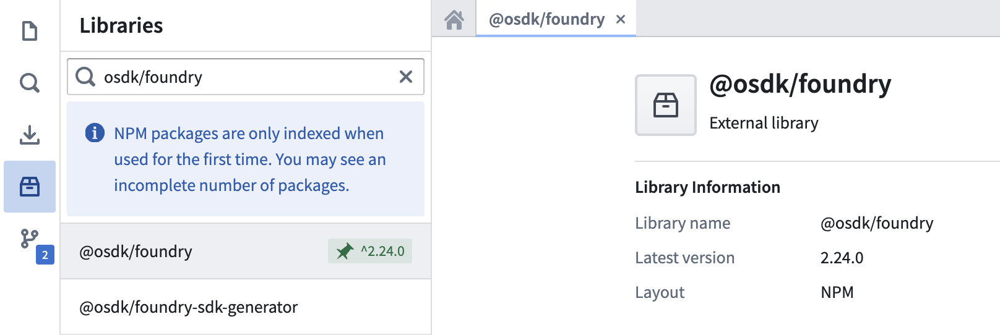
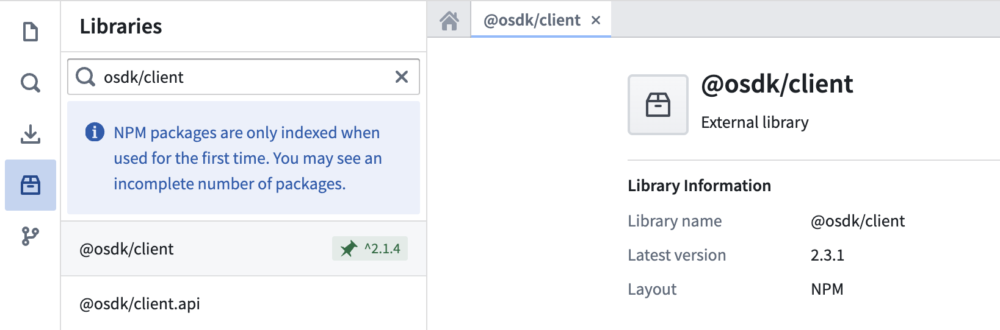

<!-- source: https://palantir.com/docs/foundry/functions/platform-sdk/ · mirrored 2026-08-22 from Palantir Foundry docs -->

# Use platform APIs with the Foundry platform SDK

Foundry APIs expose a variety of functionality that you can leverage with the [Foundry platform SDK](/docs/foundry/api/v2/general/overview/sdks/#foundry-platform-software-development-kits) library through functions. You can use the platform SDK to build functions for administrative or governance workflows, interact with schedules and builds, access media sets, and more.

:::callout{theme="warning"}
First-class authentication is not supported for TypeScript v1 functions. We recommend using Python functions and TypeScript v2 functions for these workflows.
:::

## Install the SDK

To install the Foundry platform SDK, navigate to the **Libraries** side panel in your code repository and search for the SDK name: `foundry-platform-sdk` for Python, or `@osdk/foundry` for TypeScript.





### Python version compatibility

The Python `foundry-platform-sdk` requires Python 3.9 or later. Support for Python 3.14 begins with `foundry-platform-sdk` version 1.93.0. Earlier SDK versions can return `typing` module errors with Python 3.14. To resolve these errors, upgrade to version 1.93.0 or later. Alternatively, use Python 3.11, 3.12, or 3.13.

## Initialize your client

Your function requires authentication to interact with Foundry APIs. This process involves instantiating an authenticated “client” through which you can make requests to the Foundry APIs through the SDK. In TypeScript v2 repositories, this requires the `@osdk/client` library, which should be pre-installed. You can verify this by looking for the green pin:



## Use platform APIs

Once your function is authenticated, you can start using Foundry APIs. The examples below show how to call a language model or query media sets in both Python and TypeScript:

```typescript tab="TypeScript v2"
import {
    Client, // Use Client if your function interacts with the Ontology
    PlatformClient // Use PlatformClient if your function does not interact with the Ontology
} from "@osdk/client";
import { Functions } from "@osdk/foundry";

export default async function useLlm(
    client: PlatformClient, // This parameter gets populated by Foundry at runtime
    prompt: string
): Promise<string> {

    const promptMessage = [
        {
            role: "USER",
            content: prompt
        }
    ];
    const result = await Functions.Queries.execute(
        client,
        "com.foundry.languagemodelservice.models.gpt41.CreateChatCompletion",
        {
            parameters: {
                messages: promptMessage
            }
        },
        {
            preview: true, // Required only for unstable endpoints, see API reference
        }
    );
    return result.value["completion"] as string;
}
```

```python tab="Python"
from foundry_sdk import FoundryClient

@function
def media_item_to_base64(media_item_rid: str, media_set_rid: str) -> str:
    foundry_client = FoundryClient()

    result = foundry_client.media_sets.MediaSet.read(
        media_set_rid=media_set_rid,
        media_item_rid=media_item_rid,
        preview=True  # Required only for unstable endpoints, see API reference
    )

    # Convert the binary stream to a base64 encoded string
    base64_encoded = base64.b64encode(result).decode('utf-8')

    return base64_encoded
```

### Client permissions

The TypeScript v2 client (passed to the function by Foundry at runtime) and the Python client initialized in code have the following permissions scope:

* `api:admin-read`
* `api:functions-read`
* `api:ontologies-read`
* `api:orchestration-read`
* `api:usage:mediasets-read`
* `api:usage:ontologies-write`

Each platform API endpoint requires certain scopes to hit the endpoint. Documentation on these scopes can be found in the [API reference](/docs/foundry/api/v2)

:::callout{theme="warning"}
Foundry functions do not support reading datasets directly with the `api:usage:datasets-read` scope. Dataset reads return a permission error. Code may succeed in Code Workspaces live preview because it runs with your user context and full scopes, but fail as a deployed function because deployed functions use restricted permissions.
:::
