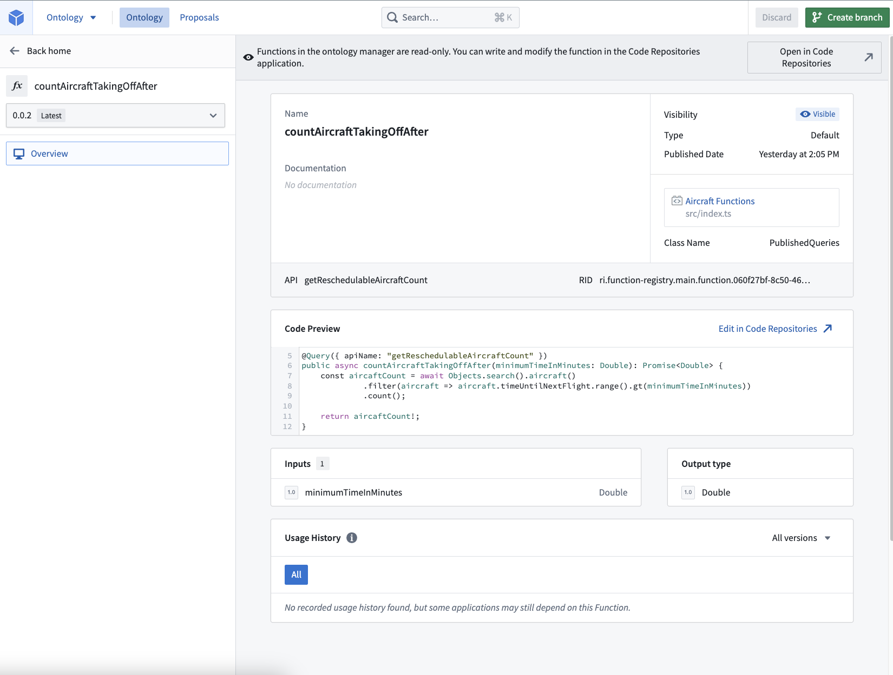

<!-- source: https://palantir.com/docs/foundry/functions/python-functions-advanced-usage/ · mirrored 2026-08-22 from Palantir Foundry docs -->

# Queries

Queries are the read-only subsets of functions that may be optionally exposed through the [API gateway](/docs/foundry/api/general/overview/introduction/). They cannot have any side effects, such as modifying the Ontology or altering external systems. You should use an [Action](/docs/foundry/api/ontology-resources/actions/apply-action/) if you need those additional editing capabilities through the API gateway.

## Query decorator

Use the following syntax to define a query function.

```typescript tab="TypeScript v1"
import { Query } from "@foundry/functions-api";

@Query({ apiName: "myTypeScriptV1Function" })
```

```typescript tab="TypeScript v2"
// Export a config object with an apiName parameter from the file containing the function
export const config = {
    apiName: "myTypeScriptV2Function"
};
```

```python tab="Python"
from functions.api import function

@function(api_name="myPythonFunction")
```

For Python and TypeScript v1 functions, the decorator accepts an API name parameter of type `string`, which is required to define an API name. When using TypeScript v1, the query will behave similarly to the existing [`@Function` decorator](/docs/foundry/functions/decorators/) if the `apiName` parameter is not defined. Note that the corresponding Python syntax is `api_name`.

### Example: API-named query

The example below demonstrates how to expose a query through the [API gateway](/docs/foundry/api/general/overview/introduction/):

```typescript tab="TypeScript v1"
import { Query, Double } from "@foundry/functions-api";
import { Objects, Aircraft } from "@foundry/ontology-api";

export class PublishedQueries {
    @Query({ apiName: "getReschedulableAircraftCount" })
    public async countAircraftTakingOffAfter(minimumTimeInMinutes: Double): Promise<Double> {
        const aircraftCount = await Objects.search().aircraft()
                 .filter(aircraft => aircraft.timeUntilNextFlight.range().gt(minimumTimeInMinutes))
                 .count();

        return aircraftCount!;
    }
}
```

```typescript tab="TypeScript v2"
import { Client } from "@osdk/client";
import { Double } from "@osdk/functions";
import { Aircraft } from "@ontology/sdk";

export const config = {
    apiName: "getReschedulableAircraftCount"
};

async function countAircraftTakingOffAfter(client: Client, minimumTimeInMinutes: Double): Promise<Double> {
    const { $count } = await client(Aircraft).where({
        timeUntilNextFlight: {
            $gt: minimumTimeInMinutes
        }
    }).aggregate({ $select: { $count: "unordered" } })

    return $count;
}

export default countAircraftTakingOffAfter;

```

```python tab="Python"
from functions.api import Double, function
from ontology_sdk import FoundryClient
from ontology_sdk.ontology.objects import Aircraft

@function(api_name="getReschedulableAircraftCount")
def count_aircraft_taking_off_after(minimum_time_in_minutes: Double) -> Double:
    client = FoundryClient()
    aircraft_count = client.ontology.objects.Aircraft.where(
        Aircraft.time_until_next_flight > minimum_time_in_minutes
    ).count().compute()

    return aircraft_count
```

## API name validations

The `apiName` of a query must be a string that meets the following requirements:

* Be in `lowerCamelCase`.
* Be under 100 characters.
* Not contain leading numbers.
* Be unique among all Ontologies imported into the repository.
  * The [tagging process](/docs/foundry/functions/getting-started/#publish-your-functions) will fail if the `apiName` is not unique, requiring you to change the name.

Additionally, a repository containing API-named queries must import entities from at least one ontology.

## Version and update API-named queries

API-named queries will always use the **latest tagged version** of the published query and do not follow the same semantic versioning paradigm as other Foundry functions.

To disassociate the API name from the query and break it in the API gateway, you must remove the API name from the query decorator and release a new tag from the repository.

:::callout{theme="neutral"}
Changing the API name in the decorator and publishing a new tag will break the consumer. Only the latest published version of the query is supported.

To allow consumers to upgrade at their convenience without breaking changes, you can support multiple versions of the same API name. To do this, you must make a copy of the query code in your repository and give it a different API name, for example `getReschedulableAircraftCountV2`.
:::

## Search and view queries

As with other functions, you can search for and manage your queries in [Ontology Manager](/docs/foundry/ontology-manager/overview/). You can search for the query name or the API name. In the example [above](#example-api-named-query), the queries are `getReschedulableAircraftCount` for the API name and `countAircraftTakingOffAfter` for the query name, respectively.



:::callout{theme="neutral"}
When using TypeScript v1 functions, you may need to update the `functions.json` file in your repository to enable queries by setting the `enableQueries` property to true: <br><br>

```typescript tab="TypeScript v1"
{
  "enableQueries": true
}
```
:::

## Call a query function

After publishing your TypeScript or Python query function, navigate to the code repository where you want to consume the function, and import it using the [**Resource imports** sidebar](/docs/foundry/functions/resource-imports-sidebar/).

Your function will be callable from the consuming repository. For example:

```typescript tab="TypeScript v1"
import { Queries } from "@foundry/ontology-api";

export class MyFunctions {
    @Function()
    public callQueryFunction(): Promise<Double> {
        return Queries.getReschedulableAircraftCount(10);
    }
}
```

```typescript tab="TypeScript v2"
import { Client } from "@osdk/client";
import { Double } from "@osdk/functions";
import { getReschedulableAircraftCount } from "@ontology/sdk";

async function callQueryFunction(client: Client): Promise<Double> {
    return client(getReschedulableAircraftCount).executeFunction({ timeUntilNextFlight: 10 });
}

export default callQueryFunction;
```

```python tab="Python"
from functions.api import Double, function
from ontology_sdk import FoundryClient

@function
def call_query_function() -> Double:
    return FoundryClient().ontology.queries.get_reschedulable_aircraft_count(
        time_until_next_flight=Double(10)
    )
```

For TypeScript v1 functions, Foundry must know which query functions you call from a published function. We automatically provide static analysis to try and detect queries that are called. However, this static analysis may occasionally miss certain calls leading to a runtime error instructing you to add the `@Uses` decorator. This decorator serves to augment the automatically detected query usage.

The following example demonstrates the usage of the `@Uses` decorator:

```typescript tab="TypeScript v1"
import { Uses } from "@foundry/functions-api";
import { Queries } from "@foundry/ontology-api";

export class MyFunctions {
    @Uses({ queries: [Queries.getReschedulableAircraftCount] })
    @Function()
    public callQueryFunction(): Promise<Double> {
        return Queries.getReschedulableAircraftCount(10);
    }
}
```
