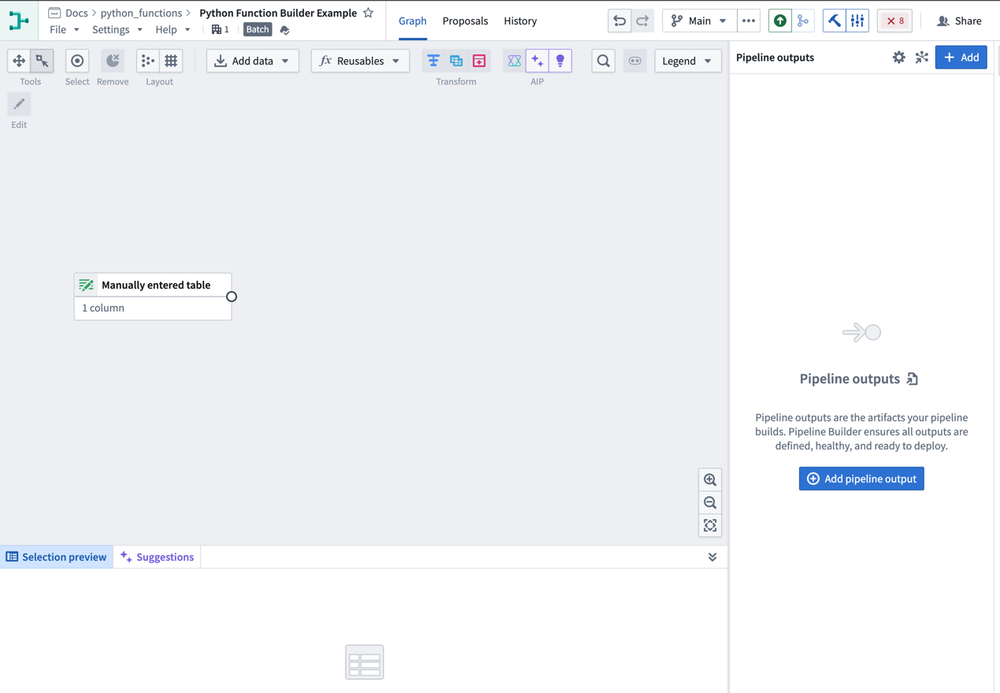
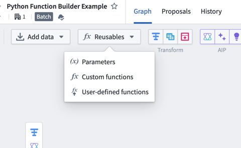
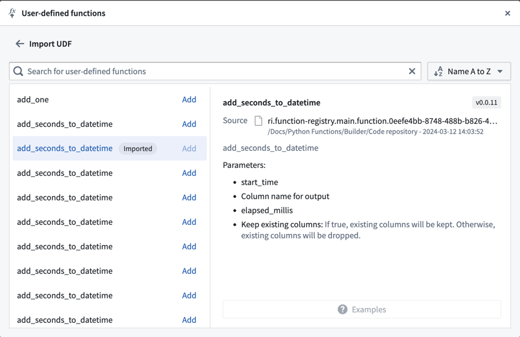
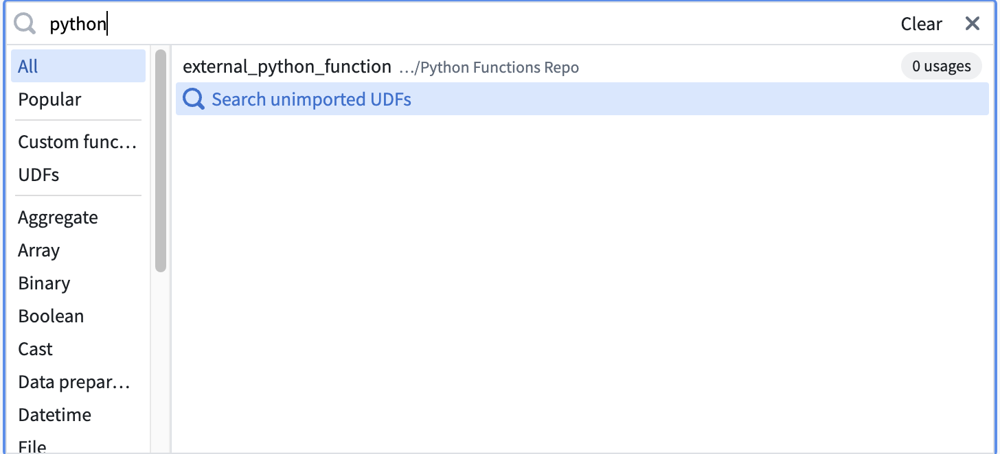
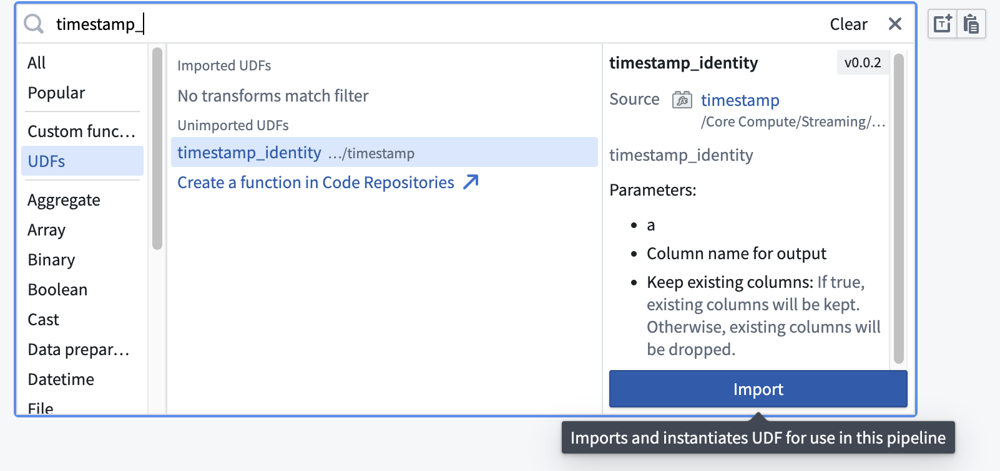
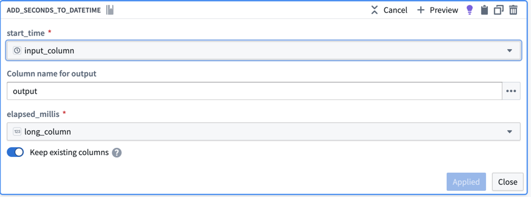
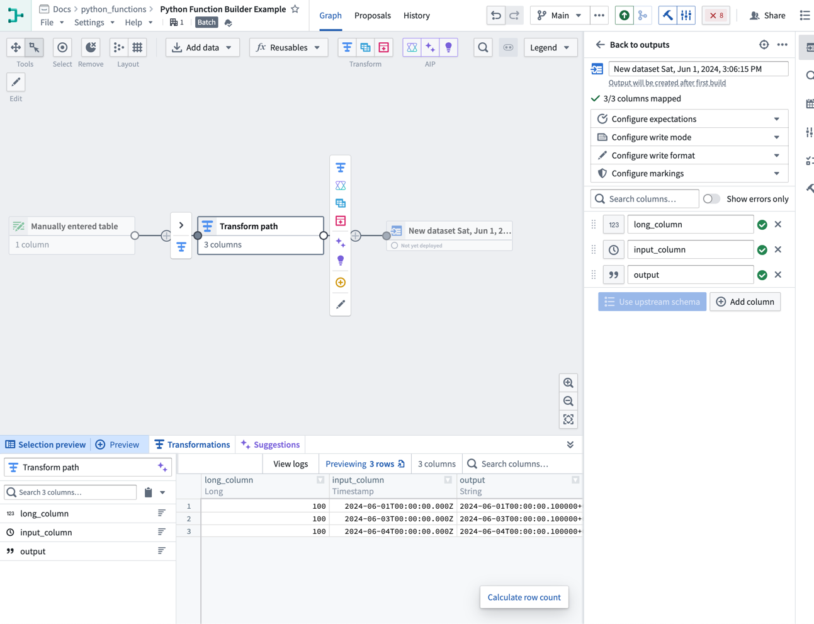
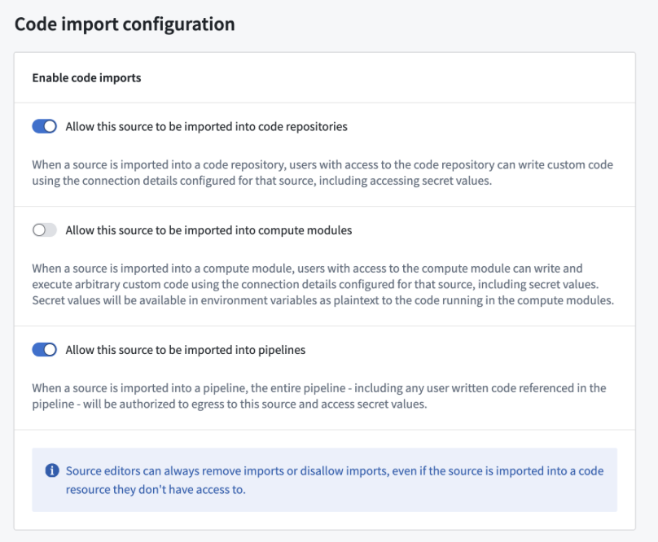

<!-- source: https://palantir.com/docs/foundry/functions/python-functions-builder/ · mirrored 2026-08-22 from Palantir Foundry docs -->

# Use a Python function in Pipeline Builder

:::callout{theme="neutral"}
Pipeline Builder supports both Java and Python user-defined functions (UDF). [Learn more about Java UDFs](/docs/foundry/transforms-java/user-defined-functions/).
:::

## Prerequisites

This guide assumes you have already authored and published a Python function. Review our [getting started with Python functions](/docs/foundry/functions/python-getting-started/) documentation for a tutorial.

## Architecture

Python functions run in a Pipeline Builder pipeline as a sidecar container. This means that the function does not need to be deployed and scales dynamically with the size of your pipeline. Embedded functions can be [previewed](/docs/foundry/pipeline-builder/outputs-preview-pipeline/) similarly to other transforms in Pipeline Builder.

## How Python functions process data

When you use a Python function as a user-defined function (UDF) in Pipeline Builder, the function runs **once per row**. Pipeline Builder does not pass an entire table, `pandas` DataFrame, or Spark DataFrame to your function. Instead, you map one or more input columns to the function's parameters, and Pipeline Builder invokes the function for every row, passing that row's cell values as the parameter arguments.

The value your function returns becomes a new column in the output table, with one value produced per row. For this reason, a Python UDF returns a scalar (single-value) type such as `str`, `int`, `float`, `bool`, or `datetime` rather than a DataFrame. There is no DataFrame type to return: the column that Pipeline Builder assembles from each row's return value *is* the resulting tabular output.

The following example takes two columns as input and returns one `str` value per row, which Pipeline Builder writes to a new column:

```python tab="Python"
from functions.api import function

@function
def full_name(first_name: str, last_name: str) -> str:
    return f"{first_name} {last_name}"
```

When you [configure the transform](#use-your-function-in-a-pipeline-builder-pipeline), map the `first_name` and `last_name` parameters to the corresponding input columns. When the transform runs, Pipeline Builder evaluates `full_name` for each row and writes the returned string to a new output column.

For the full list of supported input and output types and their Python equivalents, review the [types reference](/docs/foundry/functions/types-reference/).

### Return a struct

To return multiple related values from a single function, return a [custom type (struct)](/docs/foundry/functions/types-reference/#structcustom-type) instead of a scalar. Pipeline Builder adds the returned value as a single struct column with one field for each attribute of the custom type. You can then extract individual fields with the [Get struct field](/docs/foundry/pipeline-builder/functions-index/#get-struct-field) transform.

```python tab="Python"
from dataclasses import dataclass
from functions.api import function, Double

@dataclass
class Stats:
    total: Double
    average: Double

@function
def compute_stats(a: Double, b: Double) -> Stats:
    total = a + b
    return Stats(total=total, average=total / 2)
```

## Use your function in a Pipeline Builder pipeline

Follow the steps below to prepare and configure a Python function in your pipeline:

1. Open the Pipeline Builder pipeline in which you want to use your Python function.



2. Import your UDF into Pipeline Builder using one of two methods:
   * **From the graph view:**
     1. Select **Reusables** from the upper part of the pipeline graph, then choose **User-defined functions**. <br><br>
        
     <br><br>
     2\. Select **Import UDF** and search through the available functions to find the one you want to use
     3\. Choose **Add** next to the function name. The function should then display an **Imported** tag.<br><br>  <br><br>
     4\. Close the import dialogue and select **Transform** on your Pipeline Builder graph where you would like to use the function.
     5\. From the list of transforms, find the **UDFs** tab to the left to view your imported functions.
   * **Use the transform picker:**
     1. Select **Transform** on the pipeline builder graph.
     2. Enter the name of the UDF you want to import. <br><br>
        
     <br><br>
     3\. Select **Search unimported UDFs**.
     4\. Hover over the desired UDF and select **Import**. <br><br>  <br><br>
3. Fill out the transform definition specifying the input columns and parameters, then select **Apply**.



You should now see your Python function on your Pipeline Builder graph and can preview the output of the function.



## External API calls in Pipeline Builder

To make API calls to an external system from Pipeline Builder, you can publish a [Python function with access to external systems](/docs/foundry/functions/api-calls/). This will allow you to write logic that communicates with external systems and use it as part of your pipeline.

To be used as a user-defined function (UDF) in Pipeline Builder, all sources used in your function must be configured to be importable into pipelines. To configure this setting, navigate to the source in Data Connection, then to the **Connection settings > Code import configuration** tab:



Once you have enabled this option on your source and published your Python function, it can be used in your pipeline in the same way as any other Python function.

## Ontology access in Pipeline Builder

:::callout{theme="warning"}
Pipeline Builder UDFs do not support direct Ontology access through `FoundryClient()` or the Ontology SDK (OSDK). Instantiating `FoundryClient()` and accessing the Ontology from a UDF returns an `EnvironmentNotConfigured` error. This restriction helps prevent data from being unmarked or leaked across builds.
:::

To access Ontology data from a Pipeline Builder UDF, consider the following approaches:

* **Use an external source:** Create an external source for the Python function that performs the Ontology query, then import the source into your Pipeline Builder UDF. This avoids authentication and permission issues from direct Ontology queries in the UDF context. To configure the source, navigate to it in Data Connection and enable **Connection settings > Code import configuration** as described [above](#external-api-calls-in-pipeline-builder).
* **Join Ontology-backed datasets:** If your use case allows, maintain a separate dataset with the relevant Ontology-backed data and join it into your pipeline. This avoids Ontology API calls and supports deduplication or existence checks.
