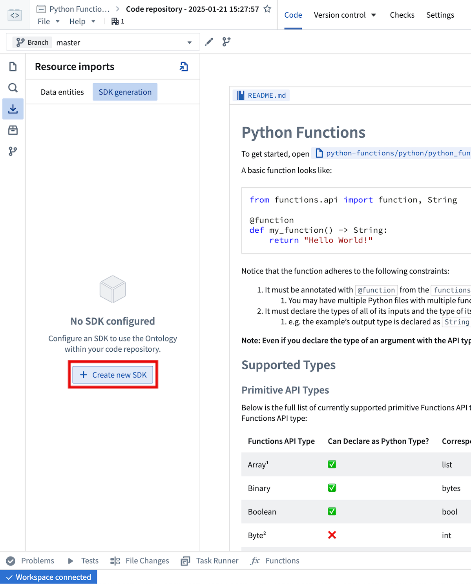
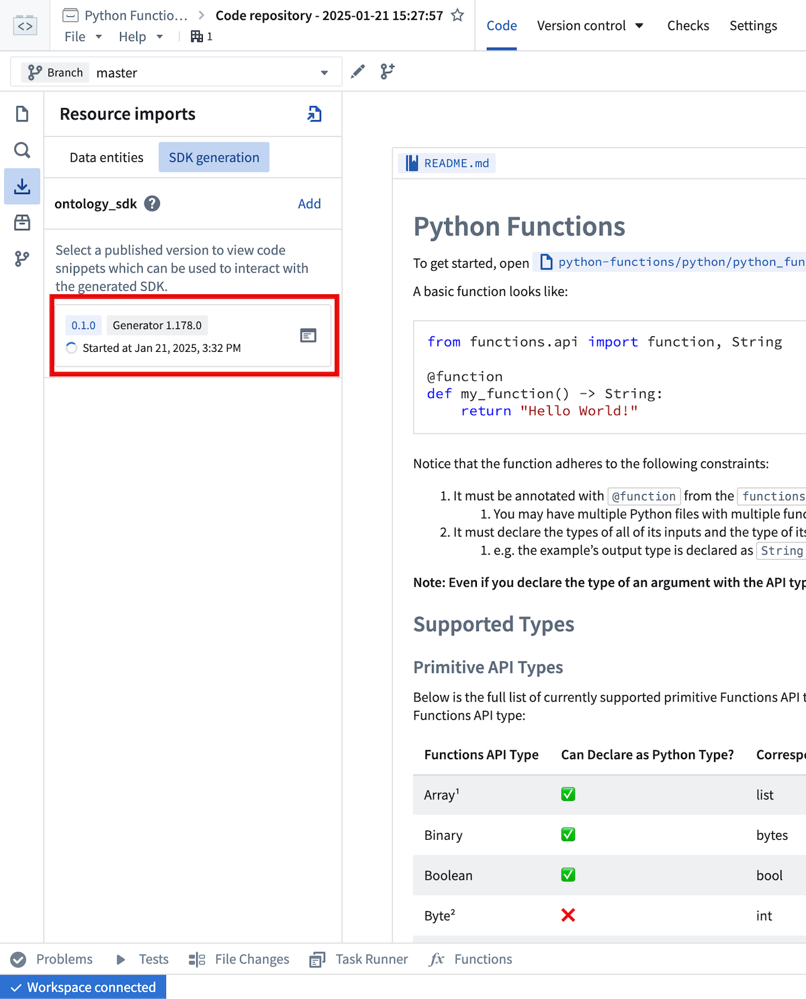
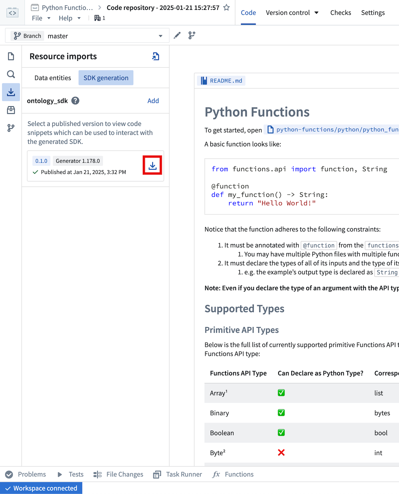
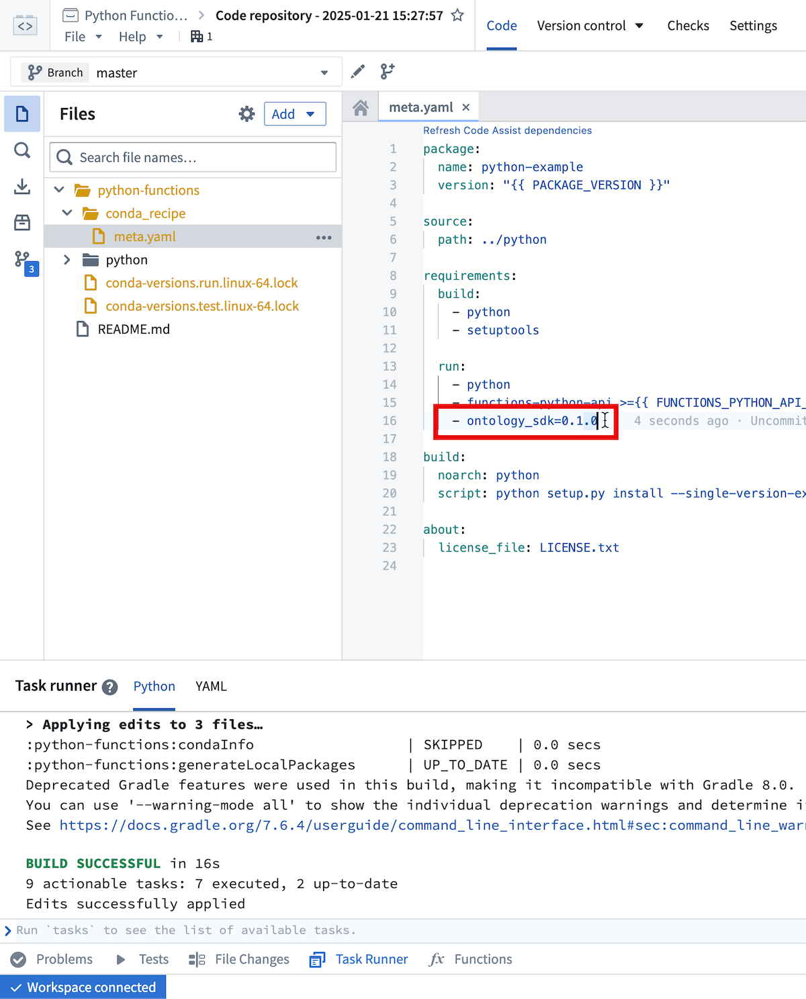

<!-- source: https://palantir.com/docs/foundry/functions/python-functions-on-objects/ · mirrored 2026-08-22 from Palantir Foundry docs -->

# Functions on objects

You can write functions that interact with the Ontology using the Python Ontology SDK.

## Generate a Python Ontology SDK

To generate a Python Ontology SDK client, navigate to the [**Resource imports** sidebar](/docs/foundry/functions/resource-imports-sidebar/) and select
**Add > Ontology**. From there, select your desired Ontology and import any objects and links you would like to interact with in
your functions. After saving to confirm your selections, a banner will appear to indicate that a corresponding OSDK has not yet been created.

Navigate to the **SDK Generation** tab to generate and install the OSDK.

:::callout{theme="warning"}
If SDK generation returns an import error such as `cannot import name 'Equipment2' from 'ontology_sdk.ontology.objects'`, confirm that you selected an Ontology in the blue bar at the bottom of the interface. Importing object types does not select the Ontology required for SDK generation.
:::



If no OSDK has been generated, you will be prompted to enter a name for the generated package.
The package name cannot be changed after the first version has been generated.

After selecting **Create new version**, you can monitor the generation progress from this view.



Once generation is complete, you will need to install the newly generated version with the  button.



This will trigger an interactive install in the task runner panel.
Once that task completes successfully (the Task Runner will display `BUILD SUCCESSFUL`), code completion for the OSDK will be available in your code assist session.

The `meta.yml` file will also be updated to include a reference to the generated package.
You can manually update `meta.yml` instead of using the installation helper, but if you manually update `meta.yml`, you will need to rebuild your code assist session to pick up the changes.



Any time you import additional resources in the sidebar you will be prompted to generate and install a new version of the OSDK that includes these resources.
Additionally, if you modify imported resources (for instance, adding a new property to an already imported object type), you will need to generate a new OSDK version to pick up these changes.

## Examples

For an example object type named `Aircraft` with properties `brand` and `capacity`, you could write a
function that accepts an `Aircraft` object and summarizes it like so:

```python
from functions.api import function
from ontology_sdk.ontology.objects import Aircraft

@function
def aircraft_input_example(aircraft: Aircraft) -> str:
    return f"{aircraft.brand} aircraft, holds {aircraft.capacity} passengers"
```

Furthermore, if you wanted to search for `Aircraft` objects satisfying a certain capacity threshold, you could write the
following:

```python
from functions.api import function
from ontology_sdk import FoundryClient
from ontology_sdk.ontology.objects import Aircraft
from ontology_sdk.ontology.object_sets import AircraftObjectSet

@function
def aircraft_search_example() -> AircraftObjectSet:
    client = FoundryClient()
    return client.ontology.objects.Aircraft.where(Aircraft.object_type.capacity > 100)
```

The Python OSDK also offers beta features such as interoperability with pandas DataFrames:

```python
from functions.api import function
from ontology_sdk.ontology.object_sets import AircraftObjectSet

@function
def aircraft_dataframe_example(aircrafts: AircraftObjectSet) -> int:
    df = aircrafts.to_dataframe()
    return df['capacity'].sum()
```

Review the [Python Ontology SDK documentation](/docs/foundry/ontology-sdk/python-osdk/) for more information.
