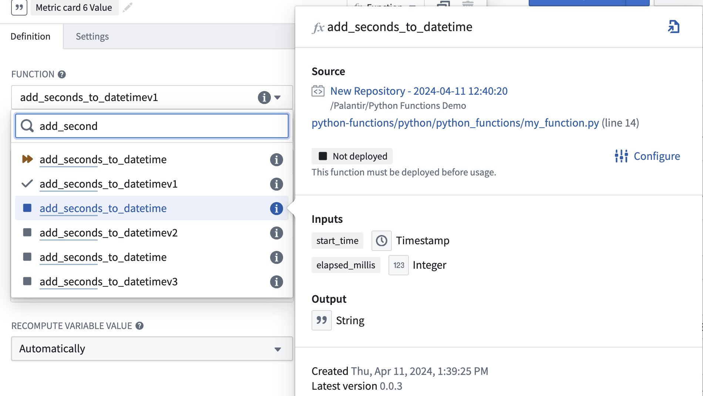
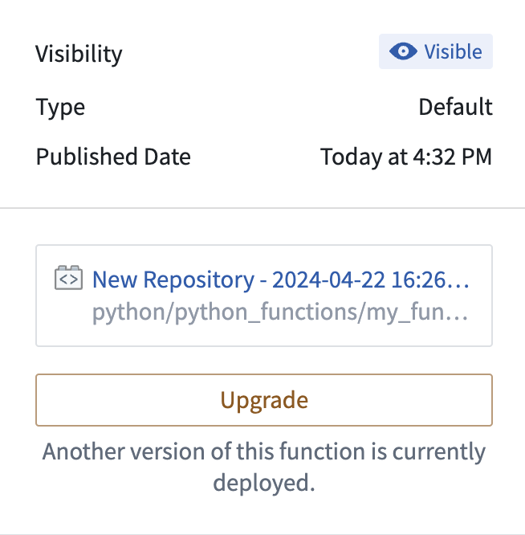
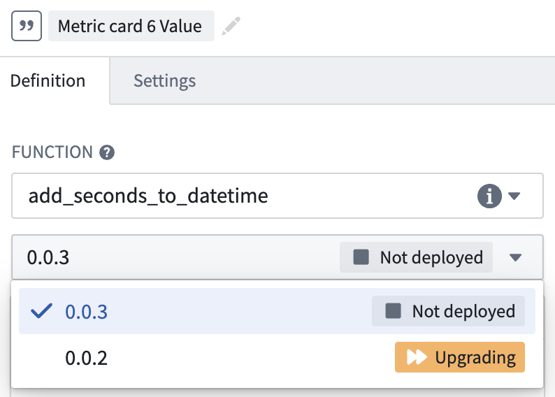
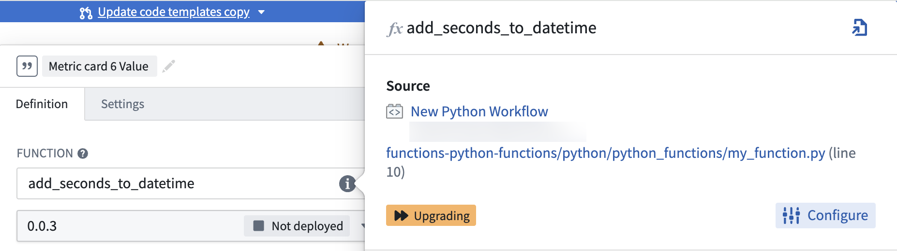
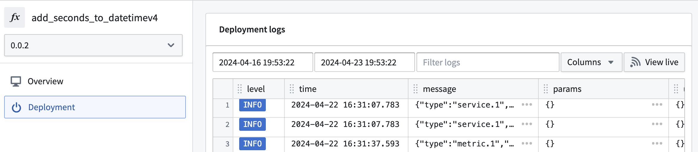
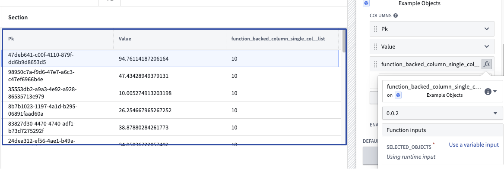
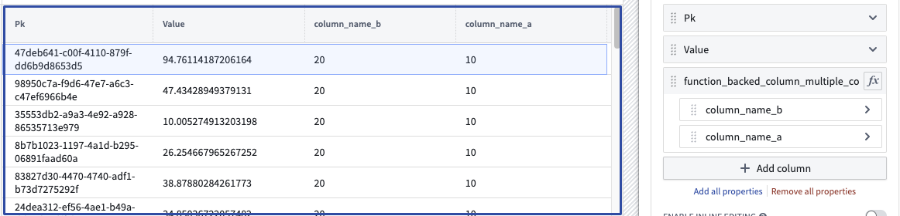

<!-- source: https://palantir.com/docs/foundry/functions/python-functions-workshop/ · mirrored 2026-08-18 from Palantir Foundry docs -->

# Use a Python function in Workshop

## Prerequisites

This guide assumes you have already authored and published a Python function. Review the [getting started with Python functions](/docs/foundry/functions/python-getting-started/) documentation for a tutorial. For examples of how to query the Ontology using the Python SDK, see the [Python Ontology SDK documentation](/docs/foundry/ontology-sdk/python-osdk/).

## Use the Python function in Workshop

In Workshop, search for the Python function from the **Variables** tab to the left side of the module. Both [serverless and deployed functions](/docs/foundry/functions/functions-deployed/#choose-between-deployed-and-serverless-execution-modes) will appear here. Serverless functions can always be run at any version and do not need to be manually deployed. Deployed functions will show an icon with one of three states for both the function and the function version:

* **Running:** This function and version can serve requests.
* **Stopped:** This function and version are not available. In the function selector, hover over the information icon, select **Configure** and then **Create and start deployment** to make the function available.
* **Upgrading:** This function and version are not yet available.



### Cut a new release

Only one version of the function’s repository is hosted at a given time. To make changes to functions with limited downtime we recommend adding a new function (like `function_v1`) with the changes and tagging as described [here](/docs/foundry/functions/python-getting-started/#commit-and-publish-a-function). From your published functions under tags and releases, select **Open in Ontology Manager**.

In Ontology Manager, select the version of the function repository you want to use in applications, then select **Upgrade**.



Update all downstream applications using functions from this repository to the new version you have deployed. Note that the previous deployment version will no longer be running so your applications will have a short downtime as you make this change. You will have `function_v0` and `function_v1` available at the same time so while you need to switch to the new deployment version, you do not have to change the function you are using. When `function_v0` is no longer used, you can delete the function.

### Debug errors

If your function is not working as expected in Workshop, first check if the issue is related to the logic or the responsiveness of the function. If there is an issue with the logic, inspect the source code in the backing code repository. If there is an issue with the function being unresponsive or throwing an error, follow the steps below:

1. Check if the version you selected is currently running in the function selector dropdown menu.



2. If the function is not deployed or `Upgrading`, hover over the function’s information icon and select **Configure**. This will take you to Ontology Manager where you can select **Start Deployment** to get your function running again.



3. If your function is `Running` or you need more information about the deployment’s behavior, select **Deployment** from the left panel in Ontology Manager to view detailed logs. SLS logs are also available if you select **View live**.



## Create a function-backed column

To create a function-backed column, you must publish a function that meets the following requirements:

* The function's input parameters must include an object set parameter (imported from `ontology_sdk.ontology.object_sets`) and can optionally include other input parameters. This object set parameter will enable the objects displayed in the table to be passed into the function to then generate the desired derived column. Note that a `list[ObjectType]` parameter will also work here, but this less performant option is not recommended.

* The function's return type must be `dict[ObjectType, ColumnType]`, where `ColumnType` is the desired [type](/docs/foundry/functions/types-reference/#types-reference) for the column, or `dict[ObjectType, CustomType]` to return multiple columns from the function. Learn more about [custom types](/docs/foundry/functions/types-reference/#structcustom-type).

Once a function that meets the above criteria is configured and published, you can configure a function-backed property column within the [Object Table](/docs/foundry/workshop/widgets-object-table/#features-of-function-backed-properties) widget configuration.

An example of a function returning one column:

```python
from functions.api import Date, Integer, String, function
from ontology_sdk import FoundryClient
from ontology_sdk.ontology.object_sets import MyObjectTypeObjectSet
from ontology_sdk.ontology.objects import MyObjectType

@function
def function_backed_column_single_col(
    selected_objects: MyObjectTypeObjectSet
) -> dict[MyObjectType, Integer]:
    final_dict = {}

    for curr_obj in selected_objects:
        final_dict[curr_obj] = 10 # The value can be defined for any arbitrary logic

    return final_dict
```



An example of a function returning multiple columns:

```python
from dataclasses import dataclass

@dataclass
class CustomType:
    column_name_a: int
    column_name_b: int

@function
def function_backed_column_multiple_cols(
    selected_objects: MyObjectTypeObjectSet, some_other_parameter: String
) -> dict[MyObjectType, CustomType]:
    final_dict = {}

    for curr_obj in selected_objects:
        final_dict[curr_obj] = CustomType(column_name_a=10, column_name_b=20)

    return final_dict

```


