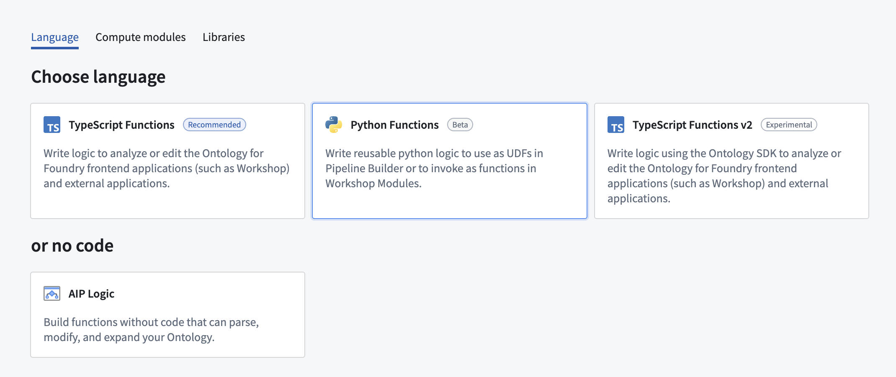
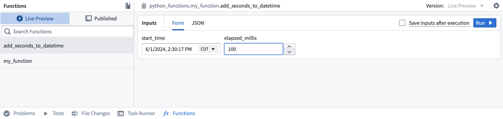
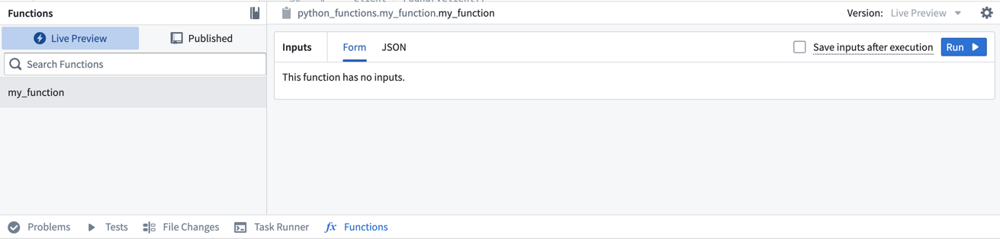
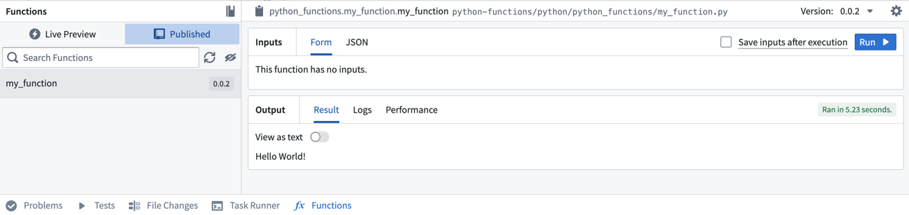

<!-- source: https://palantir.com/docs/foundry/functions/python-getting-started/ · mirrored 2026-08-18 from Palantir Foundry docs -->

# Getting started with Python functions

The following documentation will guide you through the initial steps to prepare Python functions for use in the Palantir platform. You will learn how to create a Python functions repository, commit and publish a function, test in live previews, and more.

## Create a Python functions repository

Navigate to a project of your choice and create a new code repository by selecting **+ New > Repository**. Select the **Pythons functions** template to initialize your repository. We recommend grouping all functions for use in Workshop or Ontology-based applications in a single repository to minimize costs.



Once the repository is created, navigate to the `python-functions/python/python-functions/my_function.py` file.

## Explore the repository

Your repository will be initialized with a `my_function.py` file containing some example functions, including the following:

```python tab="Python"
from functions.api import function, String

@function
def my_function() -> String:
    return "Hello World!"
```

Notice that the function adheres to the following constraints:

* The function must be decorated with `@function` from the `functions.api` package to be recognized as a Python function. You may have multiple Python files with multiple functions in each file, but *only the functions with this decorator* will be registered as Python functions.
* The function must declare the types of all of its inputs along with the type of its output, either using the type from the functions API package or its corresponding Python type. For example, the above example’s output type is declared as `String` from the functions API, but it may also be declared as the corresponding Python type `str`.

:::callout{theme="neutral"}
Even if you declare the type of an argument with the API type (for example, `String`), your function will be passed the corresponding Python type at runtime (in this example, `str`).
:::

For a full overview of types in Python functions see our [type reference documentation](/docs/foundry/functions/types-reference/).

## Test in live preview

After you add the new function, you can run it immediately in the **Functions** helper. Open the **Functions** helper from the bottom left of the screen and select **Live Preview**. Choose the `add_seconds_to_datetime` function, enter input values, and select **Run** to run the code.



Select **Commit** in the upper right to commit your changes onto the `master` branch of your repository.

### Commit and publish a function

Once you write a function (or uncomment one of the example functions provided), follow the steps below to commit and publish it.

1. Commit your changes by selecting **Commit** in the **Source control** tab and adding a commit message.
2. Select the **Branches** tab from the top center of the screen, then select **Tags and releases**.
3. Choose **New tag** and provide a version for the release.


4. Select **Tag and release** and wait for the release step to complete.

5. Once the check is successful, select the **Code** tab, then open the **Functions** tab on the bottom of the page. You will see `my_function` in the results.



6. Select the function, then choose **Run** to execute the function that you just published.



## Add another function

Now, we will add a more complex function to this repository to test and publish. Copy and paste the code below to the bottom of the `my_function` file.

```python tab="Python"
from functions.api import function, String
from datetime import datetime, timedelta

@function
def add_seconds_to_datetime(start_time: datetime, elapsed_millis: int) -> str:
    dt = start_time + timedelta(milliseconds=elapsed_millis)
    return dt.isoformat()
```

For more examples of how to use your Python functions in the platform, review our documentation on [using Python functions in Pipeline Builder](/docs/foundry/functions/python-functions-builder/) and on [using Python functions in Workshop](/docs/foundry/functions/python-functions-workshop/).
