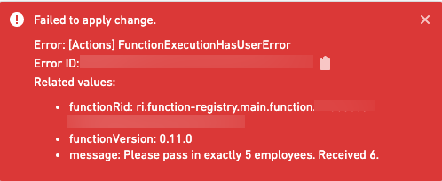

<!-- source: https://palantir.com/docs/foundry/functions/python-user-facing-error/ · mirrored 2026-08-22 from Palantir Foundry docs -->

# User-facing errors

When running functions in other parts of the platform, such as Workshop or actions, you may want to throw an error with a detailed message. To do so, throw a `UserFacingError`. For example:

```typescript tab="TypeScript v1"
import { Function, UserFacingError } from "@foundry/functions-api";
import { Employee } from "@foundry/ontology-api";

export class MyFunctions {
    @Function()
    public async searchExactlyFiveEmployees(employees: Employee[]): Proimse<string> {
        if (employees.length != 5) {
            throw new UserFacingError(`Pass in exactly 5 employees. Received ${employees.length}.`);
        }

        // search employees
    }
}
```

```typescript tab="TypeScript v2"
import { Osdk } from "@osdk/client";
import { Employee } from "@ontology/sdk";
import { UserFacingError } from "@osdk/functions";

export default async function searchExactlyFiveEmployees(employees: Array<Osdk.Instance<Employee>>): Promise<string> {
    if (employees.length != 5) {
        throw new UserFacingError(`Pass in exactly 5 employees. Received ${employees.length}.`);
    }

    // search employees
}
```

```python tab="Python"
from functions.api import function, UserFacingError
from ontology_sdk import FoundryClient
from ontology_sdk.ontology.objects import Aircraft

@function()
def search_exactly_five_employees(
    employees: list[Aircraft]
) -> str:
    if not len(aircraft) == 5:
        raise UserFacingError(f"Pass in exactly 5 employees. Received ${len(aircraft)}.")

    # search employees
```

When running this as a [Function-backed Action](/docs/foundry/action-types/function-actions-overview/) in a [Workshop application](/docs/foundry/workshop/functions-use/) with an incorrect number of employees, users will see the following error:



When a function used in a [function-backed export](/docs/foundry/workshop/widgets-button-group/#function-backed-export) throws a `UserFacingError`, the export failure toast displays the error message.

A detailed user-facing error message helps users identify and resolve the issue.
