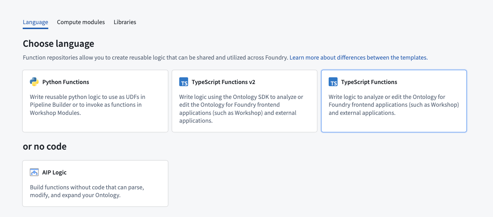
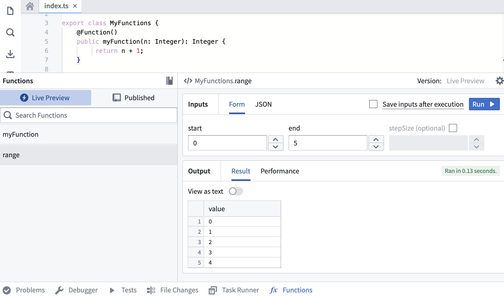
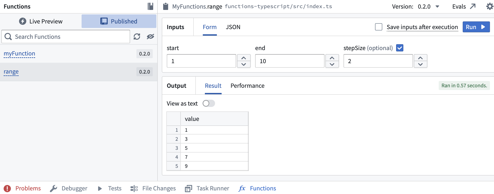

<!-- source: https://palantir.com/docs/foundry/functions/typescript-v1-getting-started/ · mirrored 2026-08-18 from Palantir Foundry docs -->

# Getting started with TypeScript v1 functions

:::callout{theme="warning"}
The following documentation is specific to TypeScript v1 functions. For the TypeScript v2 version of this page, see [Getting started with TypeScript v2 functions](/docs/foundry/functions/typescript-v2-getting-started/). For more [robust capabilities](/docs/foundry/functions/language-feature-support/#typescript-v1-vs-typescript-v2), including support for Ontology SDK and configurable resource requests, we recommend [migrating to TypeScript v2](/docs/foundry/functions/typescript-v2-migration/).
:::

## Create a TypeScript v1 functions repository

Navigate to a project of your choice and create a new code repository by selecting **+ New > Repository**. Select the TypeScript functions template to initialize your repository.



Once the repository is created, navigate to the `functions-typescript/src/index.ts` file.

## Write a function

Functions in this repository must be defined within a TypeScript class, and that class must be exported from the `functions-typescript/src/index.ts` file. You can either write your function in the prepopulated examples in `index.ts`, or create a new file. If you create a new file, ensure that you export your class from `index.ts`.

Below is a basic example:

```typescript tab="TypeScript v1"
import { Function, Integer } from "@foundry/functions-api";

export class ExampleFunctions {

    @Function()
    public addIntegers(a: Integer, b: Integer): Integer {
         return a + b;
    }
}
```

If the above code is written in a file called `exampleFunctions.ts`, it must be exported from the index file as shown below:

```typescript tab="TypeScript v1"
// in functions-typescript/src/index.ts

export * from "./relative/path/to/exampleFunctions";
```

## Test in live preview

After you add the new function, you can run it in the functions helper. Open the **Functions** helper and select **Live Preview**. Choose the `range` function, enter input values, and select **Run** to run the code.



Select **Commit** in the upper right to commit your changes onto the `master` branch of your repository.

## Publish a function

After committing your work, you will see the **Tag version** option. This will publish all of the functions in your repository.


Select **Tag version** to tag a release off the `master` branch. Set the tag name based on the extent of your changes, then choose **Tag and release**.


To view the progress as your functions are tagged and released, select the **View** pop-up or navigate to the **Tags** tab. Once **Step 2: Release** is completed, select the published functions to view them in the function registry.

:::callout{theme="warning"}
Functions may not be immediately searchable by name in Workshop or the function registry while permissions propagate.
:::


## Use a new function

After the checks for your tag have passed, navigate back to the **Code** tab in **Code Repositories** and select the **Functions** helper. You should now be able to see your new `range` function under the **Published** section. Select and run the function.



### Next steps

In this tutorial, you learned how to use Code Repositories to write, publish, and test a TypeScript v1 function from a repository. Next, we recommend learning how to author [functions on objects](/docs/foundry/functions/foo-getting-started/).
