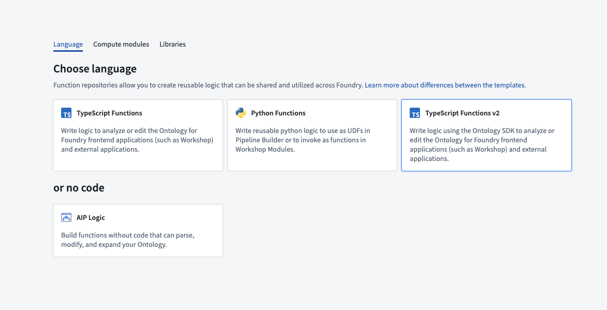
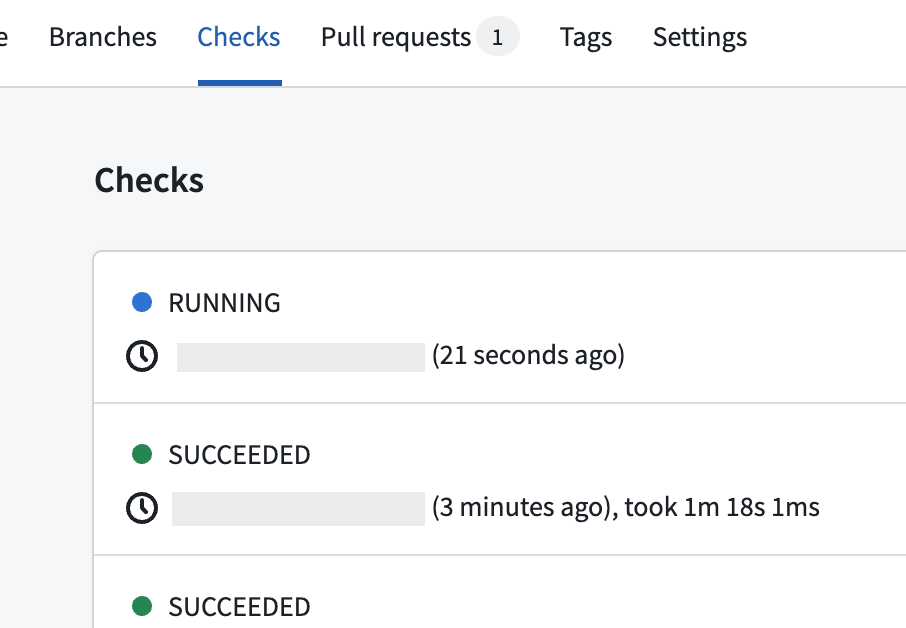
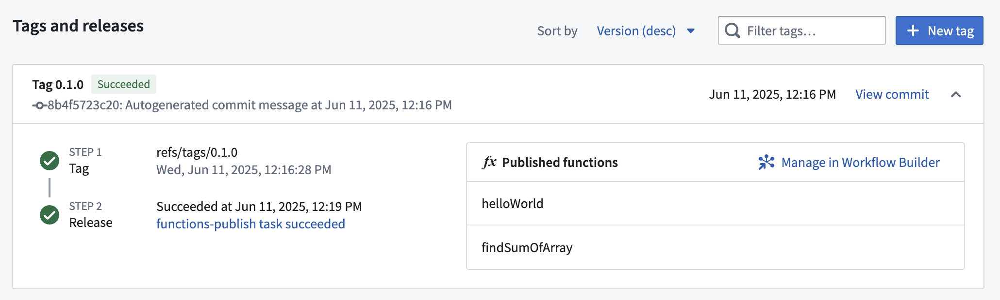
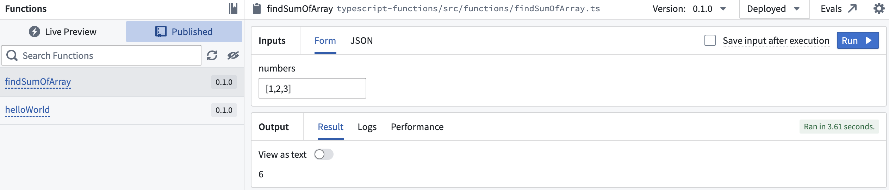

<!-- source: https://palantir.com/docs/foundry/functions/typescript-v2-getting-started/ · mirrored 2026-08-22 from Palantir Foundry docs -->

# Getting started with TypeScript v2 functions

TypeScript v2 allows users to take advantage of several key [improvements over TypeScript v1](/docs/foundry/functions/language-feature-support/#typescript-v1-vs-typescript-v2), including a Node.js runtime and first-class OSDK support. Review the sections below to get started.

## Create a TypeScript v2 functions repository

Navigate to a project of your choice and create a new code repository by selecting **+ New > Repository**. Select the TypeScript v2 functions template to initialize your repository.



Once the repository has been created, navigate to the `typescript-functions/src/functions/helloWorld.ts` file.

## Write a function

To write a new function, create a new file in the `typescript-functions/src/functions` directory of your repository and give it a descriptive name, for example, `helloWorld.ts`. Write your function using `export default` for Foundry to detect it.

```typescript tab="TypeScript v2"
export default function helloWorld(): string {
    return "Hello World!";
}
```

You must satisfy the following conditions for your function to be published to Foundry:

1. Define your function in a `.ts` file in the `typescript-functions/src/functions` directory. In this directory, you can also group related functions in subdirectories.
2. The name of your file must match the name of your function. For a function called `myFunction` to be published, it must be defined in a file called `myFunction.ts` within the `typescript-functions/src/functions` directory.
3. The TypeScript function must be the default export of your file.
4. Your function's input and output types must follow the supported function types, as detailed in the [type reference](/docs/foundry/functions/types-reference/).

Your function's file path is used to uniquely identify the function that gets published from it. Note that a change in your function's file path will therefore result in a new function being published.

## Test in live preview

To test your function in live preview, open the **Functions** helper and select **Live preview**. Choose your function and select **Run** to execute.


## Commit and publish a function

Select **Commit** at the upper right corner of the window to commit your changes to the `master` branch of your repository. To view your function's checks, open the **Checks** tab at the top of the page. Here, after making a commit, you should see a running check.



After committing your work, you will see the **Tag version** option. This will publish all of the functions in your repository.


Select **Tag version** to tag a release off of the `master` branch. Set the tag name based on the extent of your changes, and then select **Tag and release**.


To view the progress as your functions are tagged and released, select the **View** pop-up or navigate to the **Tags** tab. Once **Step 2: Release** is completed, select the published functions to view them in the function registry.

:::callout{theme="warning"}
Functions may not be immediately searchable by name in Workshop or the function registry while permissions propagate.
:::



## Use a new function

After the checks for your tag have passed, navigate back to the **Code** tab in **Code Repositories** and select the **Functions** helper. You should now be able to see your functions under the **Published** section. Select it and run the new function:



## Next steps

After you create and publish a basic function, explore these capabilities:

* **Ontology SDK:** To query or edit Ontology objects, first import the object and link types you need, then [generate and install the Ontology SDK](/docs/foundry/functions/typescript-v2-migration/#generate-the-ontology-sdk).
* **Ontology edits:** Learn how to [create, update, and delete objects](/docs/foundry/functions/typescript-v2-ontology-edits/) in your functions.
* **Staged writes \[Beta]:** For edit functions that need read-after-write guarantees or nested function calls, see [staged writes](/docs/foundry/functions/typescript-v2-staged-writes/).
