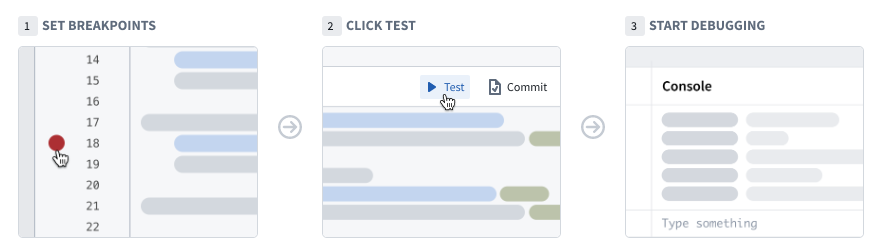

<!-- source: https://palantir.com/docs/foundry/functions/unit-test-debugging/ · mirrored 2026-08-22 from Palantir Foundry docs -->

# Debug

Use the debugger tool in Code Repositories to examine the behavior of your unit test while it runs. Set breakpoints to pause the execution of the unit test in order to examine variables, and understand functions and libraries.

For detailed information on [setting breakpoints](/docs/foundry/functions/debug/#set-breakpoints), [running the debugger](/docs/foundry/functions/debug/#run-the-debugger), and [examining variables](/docs/foundry/functions/debug/#examine-variables), refer to the [function debugging documentation](/docs/foundry/functions/debug/).
