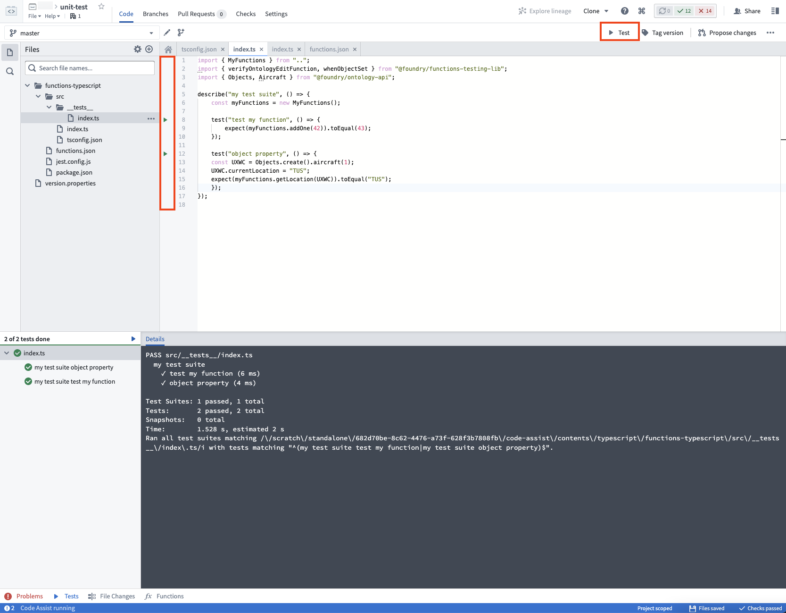
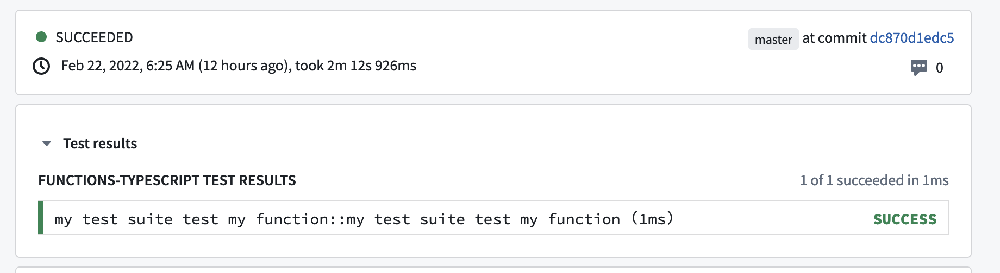

<!-- source: https://palantir.com/docs/foundry/functions/unit-test-getting-started/ · mirrored 2026-08-18 from Palantir Foundry docs -->

# Getting started

Functions ships with support for [Jest ↗](https://jestjs.io/) unit tests. Follow the steps in this guide to get unit testing tools set up for your repository.

By default, functions includes a unit test located in the test file `functions-typescript/src/__tests__/index.ts`. You can create test files anywhere in the `__tests__` folder.

## Example

For example, we may want to test the following function `addOne` in `functions-typescript/src/index.ts`:

```typescript
import { Function, Integer } from "@foundry/functions-api";

export class MyFunctions {

    @Function()
    public addOne(n: Integer): Integer {
         return n + 1;
    }
}
```

We can test the function `addOne` by writing the following test `test add one`:

```typescript
import { MyFunctions } from ".."

describe("example test suite", () => {
    const myFunctions = new MyFunctions();
    test("test add one", () => {
        expect(myFunctions.addOne(42)).toEqual(43);
    });
});
```

Refer to the [Jest API ↗](https://jestjs.io/docs/en/api) for details about the full testing API available to you.

## Running tests

You can run all your tests by clicking on the `Test` button located on the top right, or run each individual test by clicking on the triangular "Play" button located beside the line number for each test.



When you click **Commit**, all tests will also run in Checks:



## Next steps

Next, learn about the range of options available for testing functions that interact with the Ontology:

* [Create stub objects](/docs/foundry/functions/unit-test-stub-objects/)
* [Verify Ontology edits](/docs/foundry/functions/unit-test-ontology-edits/)
* [Stub Object searches and aggregations](/docs/foundry/functions/unit-test-object-searches/)
