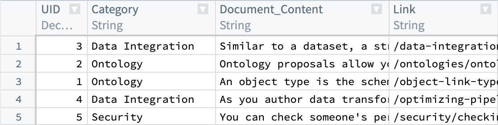
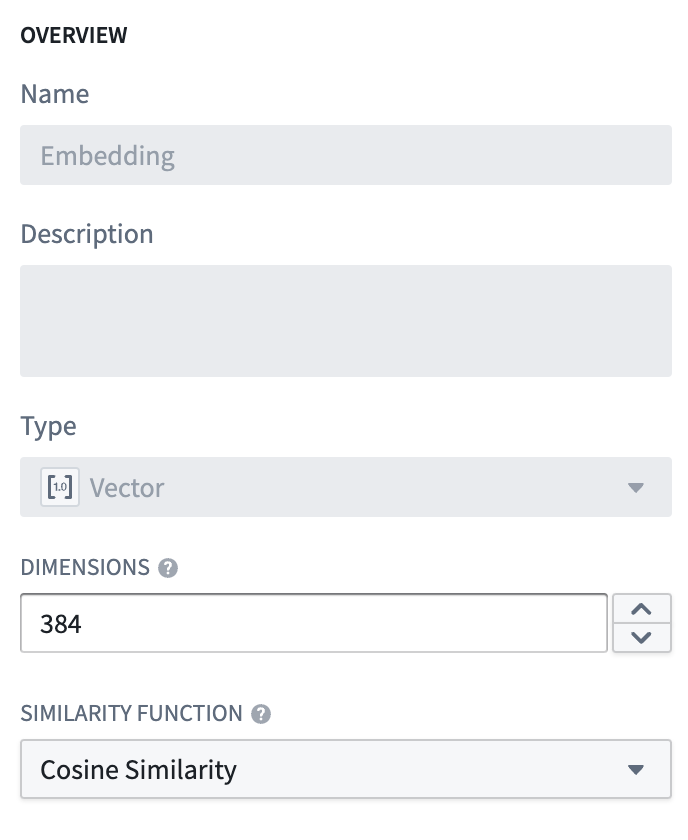
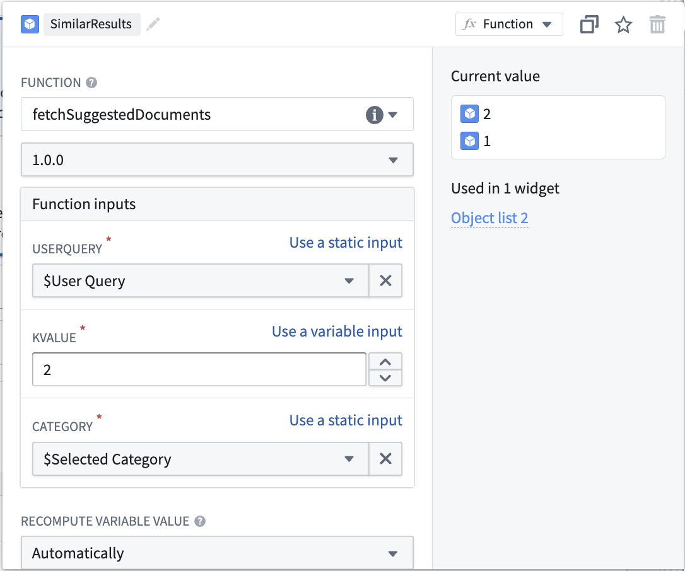
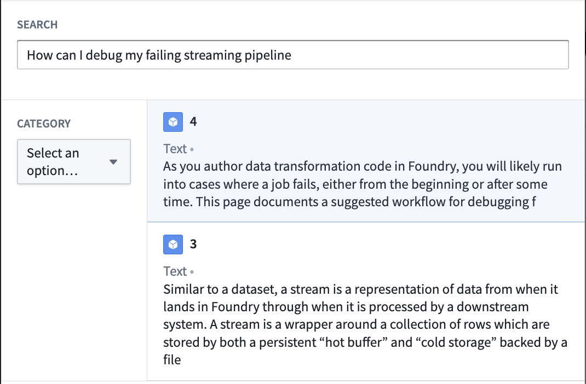

<!-- source: https://palantir.com/docs/foundry/functions/using-custom-models-to-create-a-semantic-search-workflow/ · mirrored 2026-08-18 from Palantir Foundry docs -->

# Using custom models to create a semantic search workflow

:::callout{theme="warning"}
This tutorial is for those using an embedding model not supplied by Palantir, which is no longer a recommended workflow. See the list of [Palantir-provided models](/docs/foundry/aip/supported-llms/) and the [Palantir-provided model semantic search tutorial](/docs/foundry/ontology/using-palantir-provided-models-to-create-a-semantic-search-workflow/).
:::

This page illustrates the process of building a notional end-to-end documentation search service that is capable of retrieving relevant docs when given a prompt. The service will use a [Foundry modeling objective](/docs/foundry/model-integration/objectives/) to embed documents and extract their features into a vector. These documents and embeddings will be stored in an object type with the vector property.

For this example, we begin by setting up a model in Foundry and creating a pipeline to generate embeddings. Then, we will create a new object type and a function to query it through natural language.

We begin with a dataset that currently has our parsed documents and metadata, such as `Document_Content` and `Link`. Next, we will generate embeddings from the `Document_Content` to enable us to query them via semantic search.



To understand the details of the KNN feature, review [KNN Functions on Objects](/docs/foundry/functions/api-object-sets/#k-nearest-neighbors-knn) section in the Foundry documentation.

:::callout{theme="success" title="Value substitution"}
Throughout this workflow you can substitute a value of your choosing, as long as it is consistent for each instance. For example, every instance of `ObjectApiName` is always substituted with `Document`.

The values you must substitute are:

* `ObjectApiName`: identifier for a unique ObjectType, in our case `Document`. *NOTE:* The identifier may sometimes appear as `objectApiName` with the first letter lowercased.
* `ModelApiName`: identifier for a function wrapping a Model
* `OutputDatasetRid`: identifier for the output dataset from the [embedding transform](#1-create-embeddings-using-models-in-foundry).
* `InputDatasetRid`: identifier for the input dataset for the [embedding transform](#1-create-embeddings-using-models-in-foundry).
* `ModelRid`: identifier for the model used for the [embedding transform](#1-create-embeddings-using-models-in-foundry) and in the [creation of the Live Modeling Deployment](#3-create-a-live-modeling-deployment)
:::

## 1. Create embeddings using models in Foundry

There are a few options for creating embeddings from a model in Foundry. In this example, we will create a transform to interact with an [imported open-source model](/docs/foundry/integrate-models/import-huggingface-models/). We will use the `all-MiniLM-L6-v2` model, a general purpose text-embedding model that will create vectors of dimension (size) 384. This model can be swapped out with any other existing model that outputs vectors compatible with the [Foundry Ontology `vector` type](/docs/foundry/object-link-types/property-metadata/#property-base-types-with-limited-support). To import a new open-source model, review our [Hugging Face model documentation](/docs/foundry/integrate-models/import-huggingface-models/).

The code below expects the model to expose an API with a tabular input containing a `text` string column and a column for tabular outputs containing an `embedding` list of floats. For more details on defining model APIs, refer to the [model adapter API documentation](/docs/foundry/integrate-models/model-adapter-api/).

```python
import palantir_models as pm


class EmbeddingModelAdapter(pm.ModelAdapter):
    ...

    @classmethod
    def api(cls):
        inputs = {
            "inference_data": pm.Pandas(columns=[("text", str)])
        }
        outputs = {
            "output_data": pm.Pandas(columns=[("text", str), ("embedding", list[float])])
        }
        return inputs, outputs
```

The transform below runs the data through the model to return an `embedding`, then casts the `embedding` value (double arrays) to floats in order to match the type necessary for vector embeddings.

A couple of points to consider:

* Each `StructField` in the `schema` variable relates to a columns that are present in the processed input dataset (`InputDatasetRid`) plus the `embedding` column added by the model.
* When working with data at larger scales, the transform might fail if using a Pandas dataframe that is excessively large. In these cases, the transform will have to be performed in Spark.
* Graphics Processing Units (GPUs) can be leveraged to increase the speed at which embeddings are produced by a transform. GPUs can be used by adding the `@configure` decorator to your transform. Contact your Palantir representative if you are interested in enabling this in your environment.

An example transform is shown below:

```python
from transforms.api import configure, transform, Input, Output
from palantir_models.transforms import ModelInput
from pyspark.sql.functions import pandas_udf, PandasUDFType
from pyspark.sql.types import StructType, StructField, IntegerType, StringType, FloatType, ArrayType
import numpy as np


@configure(profile=["DRIVER_GPU_ENABLED"]) # Remove this line if GPUs have not been enabled in your environment
@transform(
    dataset_out=Output("OutputDatasetRid"),
    dataset_in=Input("InputDatasetRid"),
    embedding_model=ModelInput("ModelRid")
)
def compute(ctx, dataset_out, dataset_in, embedding_model):
    # Match input column of model
    spark_df = dataset_in.dataframe().withColumnRenamed("Document_Content", "text")

    def embed_df(df):
        # Create embeddings
        output_df = embedding_model.transform(df).output_data
        # Cast to float array
        output_df["embedding"] = output_df["embedding"].apply(lambda x: np.array(x).astype(float).tolist())
        # drop unnecessary column
        return output_df.drop('inference_device', axis=1)

    # Updated schema
    schema = StructType([
        StructField("UID", IntegerType(), True),
        StructField("Category", StringType(), True),
        StructField("text", StringType(), True),
        StructField("Link", StringType(), True),
        StructField("embedding", ArrayType(FloatType()), True)
    ])

    udf = pandas_udf(embed_df, returnType=schema, functionType=PandasUDFType.GROUPED_MAP)
    output_df = spark_df.groupBy('UID').apply(udf)

    # Write the output DataFrame
    dataset_out.write_dataframe(output_df)
```

Next, we will need a Live Modeling Deployment to create embeddings off of a user query to be used to search against our existing vectors. The model used in this part should be the same as the one used to generate the initial embeddings in this current step.

## 2. Create object type

By now, we should have a new dataset with a column containing float vector embeddings generated using the batch modeling deployment [from our first and previous step](#1-create-embeddings-using-models-in-foundry). Next, we will create an object type.

We will name the object type `Document`, and set the `embedding` property to be of property type `Vector`. This requires configuring two values:

1. **Dimension:** this is the length of the array produced in the column `embedding`.
2. **Similarity Function:** the method by which distance between two `embedding` values from different objects will be calculated.



Once this object type is created, we will have a property (`embedding`) that can be used to semantically search through the `Documentation` objects.

The value for `ObjectApiName` will be available after the object type is saved, and can be found on the configuration page for the object type created. More information can be found about this on the [Create an object type](/docs/foundry/object-link-types/create-object-type/#add-metadata-for-a-new-object-type) section of the documentation.

## 3. Create a Live Modeling Deployment

Now that our objects have embeddings as a property, we need to generate embeddings for user queries with low-latency. These embeddings will be used to find objects with similar embedding values. To do this, create a live model deployment for fast, low-latency access with Functions.

Review the [instructions for configuring a live deployment in Modeling Objectives](/docs/foundry/manage-models/set-up-live/) or [directly from a model](/docs/foundry/manage-models/create-a-model-deployment/). A [Function then needs to be published](/docs/foundry/model-integration/model-functions-guide/) for that model.

## 4. Create an embedding with Functions on Models

:::callout{theme="warning" title="Enabling Vector properties for functions"}
Before proceeding, ensure that the entries `"enableVectorProperties": true`, `"enableResourceGeneration": true`, and `"useDeploymentApiNames": true` are *all* present in the `functions.json` file in your Functions code repository. If these entries are not present, add them to `functions.json` and commit the change to proceed. Contact your Palantir representative if you need further assistance.
:::

The final step is to create a function to query this object type. For the search phase, the overall goal is to be able to take some user input, generate a vector using the live modeling deployment [created earlier](#3-create-a-live-modeling-deployment), and then do a [KNN search](/docs/foundry/functions/api-object-sets/#k-nearest-neighbors-knn) over our object type.
A sample function for this use case is shown below, including the file structure they should reside within.

Edits to vector properties can be applied by Actions and Functions.

Further information on how to use a model in a Function can be found in the [Functions on models documentation](/docs/foundry/functions/functions-on-models/).

### File structure

```
|-- functions-typescript
|   |-- src
|   |   |-- tests
|   |   |   |-- index.ts
|   |   |-- index.ts
|   |   |-- semanticSearch.ts
|   |   |-- service.ts
|   |   |-- tsconfig.json
|   |   |-- types.ts
|   |-- functions.json
|   |-- jest.config.js
|   |-- package-lock.json
|   |-- package.json
|-- version.properties
```

### functions-typescript/src/types.ts

```typescript
import { Double } from "@foundry/functions-api";

export interface IEmbeddingModel {
    embed: (content: string) => Promise<IEmbeddingResponse>;
}

export interface IEmbeddingResponse {
    text: string
    embedding: Double[]
    inference_device?: string
}

export interface IEmbeddingRequest {
    text: string
}
```

### functions-typescript/src/service.ts

```typescript
// View the Model in the repository's Resource imports sidebar to know which namespace to import it from
import { ModelApiName } from "@{YOUR_NAMESPACE_HERE}/models";
import { IEmbeddingRequest, IEmbeddingResponse } from "./types";

// service to hit model
export class EmbeddingService {
    public async embed(content: string): Promise<IEmbeddingResponse> {
        const request: IEmbeddingRequest = {
                                "text": content,
                            };
        return await ModelApiName([request])
                                 .then((output: any) => output[0]) as IEmbeddingResponse;
    }
}
```

### functions-typescript/src/semanticSearch.ts

```typescript
import { Function, Integer, Double } from "@foundry/functions-api";
import { Objects, ObjectApiName } from "@foundry/ontology-api";

import { EmbeddingService } from "./service";
import { IEmbeddingResponse, IEmbeddingModel } from './types';

export class SuggestedDocs {
    embeddingService: IEmbeddingModel = new EmbeddingService;

    @Function()
    public async fetchSuggestedDocuments(userQuery: string, kValue: Integer, category: string): Promise<ObjectApiName[]> {
        const embedding: IEmbeddingResponse = await this.embeddingService.embed(userQuery);
        const vector: Double[] = embedding.embedding;

        return Objects.search()
                      .objectApiName()
                      .filter(obj => obj.category.exactMatch(category))
                      .nearestNeighbors(obj => obj.embedding.near(vector, {kValue: kValue}))
                      .orderByRelevance()
                      .take(kValue);
    }

    /**
     * The following is an alternative to fetchSuggestedDocuments which applies a threshold similarity.
     * Otherwise, kValue number of documents are always returned, no matter how similar.
     * The computation of the distance function depends on the distance function defined for the embedding
     * property. Here we assume it's cosine similarity, which can be computed with a simple vector dot
     * product if the embedding model produces normalized vectors.
     */
    @Function()
    public async fetchSuggestedDocumentsWithThreshold(userQuery: string, kValue: Integer, category: string, thresholdSimilarity: Double): Promise<ObjectApiName[]> {
        const embedding: IEmbeddingResponse = await this.embeddingService.embed(userQuery);
        const vector: Double[] = embedding.embedding;

        return Objects.search()
                      .objectApiName()
                      .filter(obj => obj.category.exactMatch(category))
                      .nearestNeighbors(obj => obj.embedding.near(vector, {kValue: kValue}))
                      .orderByRelevance()
                      .take(kValue)
                      .filter(obj => SuggestedDocs.dotProduct(vector, obj.embedding! as number[]) >= thresholdSimilarity);
    }

    private static dotProduct<K extends number>(arr1: K[], arr2: K[]): number {
        if (arr1.length !== arr2.length) {
            throw EvalError("Two vectors must be of the same dimensions");
        }
        return arr1.map((_, i) => arr1[i] * arr2[i]).reduce((m, n) => m + n);
    }
}
```

### functions-typescript/src/index.ts

```typescript
export { SuggestedDocs } from "./semanticSearch";
```

## 5. Publish the function and use in an example

At this point, we have a function that can run semantic search to query objects with natural language. The final step is to [publish the function](/docs/foundry/functions/getting-started/#publish-your-functions) and use it in a workflow. To continue building on the documentation search example, we will create a Workshop application to invoke this function with a text input to return the top two matching documentation articles to a user.

The process to creating a semantic search for the documentation service in the example is as follows:

1. Start by [creating a Workshop application](/docs/foundry/workshop/getting-started/).
2. Add a [text input](/docs/foundry/workshop/widgets-text-input/) and a [string selector](/docs/foundry/workshop/widgets-string-selector/). The string selector will be used to choose a documentation category with which to filter. Both the text input and string selector will serve as inputs into the published KNN document fetch function.
3. Finally, add an [object list widget](/docs/foundry/workshop/widgets-object-list/) with an input object set generated from the function and the selected inputs as shown below:



From this point, the inputs will be used to semantically search through documents in the object type and return the two most relevant. This is just one simple use case of vector properties and semantic search. See an example of the resulting Workshop application in the screenshot below:


