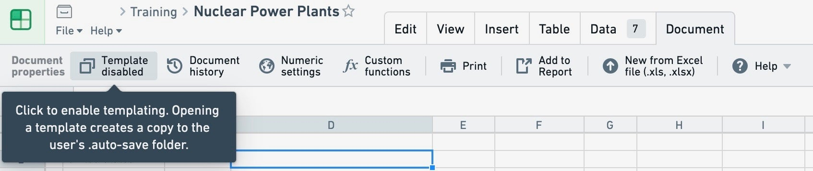
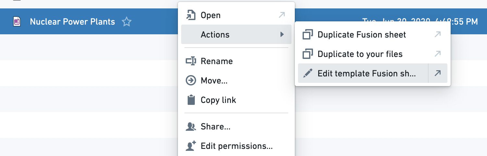

<!-- source: https://palantir.com/docs/foundry/fusion/create-templates/ · mirrored 2026-08-26 from Palantir Foundry docs -->

# Create templates

Any Fusion spreadsheet can be converted into a template under the document tab in the toolbar.

When a Fusion document is marked as a template, attempting to open the Fusion document (e.g. by clicking on it in Foundry or navigating directly to the document's URL) will not open the underlying spreadsheet; instead, a copy of the spreadsheet will be made (the user will be prompted to select a location).

If you would like to edit the master template (rather than make a copy), right click on the spreadsheet in Foundry and select **Actions** > **Edit template Fusion sheet**.

You can also have custom links to Fusion spreadsheets that make a copy with a specific change to the sheet. An example of a URL that copies with cell value overrides would be */copy?Sheet1!A1=test*.
