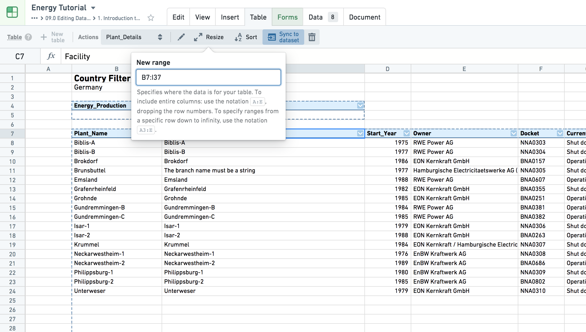

<!-- source: https://palantir.com/docs/foundry/fusion/create-use-table-regions/ · mirrored 2026-08-26 from Palantir Foundry docs -->

# Create and use table regions

You can create a table out of any region in the spreadsheet – table regions enforce a strictly tabular format to a region and allow you to assign column headers, refer to columns by column names (vs cell references), sort the rows by any column, etc.

:::callout{theme="success" title="Tip"}
When a new row is appended to a table region, it’ll grow the region, pushing down any values underneath as necessary.
:::

:::callout{theme="warning" title="Warning"}
Sorting in Fusion works differently from other spreadsheet tools that you may have used. Rather than simply presenting a sorted view of the data, performing a sort in Fusion actually rearranges the rows in a sheet so that the cells are in a sorted order. This means that a sort in Fusion cannot be "turned off" to return to the original ordering; instead, you will need to undo the sort in order to see the original ordering again.
:::
