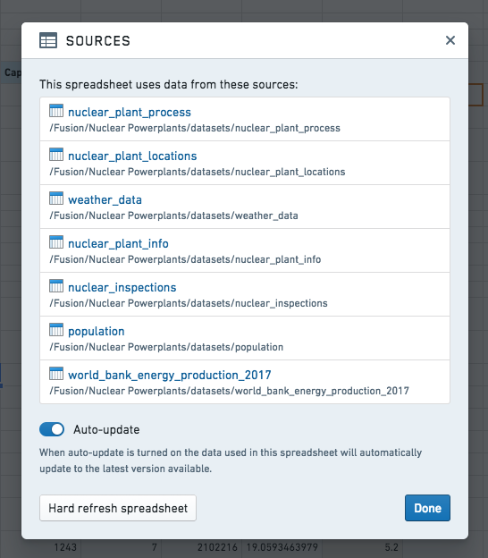
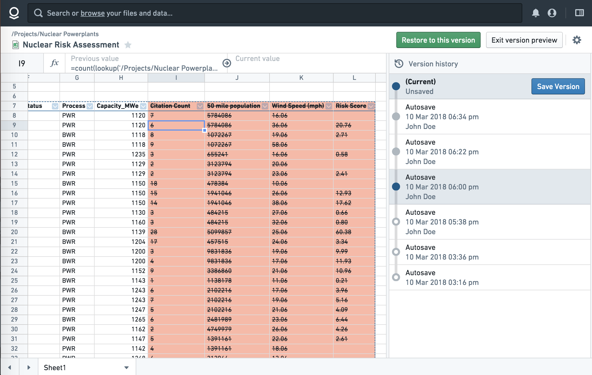

<!-- source: https://palantir.com/docs/foundry/fusion/data-updates-edit-history/ · mirrored 2026-08-26 from Palantir Foundry docs -->

# Data updates and edit history

You can view the data sources used in a spreadsheet under the Sources pane in the top right.

There are two ways to keep a spreadsheet up to date with dynamic data:

* **Auto-update:** When enabled, anytime a data source (i.e. a Foundry dataset used in a spreadsheet) is updated, cells that use data from that source will automatically be updated.
* **Manual:** If auto-update is not enabled, you will see a notification bar displayed on top of the spreadsheet whenever the data sources are updated, giving you the option to either update cells with fresh data or keep your spreadsheet as-is.

:::callout{theme="success" title="Tip"}
When you share the Fusion sheet with other users, make sure they also have read access to the datasets listed on the Sources pane. Users who lack access to referenced datasets will not be able to open the document.
:::

You can see a history of manually and automatically saved snapshots since a spreadsheet has been created in the history pane. Clicking on one of the snapshots will allow you to compare changes and restore if you would like.

:::callout{theme="success" title="Tip"}
Fusion will make backup snapshots of your spreadsheet periodically, but you can also manually make snapshots if you would like.
:::
