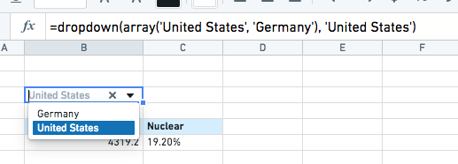
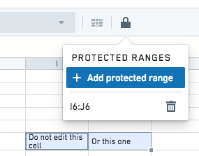

<!-- source: https://palantir.com/docs/foundry/fusion/dropdowns-locked-cells-links/ · mirrored 2026-08-26 from Palantir Foundry docs -->

# Dropdowns, locked cells, and links

Any cell in a Fusion spreadsheet can be converted to a dropdown using the `dropdown` and `multidropdown` functions (e.g. `=dropdown(array(1,2,3))`). The `dropdown` function has other optional arguments that can be found in the [function library](/docs/foundry/fusion/function-library/) to customize the behavior.

You can lock any set of cells in a shared spreadsheet to prevent accidental edits. Once locked, any user will need to remove the lock to be able to edit the cell again.

The `url` function allows you to create links in any cell of the spreadsheet. You can use the `url_encode` and `query_params` functions to get help formatting a string for a complex URL.
