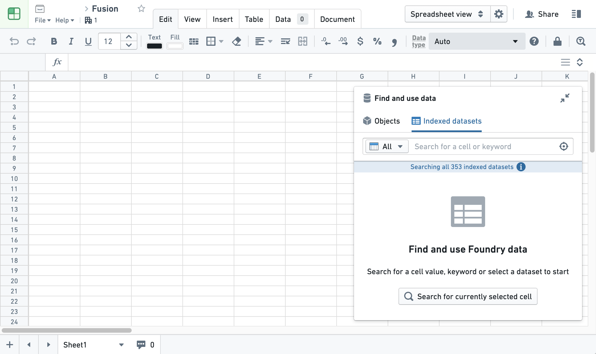
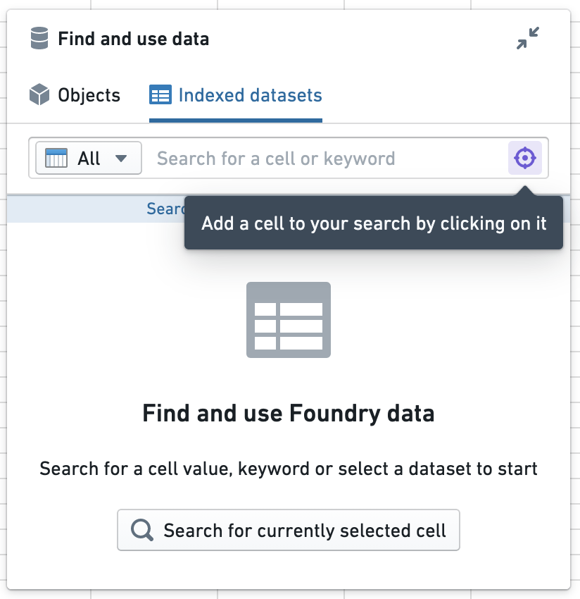
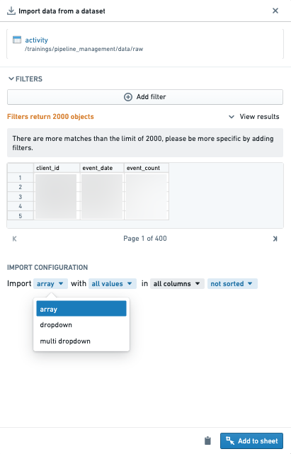
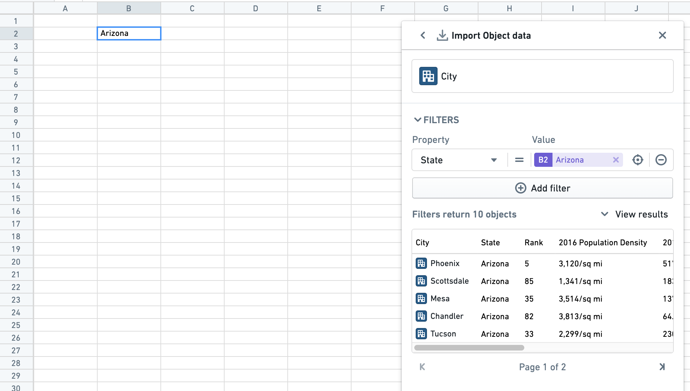
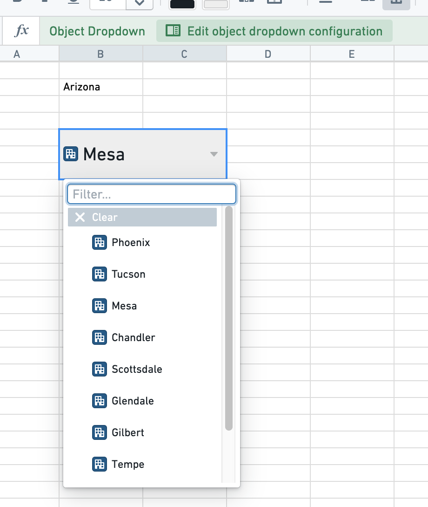
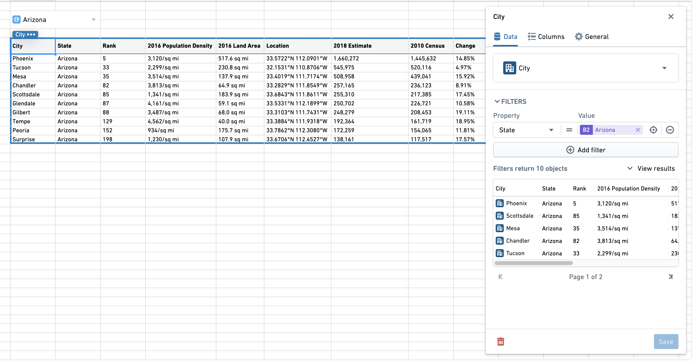

<!-- source: https://palantir.com/docs/foundry/fusion/find-and-use-data/ · mirrored 2026-08-26 from Palantir Foundry docs -->

# Find and use data

## Search

The **Find and use data** search panel makes it easy to pull data and objects into Fusion. The search panel can be accessed by selecting the **Find and use data** box in the upper-right-hand corner of the Fusion sheet.

You can search either by typing values directly into the search input area ("Search for a cell or keyword") or by clicking the "Target" icon and then selecting cell values.

You can also choose specific object types or datasets to search across. If a selected dataset is not indexed, you will be prompted to index it.

## Import data

Once you have found the data you want to import, select **Use data** and open the **Import Data** panel to bring it into the sheet. Note that you can import a maximum of 2,000 rows.

The **Import Data** panel will add any filters used in the search results as filters for the import query. For example, if you search for `Red` and select **Use data** for a set of cars that matched on the `color` property or column, your initial query will start as cars where `color == red`.

From here you can add more filters, and eventually add the resulting data to your sheet as an array, dropdown, or multi-dropdown.

### Dataset array

Importing as a dataset array adds a `lookup_array` function to the sheet. A dataset array does not include column names from the source. See [Lookup datasets](/docs/foundry/fusion/lookup-datasets/) for more information on how to use lookups.

:::callout{theme="success" title="Tip"}
To expand an array of results from a `lookup`, you can **Shift+drag** that cell down into individual cells.
:::

### Dataset dropdown and dataset multi-dropdown

Adding a dataset dropdown to a sheet places a single-select dropdown in a single cell for each imported column. A dataset multi-dropdown does the same, but allows selection of multiple values. You can then use this dropdown to power other parts of the sheet.

Formatting can be applied to dataset dropdown cells, including merging or resizing the cell, setting font size, and setting background fill.

## Import objects

Similar to datasets, you can use filters to refine the list of objects imported into your sheet if the objects are not backed by restricted views. Filters can be values or cell references. Cell references will filter based on the value of a cell and allow you to make a dynamic sheet where your object set will update based on other values or selections. In this example, the underlying data comes from the [U.S. Census Bureau ↗](https://www.census.gov/newsroom/press-kits/2018/pop-estimates-national-state.html).

Below, the `City` object type has a filter where `State` is equal to the value of cell `B2`. Currently the cell value is `Arizona`, and filters down to cities where `State` is `Arizona`. The cell value could be changed, which would update the filter.

After applying filters, you can select **Reload** to view the resulting object set. You can import this object set to the sheet as an object dropdown or an object table. By default, up to 200 objects can be pulled into a single object dropdown or object table.

### Object dropdown

Adding objects to a sheet as a dropdown will place a dropdown in a single cell. You can use this dropdown to power other parts of the sheet.

The object dropdown cell will display the currently selected object alongside the object icon. You can then select the cell to open the dropdown and select another object.

Formatting can be applied to object dropdown cells, including merging or resizing the cell, setting font size, and setting background fill.

### Object tables

Object tables can be formatted for presentation or used elsewhere in the sheet.

Object dropdowns and object tables can be combined to create a simple dashboard: to accomplish this, object dropdowns can be used to select objects which are in turn used as filters in the object table.

:::callout{theme="neutral"}
A Fusion sheet cannot contain both objects and export dataset syncs. If you have objects, you will be prevented from adding new dataset syncs and vice versa.
:::
