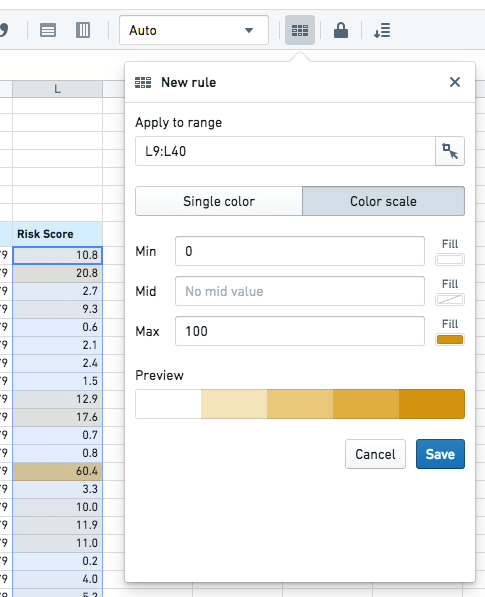
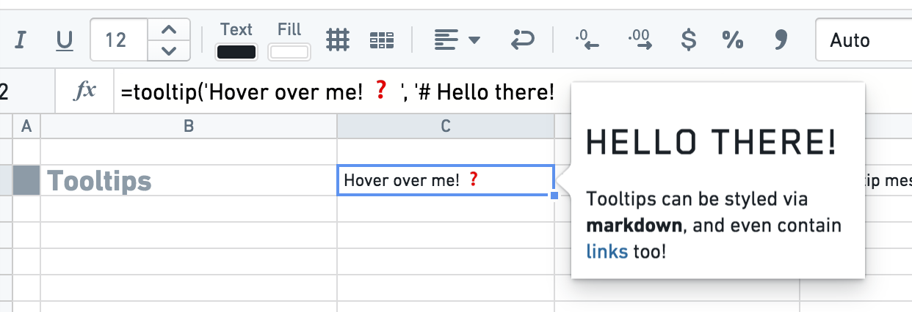
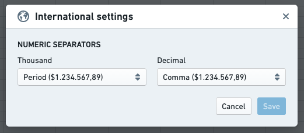

<!-- source: https://palantir.com/docs/foundry/fusion/format-cells/ · mirrored 2026-08-26 from Palantir Foundry docs -->

# Format cells

The most commonly used formatting options (styling, numeric/currency formats, freezing panes, etc.) are available in the formatting bar above the spreadsheet.

Conditional formatting can be especially useful when coupled with dynamic data from `lookup` functions to offer changing views.

You can also use the `color` function to add styling to a cell based on custom logic. Similarly, the `tooltip` function can be used to have a tooltip show custom content when the user hovers on a cell.

The decimal and thousands separators can be changed by clicking the **Numeric settings** button under the Document tab.

