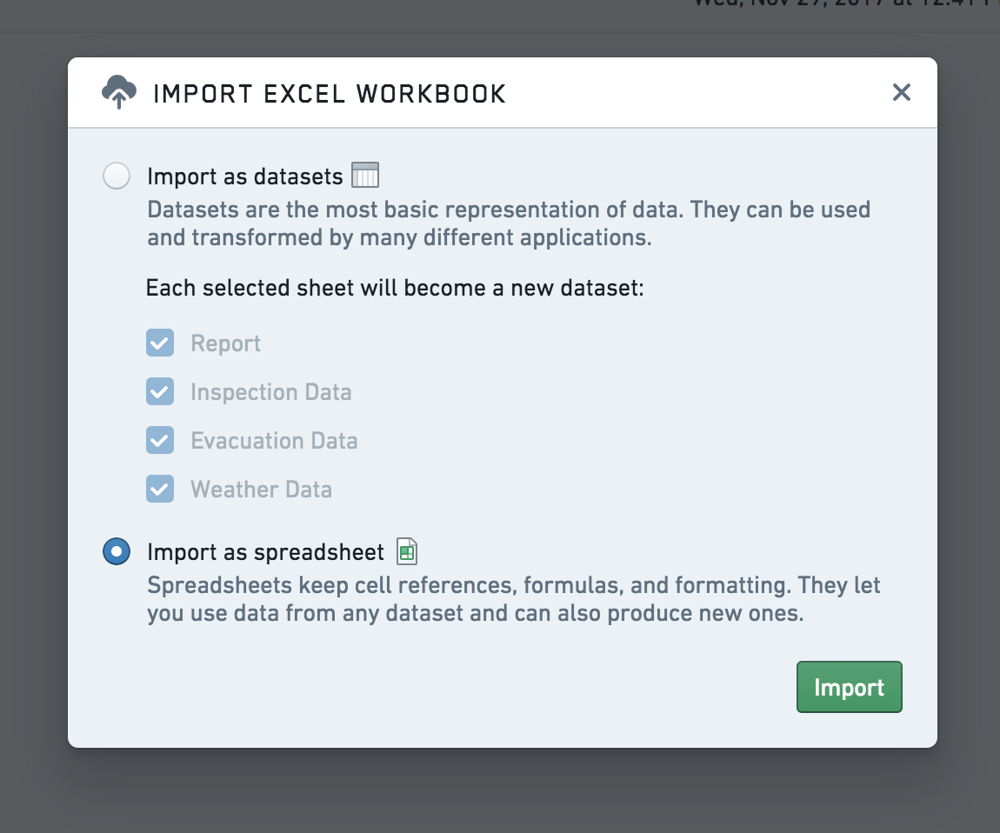

<!-- source: https://palantir.com/docs/foundry/fusion/import-xls/ · mirrored 2026-08-26 from Palantir Foundry docs -->

# Import XLS documents

You can convert an existing Excel file (`.xls` or `.xlsx`) to a Fusion spreadsheet by dragging and dropping into any folder in Foundry or through the **New from Excel file** option under the **Document** tab.

:::callout{theme="warning"}
The amount of data you can paste into a Fusion spreadsheet scales with your computer's memory, and typically works up to a few thousand rows. Use XLS Import to import larger files.
:::
