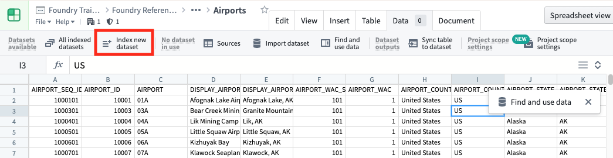
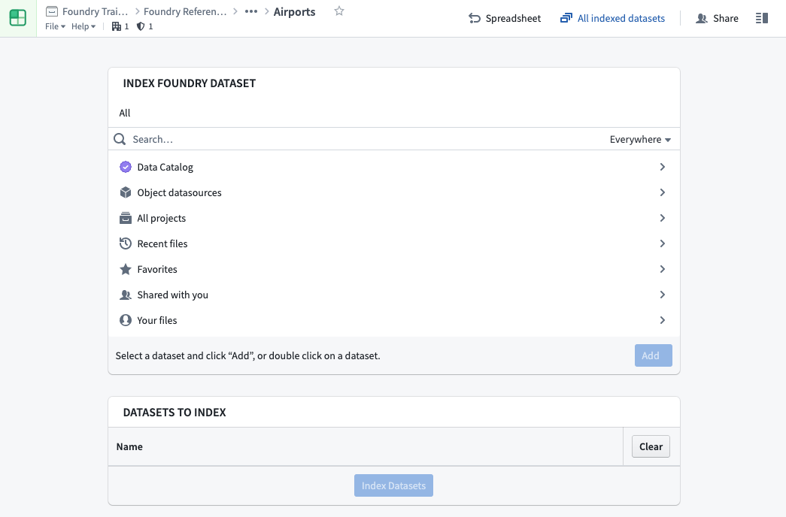

<!-- source: https://palantir.com/docs/foundry/fusion/index-datasets/ · mirrored 2026-08-26 from Palantir Foundry docs -->

# Index datasets

Before you can use your datasets in Fusion, you have to make sure they are indexed into Lime. The easiest way to do this is through **Index new dataset** under the Data tab menu in Fusion. The screenshot below uses an open source dataset of U.S. airports.

On the resulting screen, you can select multiple datasets (and branches) to index.

Click **Indexed datasets** under the settings menu to see the list of datasets available in Fusion and their current index status (**Up-to-date**, **Syncing**, **Stale**).
