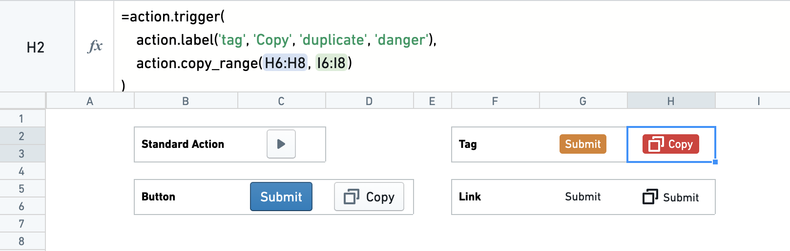
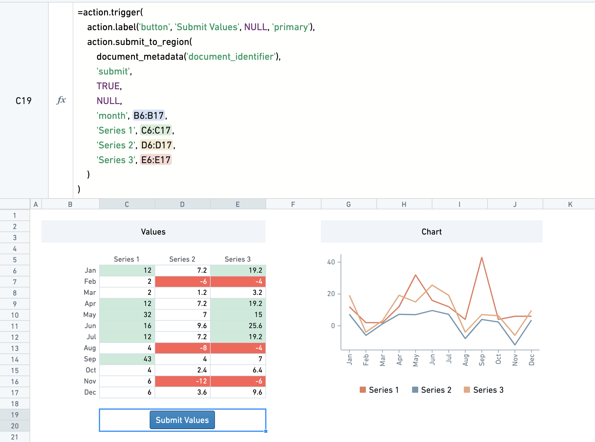
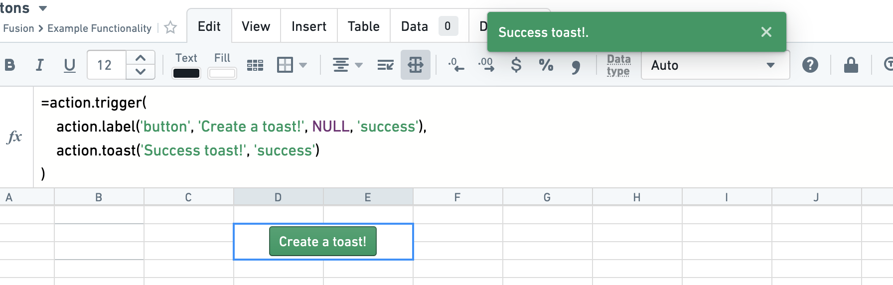
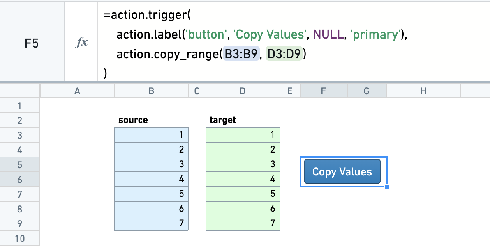
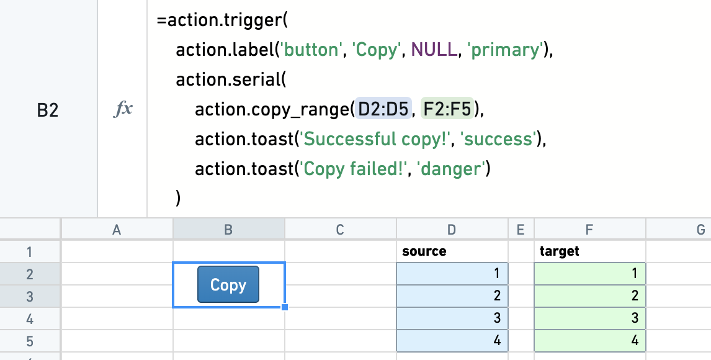

<!-- source: https://palantir.com/docs/foundry/fusion/perform-actions/ · mirrored 2026-08-26 from Palantir Foundry docs -->

# Perform Actions

Fusion offers a set of formulas which perform an Action. The Actions display as buttons, which are triggered upon click. For example, a cell with `=action.copy_range(A1:A10, B1:B10)` will display a button, which, when clicked, will copy the contents of the range `A1:A10` to the range `B1:B10`.

This page is an overview of available Actions. For a full list of formulas and arguments, see the [function library](/docs/foundry/fusion/function-library/#action-functions).

## Action labels

By default, Actions display as a simple square play button. Through the use of `action.label`, a button can be customized to have a type, text, an icon, and a color intent.

Resizing cells and merging cells are useful tools for positioning buttons.

Suppose you have an Action `action.copy_range(...)`. Wrapping it in a trigger Action allows you to include an Action label: `=action.trigger(action.label(...), action_copy_range(...))`.

## Submit Actions

The `=action.submit_to_region(...)` Action allows you to submit data to a table region. This is often useful for collecting user entered data or calculation outputs into a table.

The submission Action submits with a `key_value` column. For each row that is submitted, if the `key_value` exists in the submission table, the row is updated with the newly submitted values. If the `key_value` does not exist, a new row is inserted.

The table region can also be in a separate sheet. To successfully submit values, the user will need edit access to the sheet that is being submitted to. If the sheet being submitted to is synced to a dataset, the dataset will only build with the latest changes made by the user if the user has edit permissions on the synced dataset.

## Toast Actions

The `=action.toast(...)` formula can be used to generate a floating message at the top of the page — called a 'toast'. These are best used in combination with other Actions through the `parallel` and `serial` Actions.

## Copy Actions

The `=action.copy(...)` Action allows you to copy the contents of one range to another.

The optional `copy_result` argument can be set to `true` to copy the computed value, rather than the cell formula.

## Chaining Actions

Actions can be combined together in parallel or in serial.

### Parallel Actions

Multiple Actions can be triggered at once with `=action.parallel(...)`. This is useful if they are independent Actions, such as a two copy Actions that have no overlap.

### Serial Actions

Actions can be triggered in serial with `=action.serial(...)`. As well as an Action, each serial Action has two further Action arguments: actionOnSuccess and actionOnFailure. One of these is run, determined by whether the initial Action succeeds or fails.

Serial Actions are often useful alongside the validation formulas, where you could set a custom toast depending on whether the validation succeeds or fails. See the [validation documentation](/docs/foundry/fusion/validate-results/) for more details on these functions.

