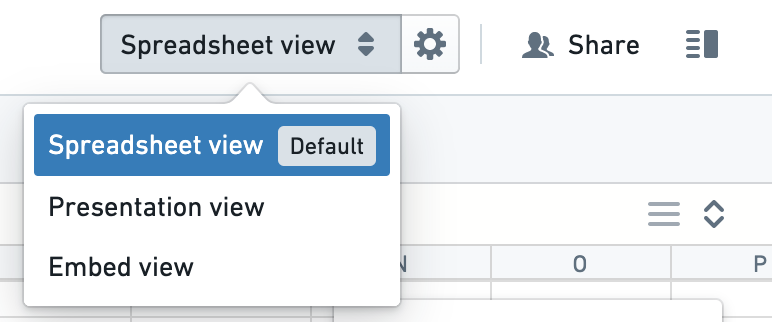
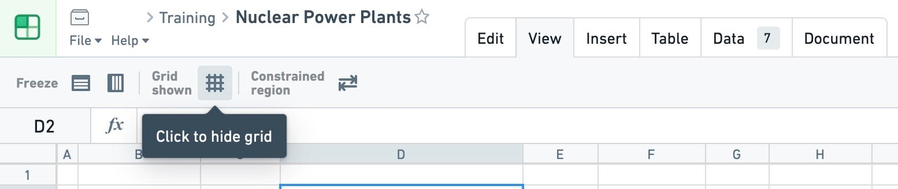
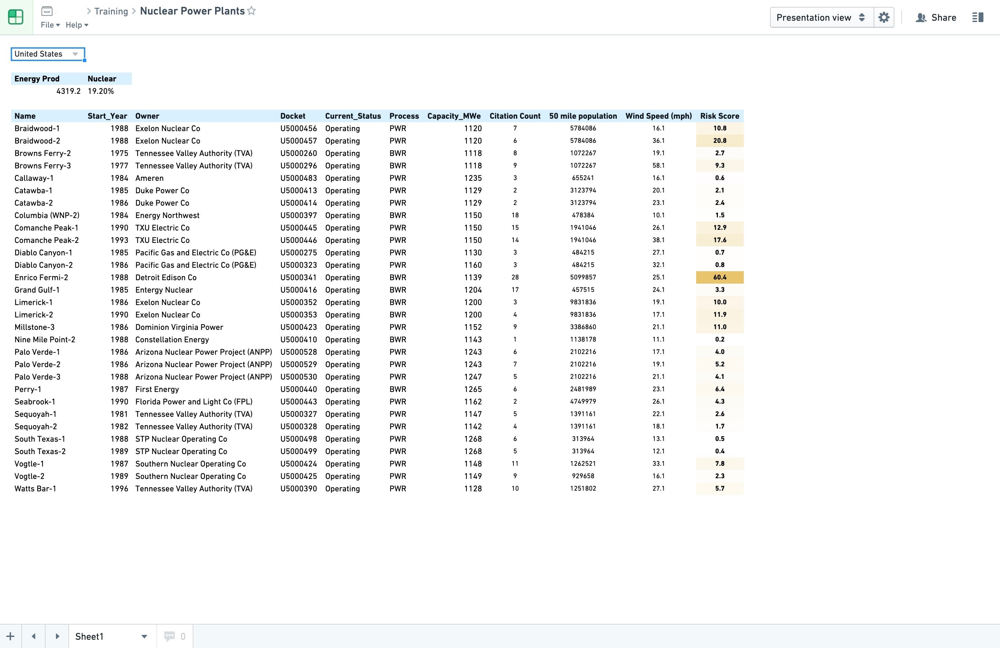

<!-- source: https://palantir.com/docs/foundry/fusion/presentation-view/ · mirrored 2026-08-26 from Palantir Foundry docs -->

# Presentation view

You can preview your document in presentation view using the dropdown in the toolbar, and make it the default viewing experience using the settings button.

A nice addition to presentation view is the option to hide the default grid via the button in the toolbar.

The combination of presentation view and hiding the grid can create a very focused consumption experience for the Fusion documents you would like to share with large audiences.

*Screenshots use open-source data from the [US Nuclear Regulatory Commission ↗](https://www.nrc.gov/data/index.html).*
