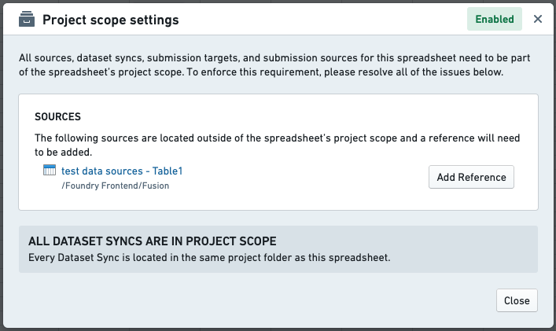

<!-- source: https://palantir.com/docs/foundry/fusion/project-scope/ · mirrored 2026-08-26 from Palantir Foundry docs -->

# Project scope

Project scoping in Foundry requires placing all inputs and outputs for a resource in a single project.

References across projects are still allowed, but requires a greater degree of scrutiny and can only be performed by some users.

To reference a resource, go to the Project Summary Panel at the root level of the project. Click the **+Add** button to add a reference to the project.

To keep track of this information, Fusion provides a **Project scope settings** user interface (see image below) under the **Data** tab.

