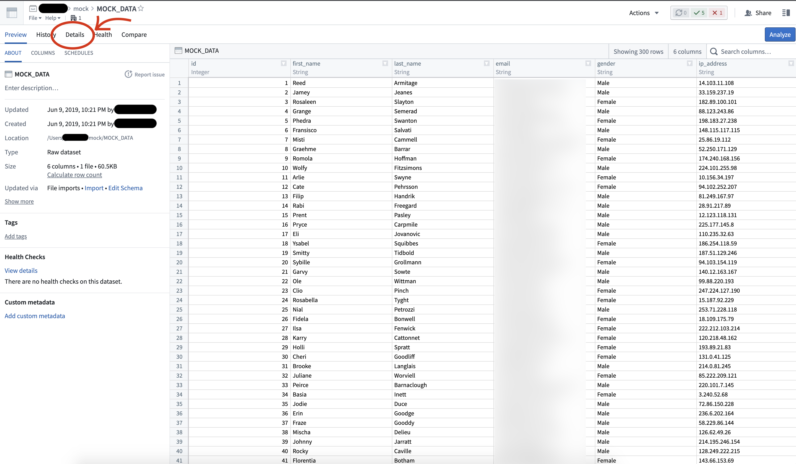
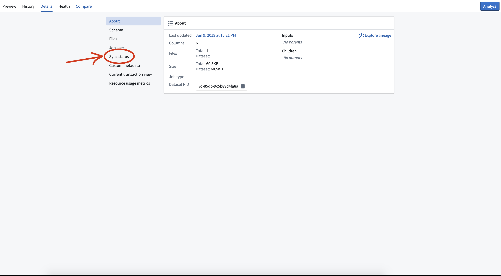
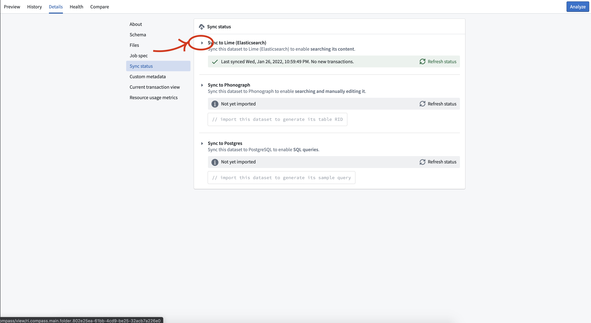
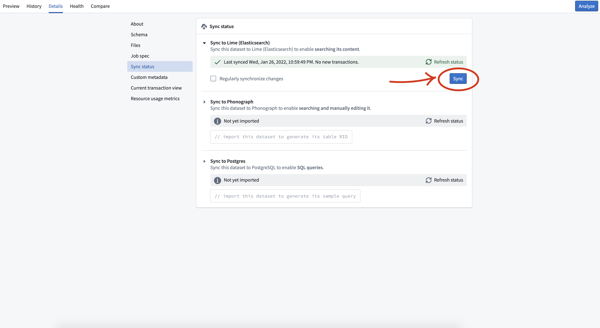

<!-- source: https://palantir.com/docs/foundry/fusion/resync-table-dataset/ · mirrored 2026-08-26 from Palantir Foundry docs -->

# Resync a table to a dataset

Datasets can be synced to Lime (ElasticSearch) so that full-text search, aggregations, and edits can be performed with applications like Fusion. Sometimes it is necessary to re-sync datasets, such as when the underlying Elasticsearch cluster needs to be migrated. It can also be required if the existing index is under-provisioned for the size of data.

Generally, re-syncs either happen on a schedule, or are automatically triggered by the platform. Occasionally, automatically triggered re-syncs may fail, in which case they need to be triggered manually and any errors must be resolved.

## How to trigger a re-sync

Follow the steps below to trigger a resync for a dataset (all data shown in example images is notional):

1. Select the dataset to open its preview.

2. Navigate to the **Details** tab.

    

3. Select **Sync Status**.

    

4. If a sync is currently running, wait for it to complete before proceeding.

5. Select the small triangle next to **Sync to Lime (ElasticSearch)** to expand the details for the Object Store V1 (Phonograph) sync.

    

6. Select the blue **Sync** button that appears.

    

## Frequently asked questions

* What should I do if the re-sync fails?

  Consult the job details to investigate the cause of the reindex job failure. The job details page should explain the failure reason and suggest resolution steps.
