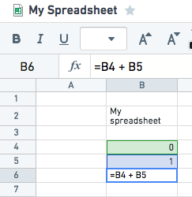
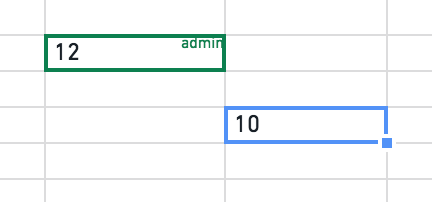
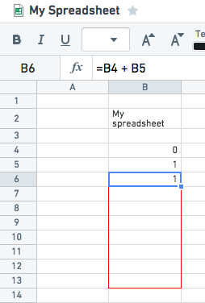

<!-- source: https://palantir.com/docs/foundry/fusion/sheets-overview/ · mirrored 2026-08-26 from Palantir Foundry docs -->

# Sheets

A Fusion spreadsheet looks and behaves like other spreadsheet applications, meaning that you can type anything anywhere, use cell references and functions, and so on. However, note that Fusion uses single quotes (`'`) to indicate strings, not double quotes (`"`).

Multiple users can edit a spreadsheet at the same time, and see each others’ cursors with their respective usernames. Changes in cells only become visible to other users once they have been submitted (e.g. after submitting with the Enter key).

Sheets can be renamed by double-clicking the sheet name. Cell references work as one would expect (e.g `=A1`, `=A1:A3`, `=Sheet2!A1:A3`) and you can use the mouse when editing in the formula bar.

:::callout{theme="success" title="Tip"}
You can drag the formula bar to expand it.
:::

The function library is a combination of Contour expression language DSL and Fusion specific spreadsheet functions. For a list of functions visit [function library](/docs/foundry/fusion/function-library/).

:::callout{theme="success" title="Tip"}
Typing `=a` into the formula bar will give you a list of suggestions.
:::

In Fusion, the most common cell types are:

* String (e.g. `Fusion` or `='Fusion'`)
* Number (e.g. `12` or `=12`)
* Date (e.g. `2013-02-18` or `=date(2013, 2, 18)`)
* Timestamp (e.g. `2013-02-18 00:00:00`)
* Boolean (e.g. `=true`)
* Array (e.g. `=array(1, 2)` or `=array('StringOne', 'StringTwo')`)
* Null (e.g. `=null`)

:::callout{theme="success" title="Tip"}
A good way to visually distinguish between decimals and other types of cells in a spreadsheet is to note that decimals will always be right-aligned in the cell.
:::

Similar to other spreadsheet applications, you can quickly fill cells with the contents of another cell by using copy/paste. Or, you can drag the cell’s fill handle. Double clicking the fill handle of a cell (or a region of cells) will automatically fill any empty cells in the same column(s), only stopping when adjacent cells are also empty.

You can also use the most common keyboard shortcuts for spreadsheets within Fusion. A list of them can be reached via the Keyboard Shortcuts button on the Document tab of the toolbar.
