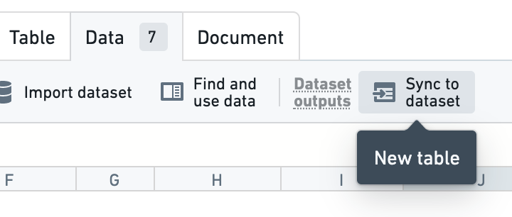
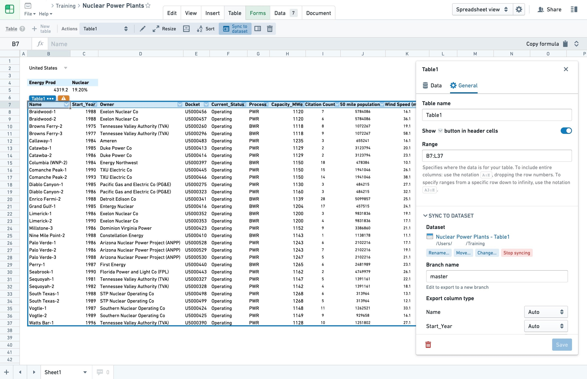
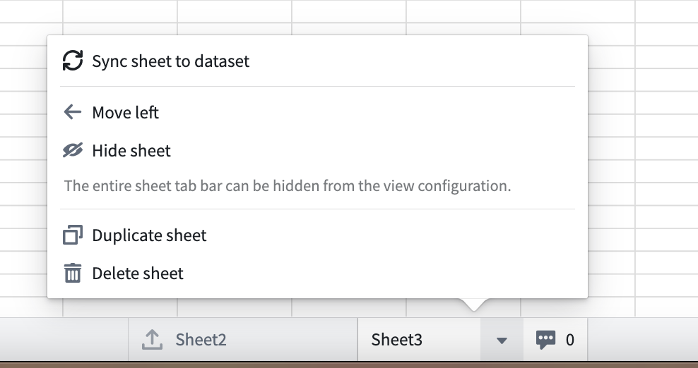

<!-- source: https://palantir.com/docs/foundry/fusion/sync-table-dataset/ · mirrored 2026-08-26 from Palantir Foundry docs -->

# Sync data from Fusion to a dataset

Fusion allows you to create datasets based on your spreadsheets. You can either sync a whole sheet to a dataset or select a table range to be synced. After the data is successfully synced to a dataset in Foundry, the data will be available for consumption by other applications, such as Contour.

:::callout{theme="warning"}
You may only use one type of sync within a Fusion sheet: a sheet sync, or a table sync. Using both types is not allowed as it would cause overlaps in dataset syncs.
:::

## Sync a table range to a dataset

To sync a specific part of a sheet to a dataset, first select the region of your spreadsheet that you want to make available as a dataset. Then, select **Sync to dataset** in the **Data** menu. A pop-up will appear where you can create a table region and set up a sync with a default name in the same folder of your spreadsheet.

You can then move, rename, or change the branch of the dataset. You can also choose to modify the export column type to match your desired data type. Change column types from the same menu or by selecting the table's label in the spreadsheet to open a panel where you can make changes.

Select **Save** to apply the changes.

Any future changes to the exported table range will trigger a build and be reflected in its associated dataset. For example, if the dataset is open in Contour, you can update your path after you modify the spreadsheet.

Once your data in Fusion is synced to a dataset, you can also choose to [export it as a CSV file](/docs/foundry/analytics/exporting-outputs/).

:::callout{theme="neutral"}
Once you sync a table range to a dataset, any changes made to that table range will trigger a build and be reflected in its associated dataset as long as you have at least `Editor` permissions on the associated dataset. As you edit the table range, you may see a number of finished and aborted transactions on the dataset.
:::

You can also set the column types of the output dataset using the dropdown menu on the column headers of the table region in your spreadsheet.

*Screenshots use open-source data from the [US Nuclear Regulatory Commission ↗](https://www.nrc.gov/data/index.html).*

## Sync a Fusion sheet to a dataset

If you need your whole Fusion sheet to be synced to a dataset, you can set up a sheet sync instead of a sync of a table range. While you can use table range syncs to create multiple datasets from within one Fusion sheet, a sheet sync will create only one dataset for the whole sheet.

To set up a sheet sync, navigate to the bottom of your Fusion document and right-click on the sheet you want to sync to a dataset. Select **Sync sheet to dataset**. After a brief wait, the dialog will change and you will be able to edit the sync that was just initialized.

If required, you can swap out the Fusion sheet backing a dataset by performing the following steps:

1. Create a new Fusion sheet with your desired data.
2. Navigate to the Fusion table you want to replace and choose **Stop syncing** in the table details window.
3. Go to the dataset and delete the job spec by navigating through the following: **Details tab > Job spec > Edit > Delete**.
4. Navigate to the newly created Fusion sheet, create a table to use, and sync it to the `master` branch of the dataset.
