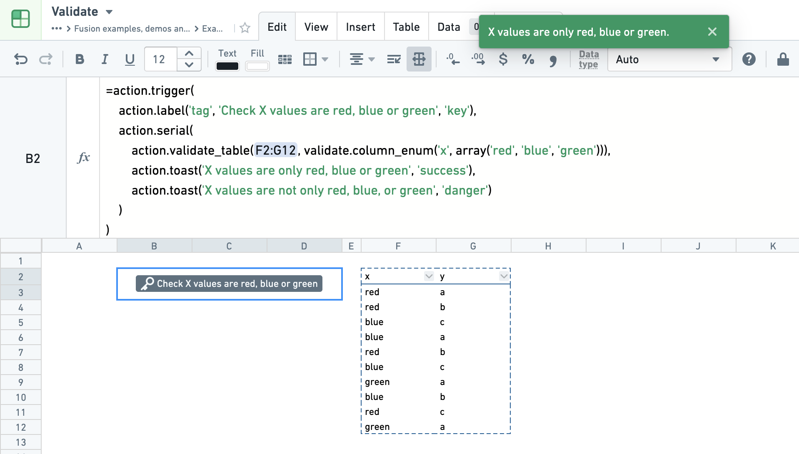
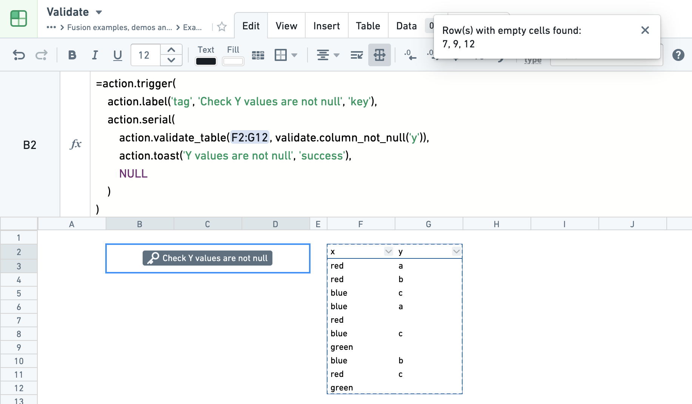
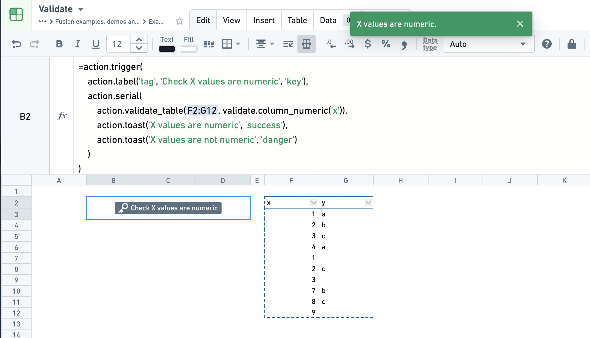
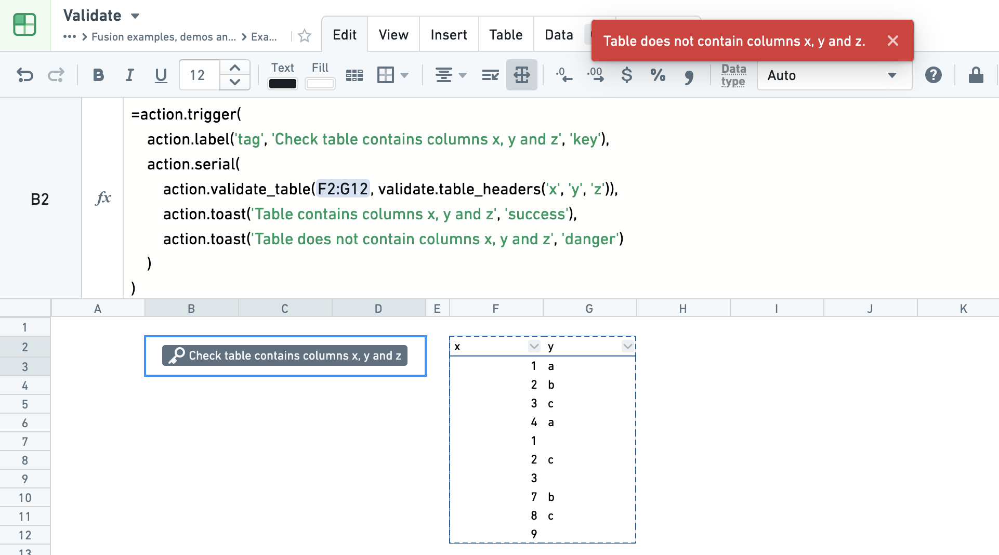
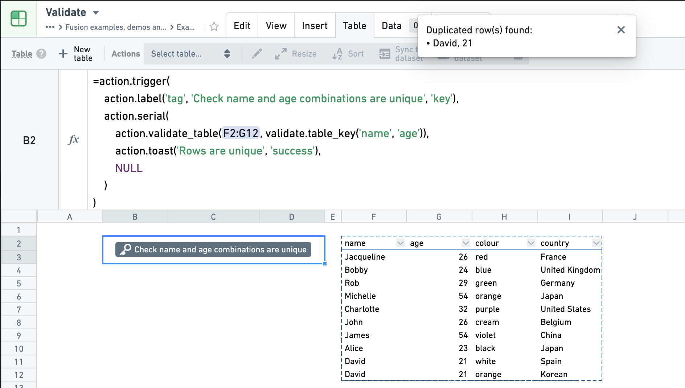

<!-- source: https://palantir.com/docs/foundry/fusion/validate-results/ · mirrored 2026-08-26 from Palantir Foundry docs -->

# Validate results

Fusion offers a set of validation formulas. They display as buttons, which are triggered upon click. If the validation fails, an error explaining why is displayed.

The validation functions are best used inside serial Actions with the use of toast Actions to display success and failure messages. See the [Actions documentation](/docs/foundry/fusion/perform-actions/) for more details.

This page is an overview of available validation formulas. For a full list of formulas and arguments, see the [function library](/docs/foundry/fusion/function-library/#validation-functions).

## Enumerate

The `column_enum(...)` validation checks the entries in a column are all within a specific list of values. The listed values can be entered into the formula manually (e.g. `array('red', 'blue', 'green')`) or through a reference (e.g. `array_flatten(B3:B14)`)

## Not null

The `column_not_null(...)` validation checks a column has no null values.

## Numeric

The `column_numeric(...)` validation checks a column has only numeric values.

## Table Headers

The `table_headers(...)` validation checks that a list of columns exist in a table.

## Table Key

The `table_key(...)` validation checks that, for a list of columns, entries for these columns are unique.

For example, running the validation on columns `name`, `age` of a table will check that the pairs of `name` and `age` entries are unique. A table with just two rows, such as `('David', 21), ('David', 24)` would pass the validation. A table with rows like `('David', 21), ('David', 21)` would fail. See the following screenshot of notional data as an example.

