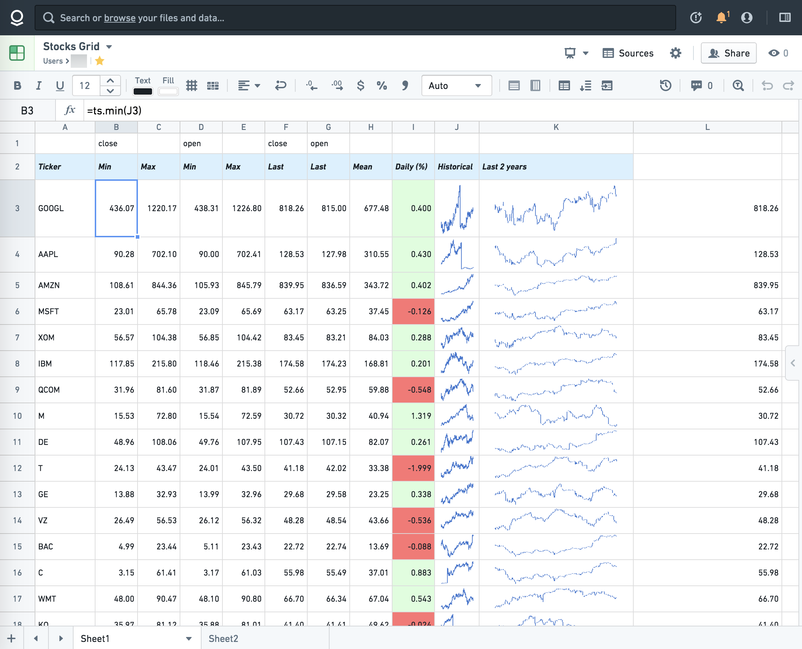

<!-- source: https://palantir.com/docs/foundry/fusion/visualize-time-series/ · mirrored 2026-08-26 from Palantir Foundry docs -->

# Visualize time series

Fusion offers integration with [time series](/docs/foundry/time-series/time-series-overview/) data through the `ts` function namespace (e.g. `ts.timeseries()`).

You can display values or sparklines, do calculations, or run basic functions on time series. Check the [function library](/docs/foundry/fusion/function-library/#time-series-functions) for details.

*This screenshot uses open source stock market data.*
