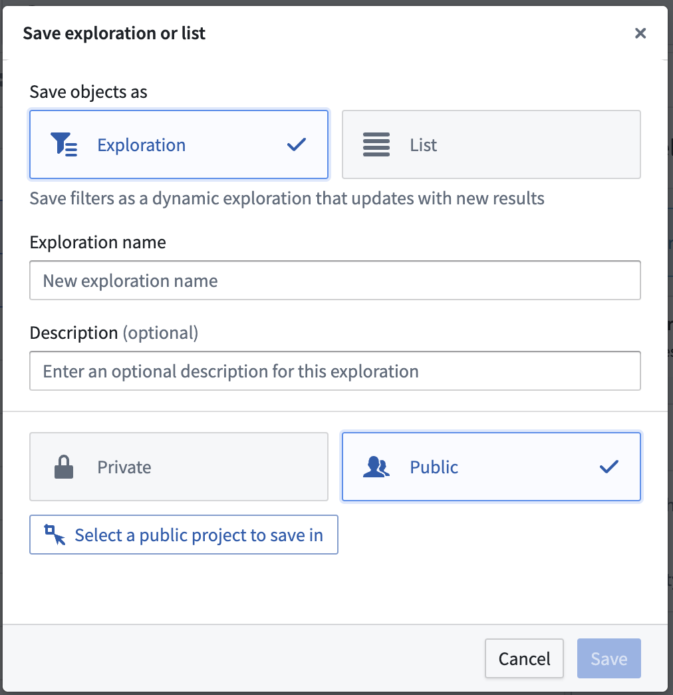
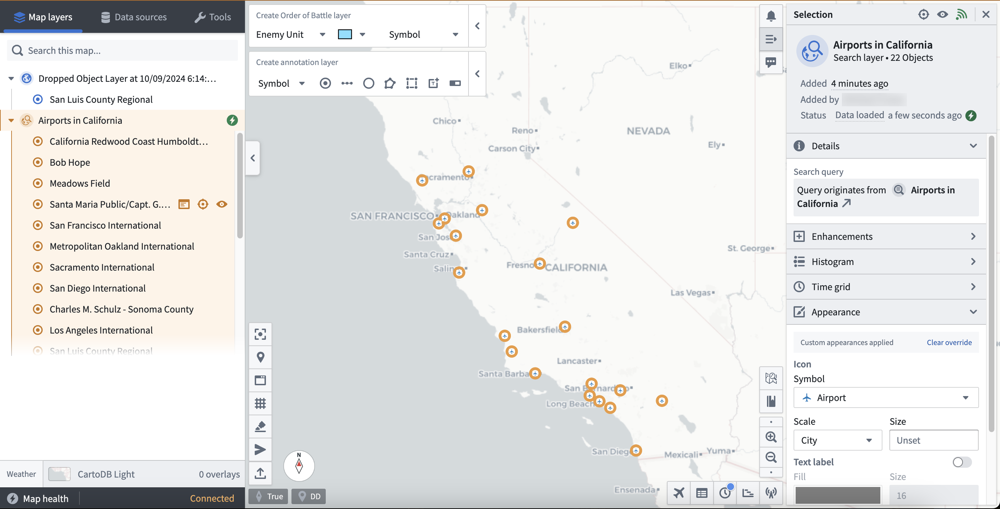
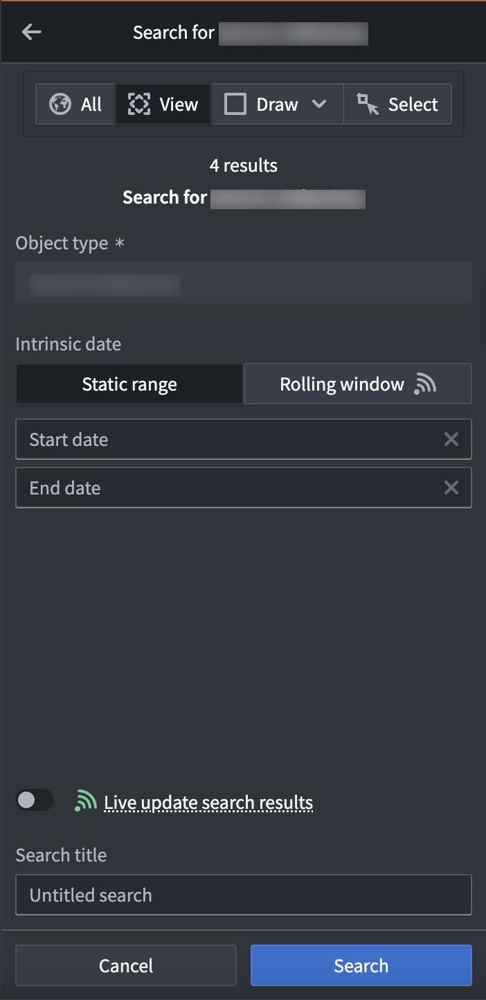
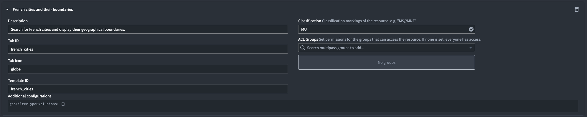
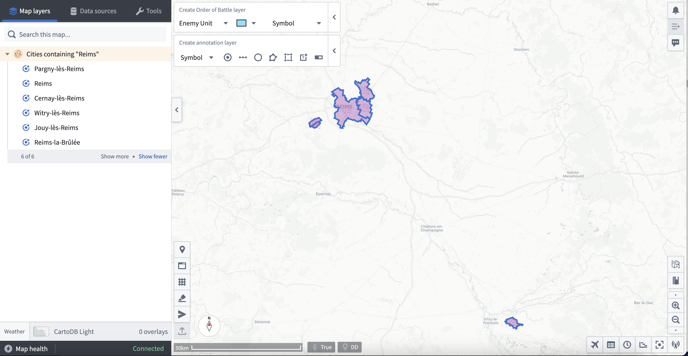
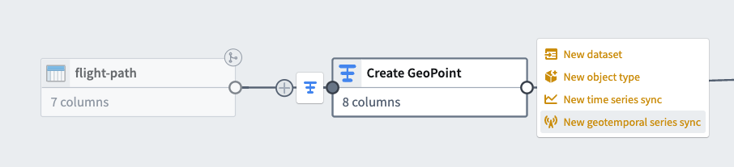
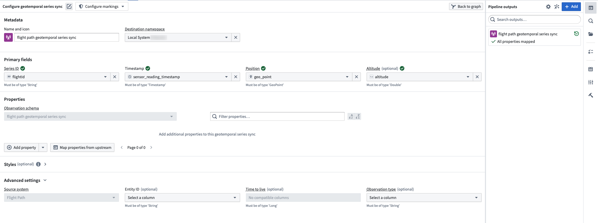
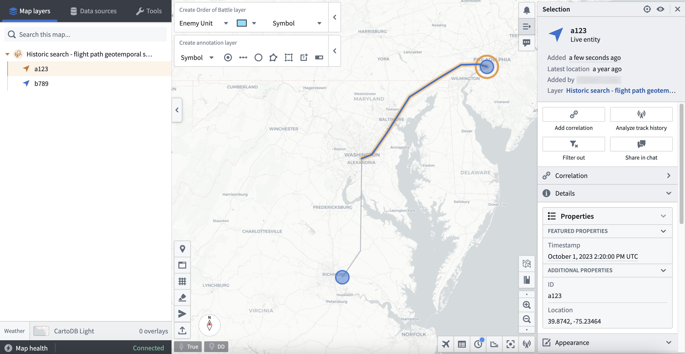
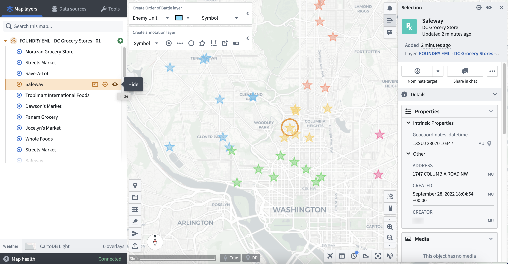

<!-- source: https://palantir.com/docs/foundry/geospatial/add-ontology-data-to-gaia/ · mirrored 2026-08-22 from Palantir Foundry docs -->

# Add Ontology data to Gaia

You can add geospatial data configured as part of your Foundry Ontology to Gotham's Gaia application through varying methods based on your use case. To make Foundry Ontology data accessible to Gotham, you will need to establish a unified representation of your ontology across both by type mapping the object types of interest using Foundry's [Ontology Manager](/docs/foundry/ontology-manager/overview/).

:::callout{theme="neutral" title="Note"}
If your enrollment contains Map Rendering Service (MRS), you do *not* need to complete the type mapping process to view Foundry objects in Gaia. You can [create new ontology objects from](/docs/foundry/object-link-types/create-ontology-objects-from-gaia/) or add existing objects to Gotham without additional configuration. [Check whether your enrollment contains MRS](/docs/foundry/object-link-types/enable-gotham-integration/#how-to-check-if-your-enrollment-contains-mrs). If your enrollment does not contain MRS, review [when to type map object types](/docs/foundry/object-link-types/enable-gotham-integration/#when-to-type-map-object-types-in-your-ontology) to determine whether you need type mapping for search templates, function-backed EMLs, or versioned object set-backed EMLs. <br><br> Contact Palantir Support with questions about MRS availability, installation, or Gotham documentation.
:::

## Comparing available methods to add Foundry data to Gaia

There are six methods you can use to add data in your Foundry Ontology to Gaia once you type-map an object type in Foundry to enable Gotham integration:

* [Drag and drop individual objects and saved explorations](#drag-and-drop-individual-objects-and-saved-explorations)
* [Search for your Foundry object type in Gaia](#search-for-your-foundry-object-type-in-gaia)
* [Create a search template](#create-a-search-template)
* [Configure a real-time geotemporal series sync in Foundry](#configure-a-real-time-geotemporal-series-sync-in-foundry)
* [Use a Function-backed Enterprise Map Layer](#use-a-function-backed-enterprise-map-layer)
* [Use a versioned object set-backed Enterprise Map Layer](#use-a-versioned-object-set-backed-enterprise-map-layer)

More information about each method is available in the table below:

|| [Drag and drop](#drag-and-drop-individual-objects-and-saved-explorations) | [Foundry object search](#search-for-your-foundry-object-type-in-gaia) | [Search templates](#create-a-search-template) | [Geotemporal series sync](#configure-a-real-time-geotemporal-series-sync-in-foundry) | [Function-backed Enterprise Map Layer](#use-a-function-backed-enterprise-map-layer) | [Versioned object set-backed Enterprise Map Layer](#use-a-versioned-object-set-backed-enterprise-map-layer) |
| ----- | ----- | ----- | ----- | ----- | ----- |----- |
| *Object quantity supported* | 1 object at a time *or* 1 object set with up to 5,000 objects | 5,000 | 5,000  | 5,000,000 | 5,000 | 5,000
| *Data refresh latency* | Static | Static *or* 30 seconds | Static *or* 30 seconds | Real time | Configurable | Configurable
| *Data filtering capability* | Within Foundry's [Object Explorer](/docs/foundry/object-explorer/overview/) | Within a Gaia map's left-hand panel | Within a Gaia map's left-hand panel | Within a Gaia map's left-hand panel | Within a Gaia map's left-hand panel or Foundry's [Code Repositories](/docs/foundry/code-repositories/overview/) | Within Foundry's Object Explorer
| *Recommended use cases* | Quickly move objects from Foundry's Object Explorer into Gaia | Perform simple object searches | Create a specific set of filters through YAML on an object set for reuse across Gaia maps | Integrate high-scale data which updates in real time | Leverage flexibility and power of Foundry Ontology [Functions](/docs/foundry/functions/overview/) | Ensure map layer updates when objects are added or removed from Foundry
| *User administrative prerequisites* | None | None | Access to Gaia admin application | None | Access to Gaia admin application | Access to Gaia admin application
| *Level of effort to implement* | Low | Low | Medium | High | High | High

:::callout{theme="neutral"}
To add Foundry data to Gaia via search templates, function-backed Enterprise Map Layers, or versioned object set-backed Enterprise Map Layers, you will need access to Gaia's admin application. Contact Palantir Support with questions about admin application access.
:::

The sections below provide detailed instructions to implement each integration method.

### Drag and drop individual objects and saved explorations

You can drag and drop individual objects or object sets derived from saved explorations (which may contain up to 5,000 objects) from Foundry onto a Gaia map.

To drag and drop individual objects from Foundry to your Gaia map:

1. Launch Object Explorer in Foundry.
2. Search for an object type.
3. Select an object from the **Results** panel on the far right side of the Object Explorer screen.
4. Select the object's icon in the upper left corner of the Object Explorer screen.
5. Drag the object from Foundry and drop it anywhere on your Gaia map - you can now view the object on your map and within the left-hand panel as part of a default layer titled `Dropped Object Layer [Date] [Time]`.

Before you can drag and drop object sets from Foundry to your Gaia map, you must first create a versioned object set from an existing object type. To create a versioned object set:

1. Launch Object Explorer in Foundry.
2. Search for and select your object type.
3. Select **Results** in the middle of the top ribbon of the Object Explorer screen.
4. Filter for objects to add to your object set using the search bar to narrow your selection by your object type's properties.
   * As an example, if your object type captures a location defined by a `name` property, you can filter for a selection of `location` objects by entering `where name is location_1 or where name is location_2` and pressing `enter` or `return` on your keyboard.
5. Select the blue **Save** button to save your selected objects as an [**Exploration**](/docs/foundry/object-explorer/save-explorations/#saving-an-exploration) within a public project.

:::callout{theme="success"}
You can also filter for objects by applying object filters directly within charts and graphs on the object type's Ontology Explorer view.
:::



After you create and save a versioned object set as an Exploration, you can follow the steps below to drag and drop the it to your Gaia map:

1. Select **New exploration** from the top ribbon of the Object Explorer view.
2. Search for and select your object set based on the name you gave it upon creation. The object set may also appear below the Object Explorer search bar under **My Explorations & Lists**.
3. Select the object set's icon in the upper left corner of the Object Explorer screen.
4. Drag the object set from Foundry and drop it anywhere on your Gaia map. Objects will individually propagate on the map and in the left-hand panel nested within a search layer automatically named after your saved exploration.



:::callout{theme="neutral" title="Duplicate object detection"}
When you add objects to a Gaia map—individually or as part of an object set from Object Explorer or Workshop—Gaia notifies you if any objects already exist on the map. You can include or exclude duplicates. Gaia highlights duplicate objects, even when their parent map layer is collapsed.
:::

:::callout{theme="success"}
You can also drag and drop objects to your Gaia map from other object views within Gotham.
:::

### Search for your Foundry object type in Gaia

You can search for Foundry object types within the **Data sources** section of Gaia's left-hand panel. Additionally, you can apply geometric and time-based filters to objects before you add them to your map. To search for Foundry object types from Gaia:

1. Select **Data Sources** within the left-hand panel on your map.
2. Search for your object type based on its name within Foundry, and it will appear at the bottom of the left-hand panel under **Object types**.
3. Select **Search for objects** next to your object type.
4. Choose the object(s) you want to add to your map and apply any necessary geometric filters available in the top ribbon of the object search panel.
   * `All` will add all objects from the discovered object type to your map.
   * `View` will only add the objects that are available within your current map view.
   * `Draw` will add objects to the map that reside within a drawn shape you can configure and add from the search panel.
   * `Select` enables you to select an item from the active map.
5. Apply any necessary time filters to load objects active within a `Static range` or `Rolling window`.
6. Optionally toggle on **Live update search results**, which will update your object or object set every 30 seconds based on newly created objects that match your filtering parameters.
7. Enter a name for your object search within **Search title** and select **Search**.



:::callout{theme="neutral"}
* If you are unable to view an object after loading your search results, then you should verify that the object type contains a geospatial property indicating its location, such as `geopoint` or `geoshape`. <br>
* If you are unable to search for your objects in Gotham after completing the prerequisite type mapping in Foundry, then the Foundry search feature may not be enabled in your Gotham enrollment. Contact Palantir Support for help enabling this capability.
:::

### Create a search template

You can create a search template in the Gaia admin application to pre-configure a custom object search interface when adding Foundry objects to a map through the left-hand panel's **Data sources** tab.

To create and implement a search template, launch the Gaia admin application and follow the steps below:

1. Locate the **Geo Search** panel and select **Show** to view all active geo searches in your Gotham enrollment.
2. Scroll to the bottom of the geo search list and select **Add**.
3. Title your search and populate each configuration input box.
   * `Description` will appear at the top of the search template interface.
   * `Tab ID` will enable mapping between your geo search and search template.
   * `Tab icon` will appear in the **Data sources** tab upon user search.
   * `Template ID` will match `Tab ID` and enable mapping between your geo search and search template.
   * `Classification`, which may be optional depending on your enrollment.
   * `ACL Groups` will set permissions for group access.
4. Input additional configurations, as needed.
5. Select **Preview and save** in the top right ribbon to save your geo search in the Gaia admin application before you configure a search template.

You can reference an example geo search that enables a user to search for cities in France and display their geographic boundaries on a Gaia map once paired with a search template.



6. Locate the **Search Template** panel and select **Show** to view all active search templates in your Gotham enrollment.
7. Scroll to the bottom of the existing `templates:` and insert YAML code containing your search template configurations and geo search mapping. You can reference an example search template YAML code block below.

```yaml
- id: french_cities # Matches the `Tab ID` and `Template ID` fields from geo search.
    title: French cities # Search template name as it will appear in the `Data sources` panel.
    query:
      queryType: AND # Define your query type and insert relevant subqueries.
      subqueries:
        - inputId: keyword
          queryType: KEYWORD
        - field: object_type
          queryType: OBJECT_TYPE
          value:
            - # Object Type's RID
    dataSource: foundry-federation
    namespaces:
      - foundry-federation
    description: Search for French cities and display their boundaries.
    integratedDataSetIds: []
    inputs:
      - hint: Type a keyword...
        id: keyword
        inputType: TEXTFIELD # Enables free text search.
        label: Keyword
    aggregations: []
```

8. Select **Preview and save** in the top right ribbon to save your search template.

You can navigate back to your Gaia map to test your search template. Type the name of your search template in the **Data sources** tab in the left-hand panel, or select it manually from the **Integrated data sources** sub-section. Select your search template to launch the pre-configured interface backed by your geo search and YAML configurations. Search for objects using the **Keyword** search bar or any other custom configurations made in your YAML code, then enter a **Search title** before you select the blue **Search** button at the bottom of the left-hand panel.

The results of your search will then appear on your Gaia map for additional exploration.



### Configure a real-time geotemporal series sync in Foundry

You can use Foundry's Pipeline Builder to [create a geotemporal series sync](/docs/foundry/pipeline-builder/outputs-add-geotemporal-series-output/#create-a-geotemporal-series-output) from an existing dataset, enabling you to add high-scale, real-time geotemporal data to your Gaia map without additional configurations.

To create a geotemporal series sync in Foundry:

1. Navigate to your dataset and ensure it contains all [prerequisite fields](/docs/foundry/geospatial/data-modeling/#observation-schema) to enable a geotemporal series sync.
2. Select **All actions** > **Create new pipeline** to launch Pipeline Builder.
3. Select your dataset node and choose **Transform** at the top of the vertical pop-up menu.
4. Search for and select **Construct GeoPoint column** to map your `latitude` and `longitude` fields and create a new `geo_point` column.
5. Rename your transform `Create GeoPoint` through the edit box in the top left corner of your transform.
6. Select the green arrow icon in the top right of your screen to **Save** your transform.
7. Choose **Back to graph** in the top right of your transform to navigate back to your Pipeline Builder graph.
8. Select the `Create GeoPoint` transform node's **Add output** button and select **New geotemporal series sync**. The image below shows the menu of output types available in Pipeline Builder.



9. Give your new output a name and assign its **Destination namespace**, such as `Local System`.
10. Configure all **Primary fields** to ensure the sync references the correct column in its backing dataset.
11. Clear all unmapped properties by selecting the `X` icon to the right of each or the **Clear unmapped properties** button.
12. Leave **Observation schema** blank under **Properties** - Foundry will auto-populate it as the name you assigned your series sync output above in **Metadata**.
13. Verify that the **Source system** under **Advanced settings** maps to your pipeline's name. The image below depicts all configurations necessary for your sync output.



14. Select the green arrow icon in the top right of your screen to **Save** your sync.
15. Select the hammer icon next to **Save** to **Deploy pipeline**.
16. Navigate **Back to graph**.  You will see a new geotemporal series sync output node to the right of your `Create GeoPoint` transform with green `Deployment up-to-date` text at the bottom of the node confirming successful deployment.

To add your newly created geotemporal series sync to your Gaia map:

1. Open the **Data sources** tab in Gaia's left-hand panel.
2. Search for the name of your geotemporal series sync and select **Tracks and observations search**.
3. Apply any necessary geometric filters available in the top ribbon of the object search panel.
   * `All` will add all objects from the discovered object type to your map.
   * `View` will only add the objects that are available within your current map view.
   * `Draw` will add objects to the map which reside within a drawn shape you can configure and add from the search panel.
   * `Select` enables you to select an item from the active map.
4. Select your appropriate time window by choosing either **Historic search** or **Live feed**.
5. Select **Add to map**.

Once your geotemporal series sync loads as part of Gaia's **Map layers**, you can select individual entities - such as a specific flight path - and make additional configurations.



### Use a Function-backed Enterprise Map Layer

You can add data to your Gaia map as a part of an Enterprise Map Layer (EML) backed by a Function written in Foundry and published to your ontology.

To create a [TypeScript Function](/docs/foundry/functions/types-reference/) which outputs an object set from an existing object type to back a Gaia EML:

1. Navigate to the project folder which contains your object type's backing dataset.
2. Select **New** > **Code repository**.
3. Choose the **Functions** options beneath `What are you building?` and select **TypeScript Functions** as your language.
4. Name your repository and save it in a public project folder to enable Foundry Ontology API access before you select **Initialize repository** at the bottom of your screen.
5. Select the green **Go to index.ts** button on the right side of your screen to write your function.
6. Follow the writing prompts embedded in the draft `index.ts` file and insert your own function; you can reference the example code below.

```typescript
import { Function, Integer } from "@foundry/functions-api";
import { Objects, ObjectSet, ObjectTypeName };

export class MyEmlFunction{

    @Function()
    public myFunctionName(): ObjectSet<ObjectTypeName> {
        return Objects.search().ObjectTypeName().filter(location => location.propertyTypeToSearch.exactMatch("match-parameter"));

    }
}
```

7. Select **Commit** in the top ribbon.
8. Select **Tag version** to release the function to the Foundry Ontology.
9. View your newly created function within the Foundry Ontology Manager's **Functions** tab.

Next, launch Gaia's admin application to establish a Foundry Function-backed EML. Once you navigate to the Gaia admin app, you can:

1. Search for and select the **Enterprise Map Layers** page.
2. Select **Add** at the bottom of the page to create a new EML.
3. Set the EML type as `Foundry function EML`.
4. Enter a **Description** for the EML and indicate its **Capabilities**.
5. Optionally input a **Tab icon**.
6. Indicate the EML's **Classification**.
7. Add **ACL Groups** to limit EML access, as necessary.
8. Insert your **Function rid** - you can copy this to your clipboard from the Function's Overview tab in Foundry's Ontology Manager application.
9. Optionally set a **Refresh interval (seconds)** for the EML - the EML will not refresh if left blank.
10. Optionally insert a **Geo filter property id** to enable object geo-filtering in Gaia when you add the EML as a reference data layer; you can use the `geopoint` property ID from your object type.

:::callout{theme="neutral"}
You can locate and copy a property ID from your object type **Properties** page in Ontology Manager; to do so, select the ellipsis icon to the right of your `geopoint` property and choose **Copy property id**.
:::

You can now add your Foundry Function-backed EML to your Gaia map by searching for its name using the **Data sources** tab in the left-hand panel. Gaia groups EMLs as `Reference data layers` under **Curated data sources**.



You can select or hide individual objects from your EML using the left-hand panel or by choosing on object's icon from your current view.

### Use a versioned object set-backed Enterprise Map Layer

You can add data to your Gaia map as a part of an EML backed by a versioned object set you create from an object type in the Foundry Ontology.

To create a versioned object set, follow the instructions above in the [Drag and drop individual objects and saved explorations](#drag-and-drop-individual-objects-and-saved-explorations) section.

:::callout{theme="neutral"}
If your enrollment contains Map Rendering Service (MRS), you can import versioned object set-backed EMLs without type mapping the backing object type. In the left-hand panel, search for and select the EML in the **Data sources** tab to add the object set as a reference data layer. Contact Palantir Support with questions about MRS availability or functionality.
:::

To establish a versioned object set-backed EML in the Gaia admin applications, follow the instructions above in the [Use a Function-backed Enterprise Map Layer](#drag-and-drop-individual-objects-and-saved-explorations) section. Set the EML type as `Versioned object set EML` instead of `Foundry function EML`; you will not need to insert a **Function rid**.

You can now add your versioned object set-backed EML to your Gaia map by searching for its name using the **Data sources** tab in the left-hand panel; Gaia groups EMLs as `Reference data layers` under **Curated data sources**.
