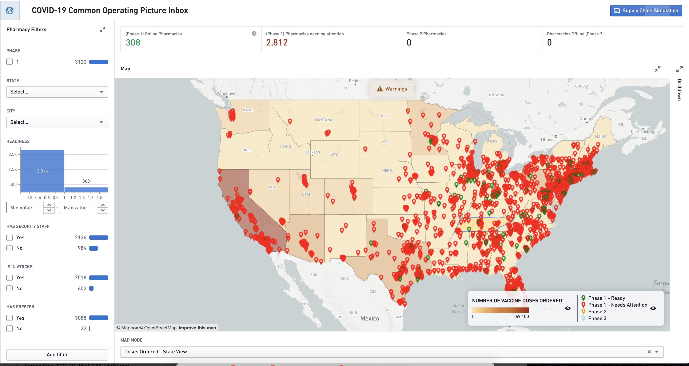
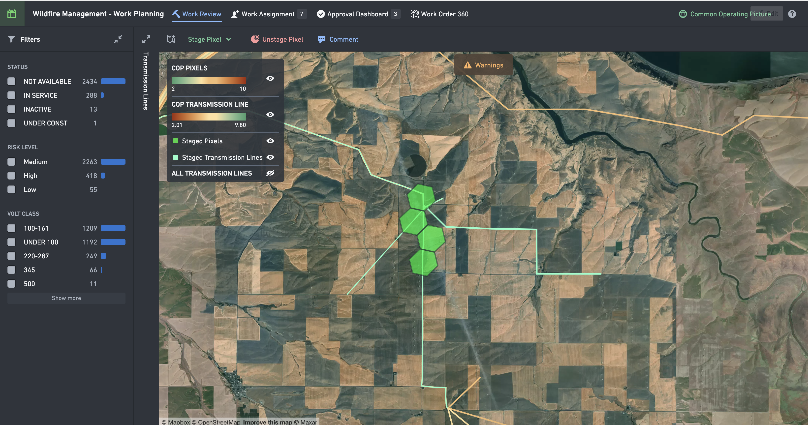
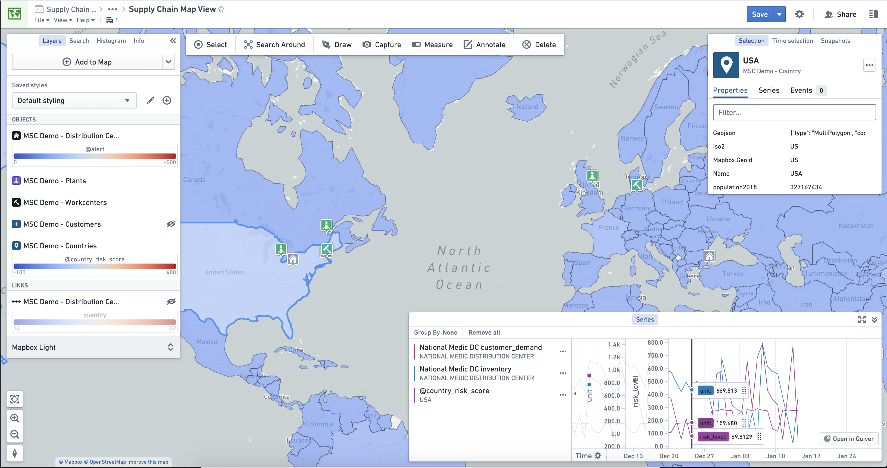

<!-- source: https://palantir.com/docs/foundry/geospatial/example-workflows/ · mirrored 2026-08-22 from Palantir Foundry docs -->

# Example workflows

To help you understand when geospatial workflows may be appropriate for your use case, this document describes several common patterns for geospatial workflows. All example images use notional or open source data.

## Common operating picture

* **Summary:** Unify organizational knowledge for enhanced decision-making against trends, risk, and capacity in emerging or emergency response scenarios.
* **Purpose:** Consolidate key context, alerts, and trends in a unified view to enable executives, stakeholders, and decision-makers to quickly understand a complex situation.
* **Geospatial data inputs:**
  * Area boundaries (e.g. states, countries, or county polygons)
  * Hotspot locations (e.g. hospital locations, points of interest)
* **Output:** A consolidated dashboard that reflects the current state, key trends, and new alerts in a complex, evolving situation.

## Geospatial work planning

* **Summary:** Track work bundles with integrated model intelligence for better prioritization.
* **Purpose:** Useful for work over a large area that needs to be bundled together, prioritized, reviewed, approved, and assigned for field crews to complete.
* **Geospatial data inputs:**
  * Asset locations (e.g. points/lines/polygons reflecting work items)
  * Work area boundaries (e.g. polygons that divide work into natural blocks)
  * Field crew locations over time
* **Output:** A work-planning tool that coordinates work bundles, including managing the process flow from planning to field crew completion.

## Supply chain optimization

* **Summary:** Interrogate your supply chain to identify obstacles, surface opportunities, and understand trends over time.
* **Purpose:** Managing constraints in complex shipping networks or geographically dispersed production operations.
* **Geospatial data inputs:**
  * Country or region polygons
  * Plant, warehouse, or supplier locations
  * Ship or truck locations over time
* **Output:** An investigative application to explore your network and test scenarios for adjusting constraints to optimize the overall system output.

